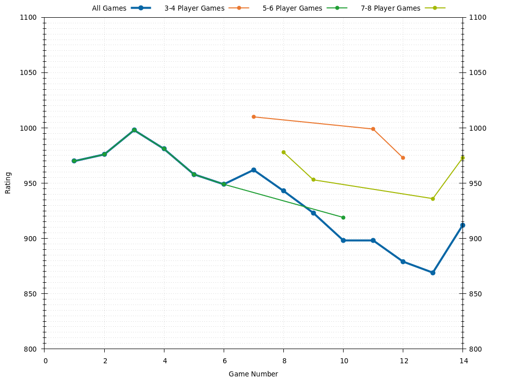
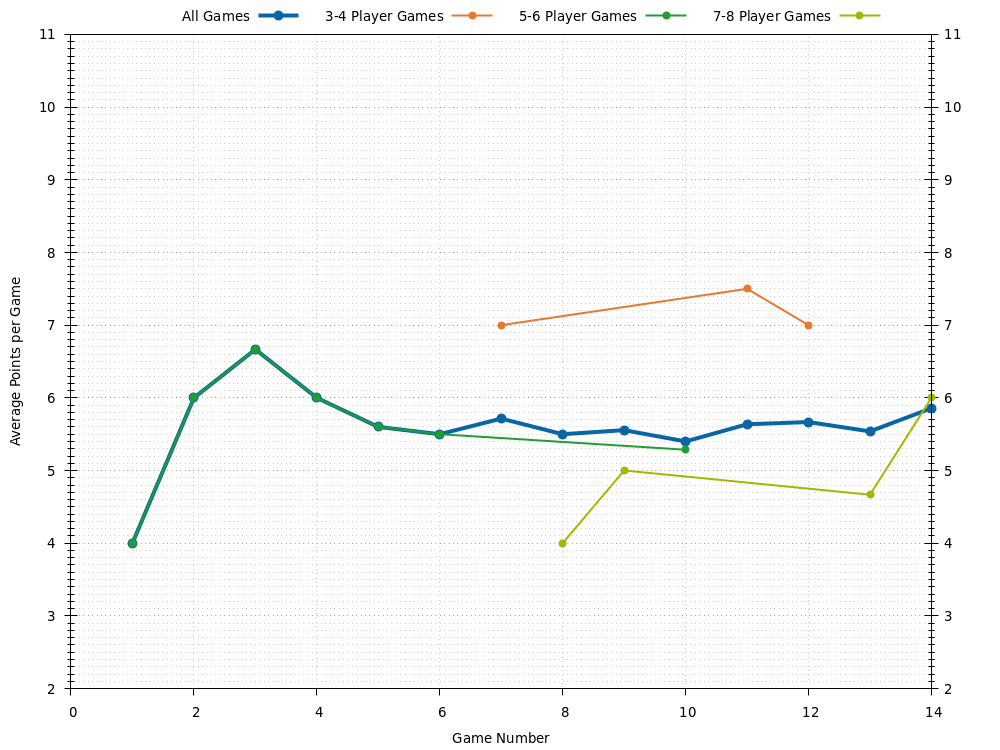
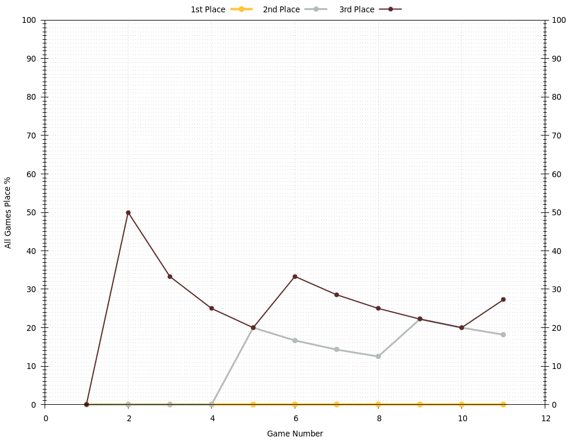
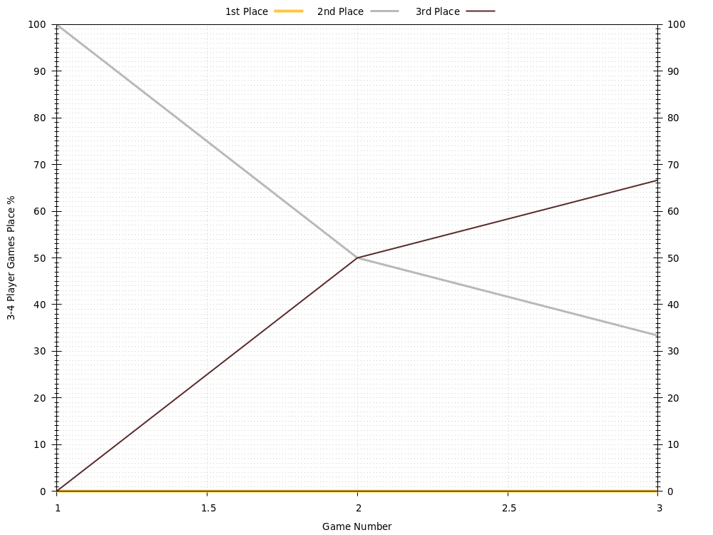
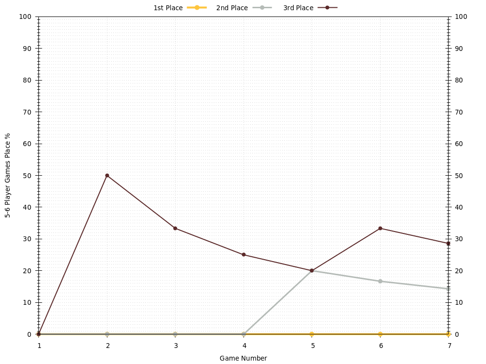
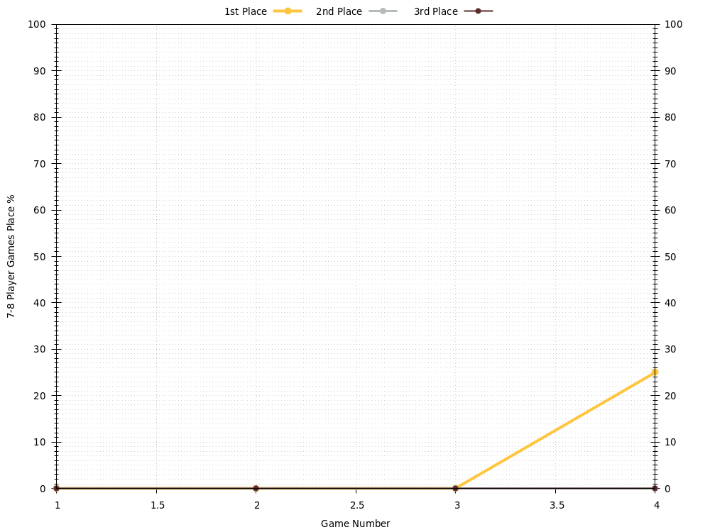

# Eftychi
Last updated 2020-10-12 03:53 UTC.

[Go back to all players.](../README.md)

## Overview
| **Category**     | **Games** | **Rating** | **Points** | **1st Place** | **2nd Place** | **3rd Place** | **1st or 2nd Place** | **1st, 2nd, or 3rd Place** |
| :---:            | :---:     | :---:      | :---:      | :---:         | :---:         | :---:         | :---:                | :---:                      |
| All Games        | 11        | 907        | 5.6        | 0 , 0%        | 2 , 18%       | 3 , 27%       | 2 , 18%              | 5 , 45%                    |
| 3-4 Player Games | 2         | 1000       | 7.5        | 0 , 0%        | 1 , 50%       | 1 , 50%       | 1 , 50%              | 2 , 100%                   |
| 5-6 Player Games | 7         | 925        | 5.3        | 0 , 0%        | 1 , 14%       | 2 , 29%       | 1 , 14%              | 3 , 43%                    |
| 7-8 Player Games | 2         | 953        | 5.0        | 0 , 0%        | 0 , 0%        | 0 , 0%        | 0 , 0%               | 0 , 0%                     |

## Ratings

## Average Points per Game

## Places

### Places: All Games

### Places: 3-4 Player Games

### Places: 5-6 Player Games

### Places: 7-8 Player Games

## Game History

### Game History: All Games
| **Game** | **Date**   | **Players** | **Results**                                                                                                    |
| :---:    | :---:      | :---:       | :---                                                                                                           |
| 11       | 2020-07-25 | 4           | 1st Alex 10 , 2nd Sean 9 , 3rd Eftychi 8 , 4th Mic 4                                                           |
| 10       | 2020-07-18 | 5           | 1st Alex 10 , 2nd Rachel 8 , 3rd Scott 6 , 4th Mic 5 , 5th Eftychi 4                                           |
| 9        | 2020-07-04 | 4           | 1st Scott 10 , 2nd Eftychi 7 , 3rd Jessica 6 , 3rd Rachel 6                                                    |
| 8        | 2020-07-04 | 8           | 1st Jay 10 , 2nd Alex 9 , 2nd Sean 9 , 3rd Scott 7 , 3rd Wendy 7 , 3rd Mic 7 , 4th Jessica 6 , 4th Eftychi 6   |
| 7        | 2020-07-04 | 8           | 1st Alex 10 , 2nd Rachel 8 , 3rd Scott 7 , 4th Jessica 6 , 4th Wendy 6 , 5th Eftychi 4 , 5th Jay 4 , 5th Mic 4 |
| 6        | 2020-07-03 | 6           | 1st Jessica 10 , 2nd Alex 6 , 2nd Wendy 6 , 3rd Scott 5 , 3rd Eftychi 5 , 4th Rachel 4                         |
| 5        | 2020-06-20 | 6           | 1st Jessica 10 , 2nd Eftychi 8 , 3rd Wendy 7 , 4th Alex 6 , 4th Scott 6 , 4th Mic 6                            |
| 4        | 2020-06-20 | 6           | 1st Alex 10 , 2nd Scott 6 , 2nd Mic 6 , 3rd Jessica 5 , 4th Eftychi 4 , 5th Wendy 2                            |
| 3        | 2020-06-20 | 6           | 1st Jessica 10 , 2nd Wendy 8 , 3rd Alex 7 , 3rd Scott 7 , 4th Eftychi 4 , 4th Mic 4                            |
| 2        | 2020-01-19 | 6           | 1st Jay 10 , 2nd Alex 9 , 3rd Jessica 8 , 3rd Eftychi 8 , 4th Sean 7 , 4th Scott 7                             |
| 1        | 2018-01-14 | 5           | 1st Sean 10 , 2nd Jessica 7 , 3rd Alex 5 , 3rd Scott 5 , 4th Eftychi 4                                         |

### Game History: 3-4 Player Games
| **Game** | **Date**   | **Players** | **Results**                                                 |
| :---:    | :---:      | :---:       | :---                                                        |
| 2        | 2020-07-25 | 4           | 1st Alex 10 , 2nd Sean 9 , 3rd Eftychi 8 , 4th Mic 4        |
| 1        | 2020-07-04 | 4           | 1st Scott 10 , 2nd Eftychi 7 , 3rd Jessica 6 , 3rd Rachel 6 |

### Game History: 5-6 Player Games
| **Game** | **Date**   | **Players** | **Results**                                                                            |
| :---:    | :---:      | :---:       | :---                                                                                   |
| 7        | 2020-07-18 | 5           | 1st Alex 10 , 2nd Rachel 8 , 3rd Scott 6 , 4th Mic 5 , 5th Eftychi 4                   |
| 6        | 2020-07-03 | 6           | 1st Jessica 10 , 2nd Alex 6 , 2nd Wendy 6 , 3rd Scott 5 , 3rd Eftychi 5 , 4th Rachel 4 |
| 5        | 2020-06-20 | 6           | 1st Jessica 10 , 2nd Eftychi 8 , 3rd Wendy 7 , 4th Alex 6 , 4th Scott 6 , 4th Mic 6    |
| 4        | 2020-06-20 | 6           | 1st Alex 10 , 2nd Scott 6 , 2nd Mic 6 , 3rd Jessica 5 , 4th Eftychi 4 , 5th Wendy 2    |
| 3        | 2020-06-20 | 6           | 1st Jessica 10 , 2nd Wendy 8 , 3rd Alex 7 , 3rd Scott 7 , 4th Eftychi 4 , 4th Mic 4    |
| 2        | 2020-01-19 | 6           | 1st Jay 10 , 2nd Alex 9 , 3rd Jessica 8 , 3rd Eftychi 8 , 4th Sean 7 , 4th Scott 7     |
| 1        | 2018-01-14 | 5           | 1st Sean 10 , 2nd Jessica 7 , 3rd Alex 5 , 3rd Scott 5 , 4th Eftychi 4                 |

### Game History: 7-8 Player Games
| **Game** | **Date**   | **Players** | **Results**                                                                                                    |
| :---:    | :---:      | :---:       | :---                                                                                                           |
| 2        | 2020-07-04 | 8           | 1st Jay 10 , 2nd Alex 9 , 2nd Sean 9 , 3rd Scott 7 , 3rd Wendy 7 , 3rd Mic 7 , 4th Jessica 6 , 4th Eftychi 6   |
| 1        | 2020-07-04 | 8           | 1st Alex 10 , 2nd Rachel 8 , 3rd Scott 7 , 4th Jessica 6 , 4th Wendy 6 , 5th Eftychi 4 , 5th Jay 4 , 5th Mic 4 |

