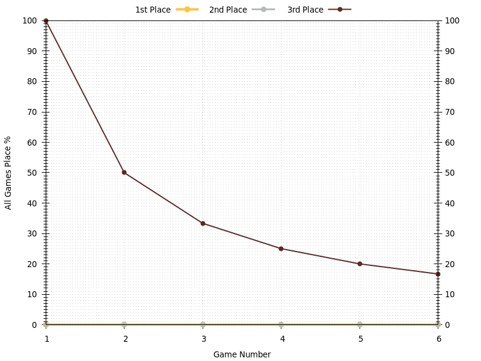
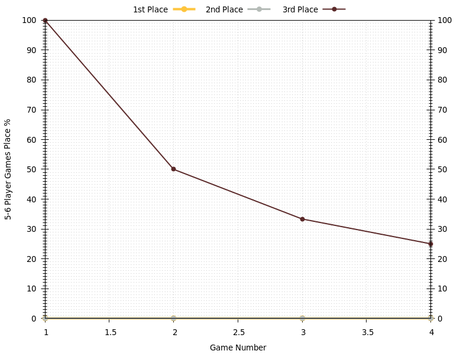

# Francis
Last updated 2020-10-03 09:17 local time (2020-10-03 09:17 UTC).

## Overview
| **Category**     | **Games** | **Points** | **1st Place** | **2nd Place** | **3rd Place** |
| :---:            | :---:     | :---:      | :---:         | :---:         | :---:         |
| All Games        | 6         | 6.2        | 0%            | 0%            | 17%           |
| 3-4 Player Games | 0         | –        | –           | –           | –           |
| 5-6 Player Games | 4         | 6.2        | 0%            | 0%            | 25%           |
| 7-8 Player Games | 2         | 6.0        | 0%            | 0%            | 0%            |

## Average Points per Game

## Places

### Places: All Games

### Places: 3-4 Player Games

### Places: 5-6 Player Games

### Places: 7-8 Player Games

## Game History

### Game History: All Games
| **Game** | **Date**   | **Players** | **Results**                                                                                                    |
| :---:    | :---:      | :---:       | :---                                                                                                           |
| 6        | 2020-03-25 | 5           | 1st Edith 10 , 2nd Alice 8 , 3rd Claire 7 , 4th Bob 6 , 4th Francis 6                                          |
| 5        | 2020-03-23 | 7           | 1st Alice 11 , 2nd Bob 9 , 3rd Claire 8 , 3rd David 8 , 4th Edith 7 , 4th Hugo 7 , 5th Francis 5               |
| 4        | 2020-03-23 | 8           | 1st Bob 10 , 2nd Alice 9 , 2nd Claire 9 , 3rd Edith 8 , 3rd Gabby 8 , 4th David 7 , 4th Francis 7 , 5th Hugo 6 |
| 3        | 2020-03-21 | 6           | 1st Claire 11 , 2nd Alice 9 , 3rd Edith 8 , 4th Bob 7 , 4th David 7 , 5th Francis 5                            |
| 2        | 2020-03-18 | 6           | 1st David 10 , 2nd Claire 9 , 3rd Alice 8 , 3rd Bob 8 , 4th Edith 7 , 5th Francis 6                            |
| 1        | 2020-03-17 | 5           | 1st Claire 10 , 2nd Bob 9 , 2nd Alice 9 , 3rd Francis 8 , 3rd Edith 8                                          |

### Game History: 3-4 Player Games
| **Game** | **Date** | **Players** | **Results** |
| :---:    | :---:    | :---:       | :---        |

### Game History: 5-6 Player Games
| **Game** | **Date**   | **Players** | **Results**                                                                         |
| :---:    | :---:      | :---:       | :---                                                                                |
| 4        | 2020-03-25 | 5           | 1st Edith 10 , 2nd Alice 8 , 3rd Claire 7 , 4th Bob 6 , 4th Francis 6               |
| 3        | 2020-03-21 | 6           | 1st Claire 11 , 2nd Alice 9 , 3rd Edith 8 , 4th Bob 7 , 4th David 7 , 5th Francis 5 |
| 2        | 2020-03-18 | 6           | 1st David 10 , 2nd Claire 9 , 3rd Alice 8 , 3rd Bob 8 , 4th Edith 7 , 5th Francis 6 |
| 1        | 2020-03-17 | 5           | 1st Claire 10 , 2nd Bob 9 , 2nd Alice 9 , 3rd Francis 8 , 3rd Edith 8               |

### Game History: 7-8 Player Games
| **Game** | **Date**   | **Players** | **Results**                                                                                                    |
| :---:    | :---:      | :---:       | :---                                                                                                           |
| 2        | 2020-03-23 | 7           | 1st Alice 11 , 2nd Bob 9 , 3rd Claire 8 , 3rd David 8 , 4th Edith 7 , 4th Hugo 7 , 5th Francis 5               |
| 1        | 2020-03-23 | 8           | 1st Bob 10 , 2nd Alice 9 , 2nd Claire 9 , 3rd Edith 8 , 3rd Gabby 8 , 4th David 7 , 4th Francis 7 , 5th Hugo 6 |

