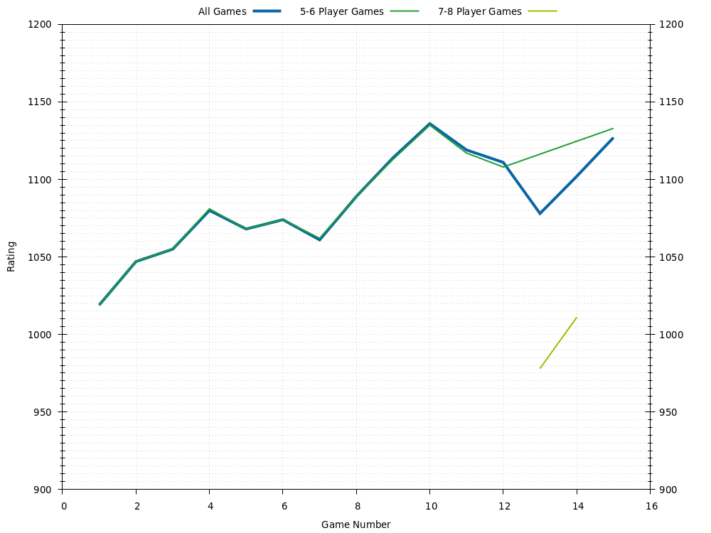
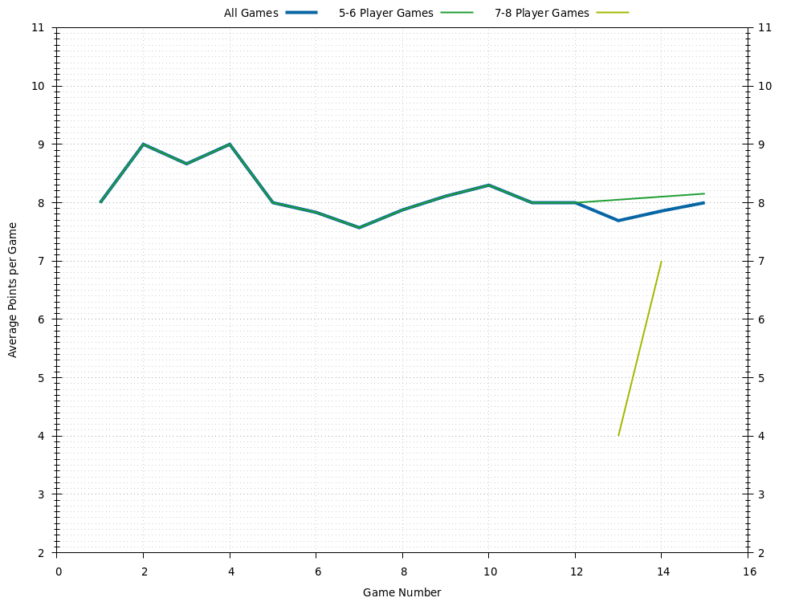
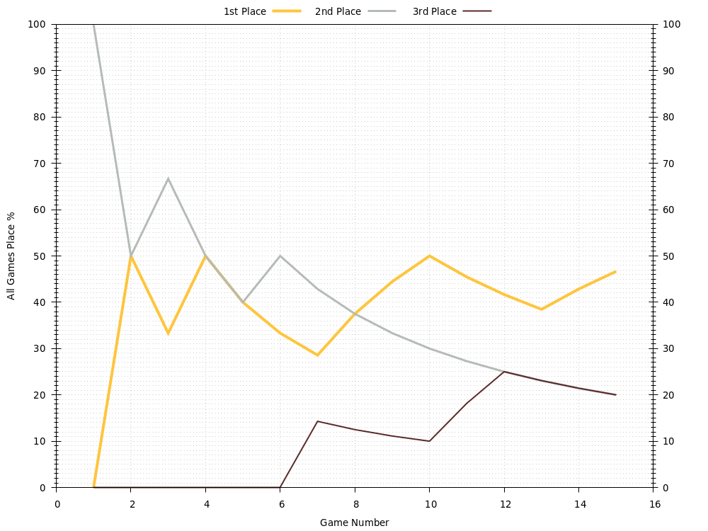

# Jay
Last updated 2021-03-13 04:55 UTC.

[Go back to all players.](../README.md)

## Overview
| **Category**     | **Games** | **Avg Rating** | **Avg Points** | **1st Place** | **2nd Place** | **3rd Place** | **1st or 2nd Place** | **1st, 2nd, or 3rd Place** |
| :---:            | :---:     | :---:          | :---:          | :---:         | :---:         | :---:         | :---:                | :---:                      |
| All Games        | 14        | 1082           | 7.86           | 43% (6)       | 21% (3)       | 21% (3)       | 64% (9)              | 86% (12)                   |
| 5-6 Player Games | 12        | 1081           | 8.00           | 42% (5)       | 25% (3)       | 25% (3)       | 67% (8)              | 92% (11)                   |
| 7-8 Player Games | 2         | 994            | 7.00           | 50% (1)       | 0% (0)        | 0% (0)        | 50% (1)              | 50% (1)                    |

## Ratings

## Average Points per Game

## Places

### Places: All Games

### Places: 5-6 Player Games

### Places: 7-8 Player Games

## Game History

### Game History: All Games
| **Game** | **Date**   | **Players** | **Results**                                                                                                 |
| :---:    | :---:      | :---:       | :---                                                                                                        |
| 14       | 2020-07-04 | 8           | 1st Jay 10 , 2nd Alex 9 , 2nd Sean 9 , 3rd Scott 7 , 3rd Wendy 7 , 3rd Mic 7 , 4th Jess 6 , 4th Eftychi 6   |
| 13       | 2020-07-04 | 8           | 1st Alex 10 , 2nd Rachel 8 , 3rd Scott 7 , 4th Jess 6 , 4th Wendy 6 , 5th Eftychi 4 , 5th Jay 4 , 5th Mic 4 |
| 12       | 2020-06-13 | 5           | 1st Jess 10 , 2nd Alex 9 , 3rd Jay 8 , 4th Scott 7 , 5th Rachel 4                                           |
| 11       | 2020-06-06 | 6           | 1st Scott 10 , 2nd Alex 9 , 3rd Jay 5 , 3rd Jess 5 , 3rd Sean 5 , 4th Rachel 3                              |
| 10       | 2020-06-06 | 5           | 1st Jay 10 , 2nd Alex 5 , 2nd Jess 5 , 3rd Scott 4 , 3rd Rachel 4                                           |
| 9        | 2020-01-19 | 6           | 1st Jay 10 , 2nd Alex 9 , 3rd Jess 8 , 3rd Eftychi 8 , 4th Sean 7 , 4th Scott 7                             |
| 8        | 2018-09-01 | 5           | 1st Jay 10 , 2nd Alex 9 , 2nd Jess 9 , 3rd Wilson 8 , 4th Scott 5                                           |
| 7        | 2017-10-08 | 6           | 1st Scott 10 , 2nd Alex 9 , 3rd Jay 6 , 3rd Jess 6 , 3rd Wendy 6 , 4th Sean 5                               |
| 6        | 2017-08-25 | 6           | 1st PA 10 , 2nd Jay 7 , 2nd Sean 7 , 3rd Scott 6 , 4th Wendy 5 , 5th Alex 4                                 |
| 5        | 2017-06-10 | 6           | 1st Wilson 10 , 2nd Scott 6 , 3rd Alex 5 , 4th Jay 4 , 5th Victoria 3 , 6th Jess 2                          |
| 4        | 2017-06-10 | 6           | 1st Jay 10 , 2nd Alex 9 , 3rd Jess 7 , 4th Scott 6 , 4th Sean 6 , 4th Wendy 6                               |
| 3        | 2017-04-01 | 6           | 1st Jess 10 , 2nd Jay 8 , 2nd Sean 8 , 3rd Wendy 5 , 4th Alex 4 , 4th Rachel 4                              |
| 2        | 2017-03-31 | 6           | 1st Jay 10 , 2nd Scott 9 , 3rd Alex 7 , 3rd Wendy 7 , 4th Sean 6 , 5th Rachel 5                             |
| 1        | 2017-03-17 | 6           | 1st Jess 10 , 2nd Jay 8 , 3rd Alex 7 , 3rd Sean 7 , 4th Scott 6 , 5th Wendy 5                               |

### Game History: 5-6 Player Games
| **Game** | **Date**   | **Players** | **Results**                                                                        |
| :---:    | :---:      | :---:       | :---                                                                               |
| 12       | 2020-06-13 | 5           | 1st Jess 10 , 2nd Alex 9 , 3rd Jay 8 , 4th Scott 7 , 5th Rachel 4                  |
| 11       | 2020-06-06 | 6           | 1st Scott 10 , 2nd Alex 9 , 3rd Jay 5 , 3rd Jess 5 , 3rd Sean 5 , 4th Rachel 3     |
| 10       | 2020-06-06 | 5           | 1st Jay 10 , 2nd Alex 5 , 2nd Jess 5 , 3rd Scott 4 , 3rd Rachel 4                  |
| 9        | 2020-01-19 | 6           | 1st Jay 10 , 2nd Alex 9 , 3rd Jess 8 , 3rd Eftychi 8 , 4th Sean 7 , 4th Scott 7    |
| 8        | 2018-09-01 | 5           | 1st Jay 10 , 2nd Alex 9 , 2nd Jess 9 , 3rd Wilson 8 , 4th Scott 5                  |
| 7        | 2017-10-08 | 6           | 1st Scott 10 , 2nd Alex 9 , 3rd Jay 6 , 3rd Jess 6 , 3rd Wendy 6 , 4th Sean 5      |
| 6        | 2017-08-25 | 6           | 1st PA 10 , 2nd Jay 7 , 2nd Sean 7 , 3rd Scott 6 , 4th Wendy 5 , 5th Alex 4        |
| 5        | 2017-06-10 | 6           | 1st Wilson 10 , 2nd Scott 6 , 3rd Alex 5 , 4th Jay 4 , 5th Victoria 3 , 6th Jess 2 |
| 4        | 2017-06-10 | 6           | 1st Jay 10 , 2nd Alex 9 , 3rd Jess 7 , 4th Scott 6 , 4th Sean 6 , 4th Wendy 6      |
| 3        | 2017-04-01 | 6           | 1st Jess 10 , 2nd Jay 8 , 2nd Sean 8 , 3rd Wendy 5 , 4th Alex 4 , 4th Rachel 4     |
| 2        | 2017-03-31 | 6           | 1st Jay 10 , 2nd Scott 9 , 3rd Alex 7 , 3rd Wendy 7 , 4th Sean 6 , 5th Rachel 5    |
| 1        | 2017-03-17 | 6           | 1st Jess 10 , 2nd Jay 8 , 3rd Alex 7 , 3rd Sean 7 , 4th Scott 6 , 5th Wendy 5      |

### Game History: 7-8 Player Games
| **Game** | **Date**   | **Players** | **Results**                                                                                                 |
| :---:    | :---:      | :---:       | :---                                                                                                        |
| 2        | 2020-07-04 | 8           | 1st Jay 10 , 2nd Alex 9 , 2nd Sean 9 , 3rd Scott 7 , 3rd Wendy 7 , 3rd Mic 7 , 4th Jess 6 , 4th Eftychi 6   |
| 1        | 2020-07-04 | 8           | 1st Alex 10 , 2nd Rachel 8 , 3rd Scott 7 , 4th Jess 6 , 4th Wendy 6 , 5th Eftychi 4 , 5th Jay 4 , 5th Mic 4 |

