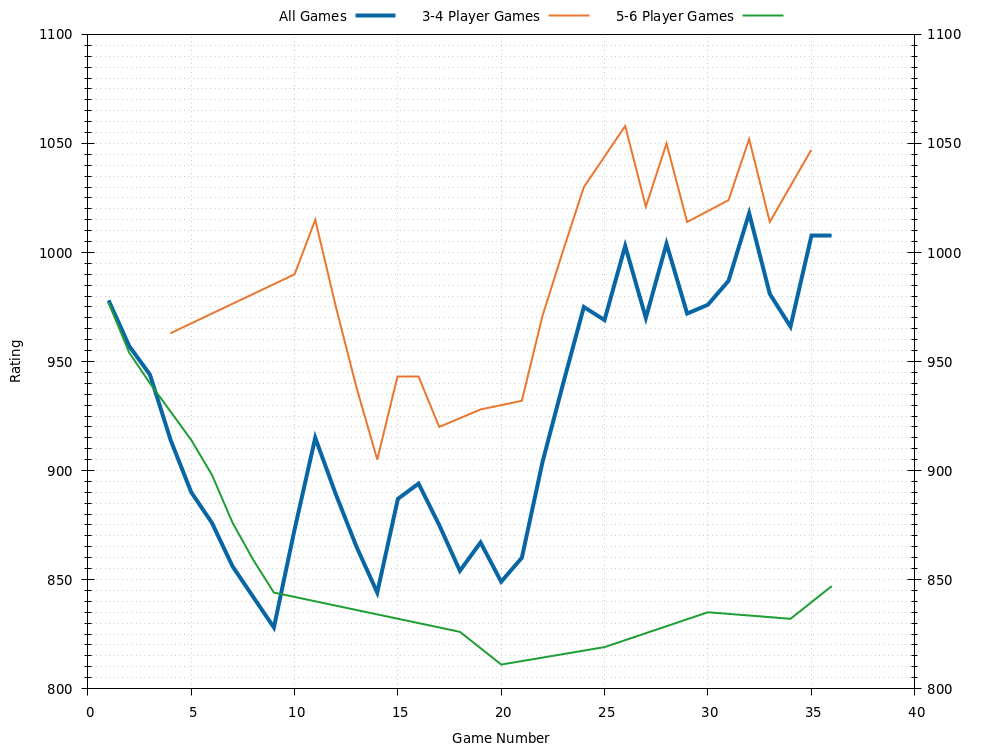
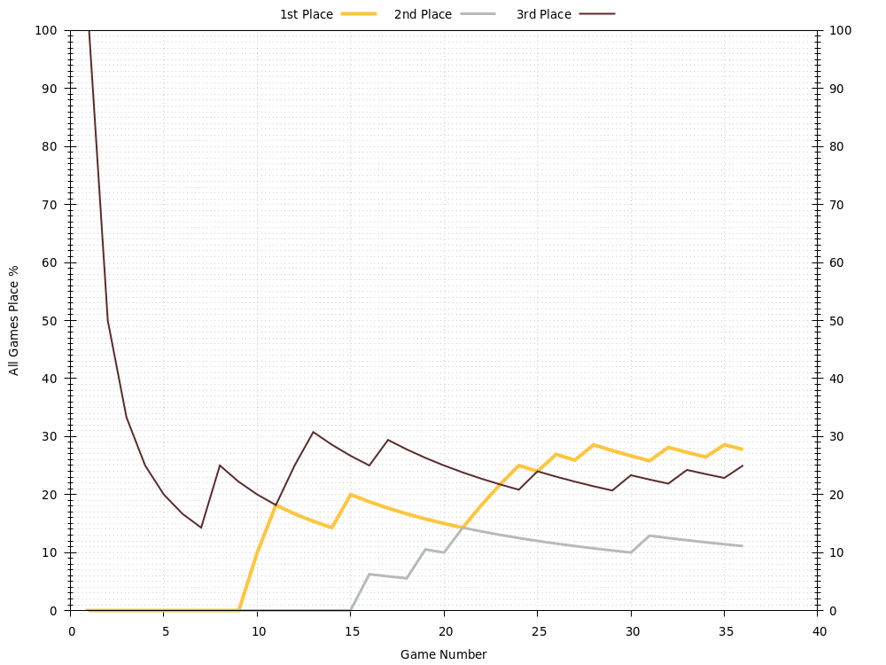

# Laura
Last updated 2020-10-12 03:53 UTC.

[Go back to all players.](../README.md)

## Overview
| **Category**     | **Games** | **Rating** | **Points** | **1st Place** | **2nd Place** | **3rd Place** | **1st or 2nd Place** | **1st, 2nd, or 3rd Place** |
| :---:            | :---:     | :---:      | :---:      | :---:         | :---:         | :---:         | :---:                | :---:                      |
| All Games        | 7         | 855        | 5.3        | 0 , 0%        | 0 , 0%        | 1 , 14%       | 0 , 0%               | 1 , 14%                    |
| 3-4 Player Games | 1         | 963        | 5.0        | 0 , 0%        | 0 , 0%        | 0 , 0%        | 0 , 0%               | 0 , 0%                     |
| 5-6 Player Games | 6         | 876        | 5.3        | 0 , 0%        | 0 , 0%        | 1 , 17%       | 0 , 0%               | 1 , 17%                    |

## Ratings

## Average Points per Game

## Places

### Places: All Games

### Places: 3-4 Player Games

### Places: 5-6 Player Games

## Game History

### Game History: All Games
| **Game** | **Date**   | **Players** | **Results**                                                                         |
| :---:    | :---:      | :---:       | :---                                                                                |
| 7        | 2020-10-11 | 5           | 1st Phil 10 , 2nd Jessica 9 , 3rd Rachel 7 , 4th Mic 6 , 5th Laura 5                |
| 6        | 2020-10-11 | 5           | 1st Mic 10 , 2nd Phil 7 , 3rd Rachel 6 , 4th Jessica 5 , 4th Laura 5                |
| 5        | 2020-09-29 | 6           | 1st Jessica 10 , 2nd Mic 9 , 3rd Phil 8 , 4th Scott 5 , 4th Rachel 5 , 5th Laura 3  |
| 4        | 2020-09-27 | 4           | 1st Sean 10 , 2nd Mic 7 , 3rd Phil 6 , 4th Laura 5                                  |
| 3        | 2020-09-17 | 6           | 1st Sean 10 , 2nd Jessica 10 , 3rd Rachel 9 , 4th Scott 8 , 5th Laura 7 , 6th Mic 6 |
| 2        | 2020-09-11 | 6           | 1st Mic 10 , 2nd Jessica 8 , 3rd Sean 6 , 3rd Scott 6 , 4th Rachel 5 , 4th Laura 5  |
| 1        | 2020-08-22 | 5           | 1st Jessica 10 , 2nd Scott 9 , 2nd Rachel 9 , 3rd Laura 7 , 3rd Mic 7               |

### Game History: 3-4 Player Games
| **Game** | **Date**   | **Players** | **Results**                                        |
| :---:    | :---:      | :---:       | :---                                               |
| 1        | 2020-09-27 | 4           | 1st Sean 10 , 2nd Mic 7 , 3rd Phil 6 , 4th Laura 5 |

### Game History: 5-6 Player Games
| **Game** | **Date**   | **Players** | **Results**                                                                         |
| :---:    | :---:      | :---:       | :---                                                                                |
| 6        | 2020-10-11 | 5           | 1st Phil 10 , 2nd Jessica 9 , 3rd Rachel 7 , 4th Mic 6 , 5th Laura 5                |
| 5        | 2020-10-11 | 5           | 1st Mic 10 , 2nd Phil 7 , 3rd Rachel 6 , 4th Jessica 5 , 4th Laura 5                |
| 4        | 2020-09-29 | 6           | 1st Jessica 10 , 2nd Mic 9 , 3rd Phil 8 , 4th Scott 5 , 4th Rachel 5 , 5th Laura 3  |
| 3        | 2020-09-17 | 6           | 1st Sean 10 , 2nd Jessica 10 , 3rd Rachel 9 , 4th Scott 8 , 5th Laura 7 , 6th Mic 6 |
| 2        | 2020-09-11 | 6           | 1st Mic 10 , 2nd Jessica 8 , 3rd Sean 6 , 3rd Scott 6 , 4th Rachel 5 , 4th Laura 5  |
| 1        | 2020-08-22 | 5           | 1st Jessica 10 , 2nd Scott 9 , 2nd Rachel 9 , 3rd Laura 7 , 3rd Mic 7               |

