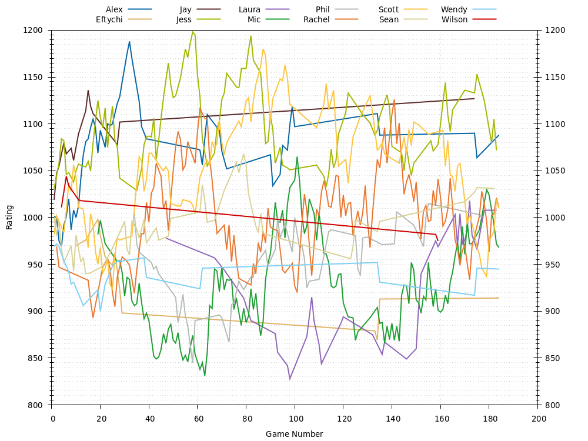
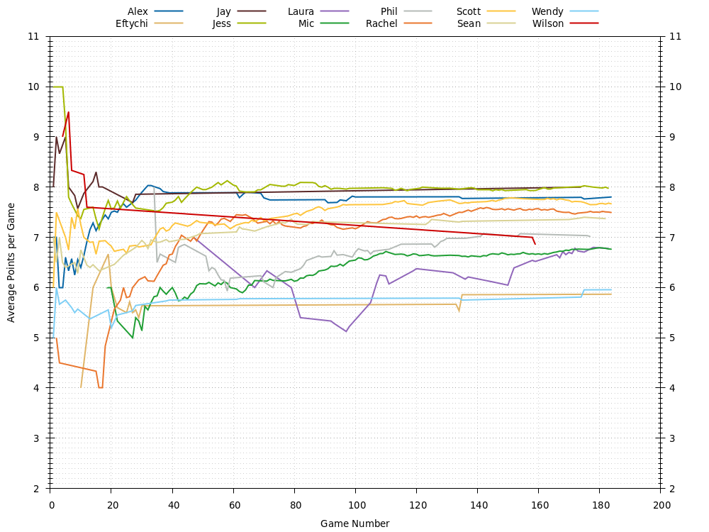
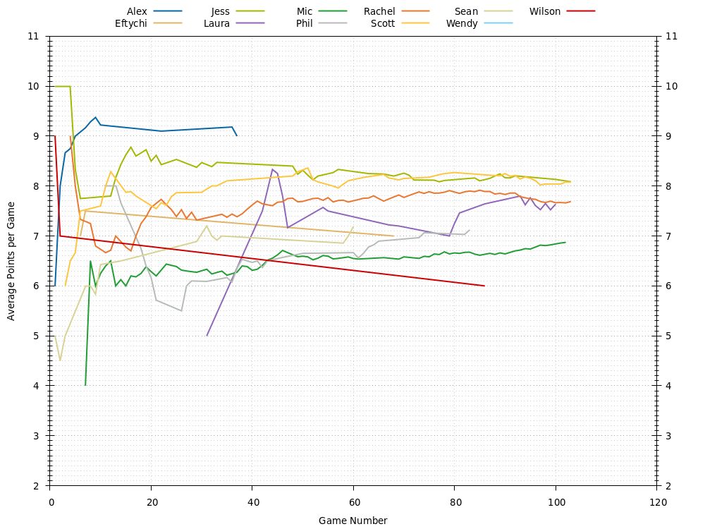
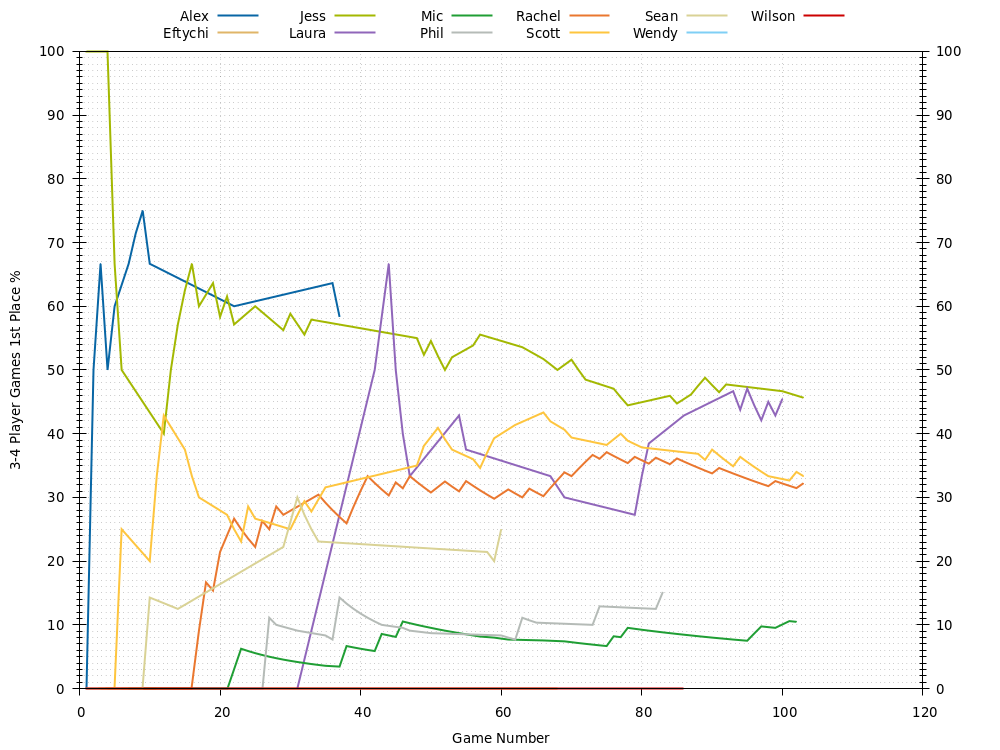
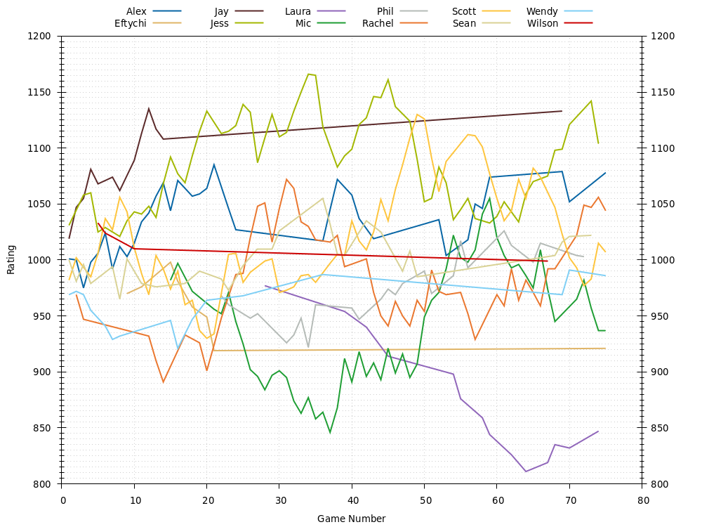
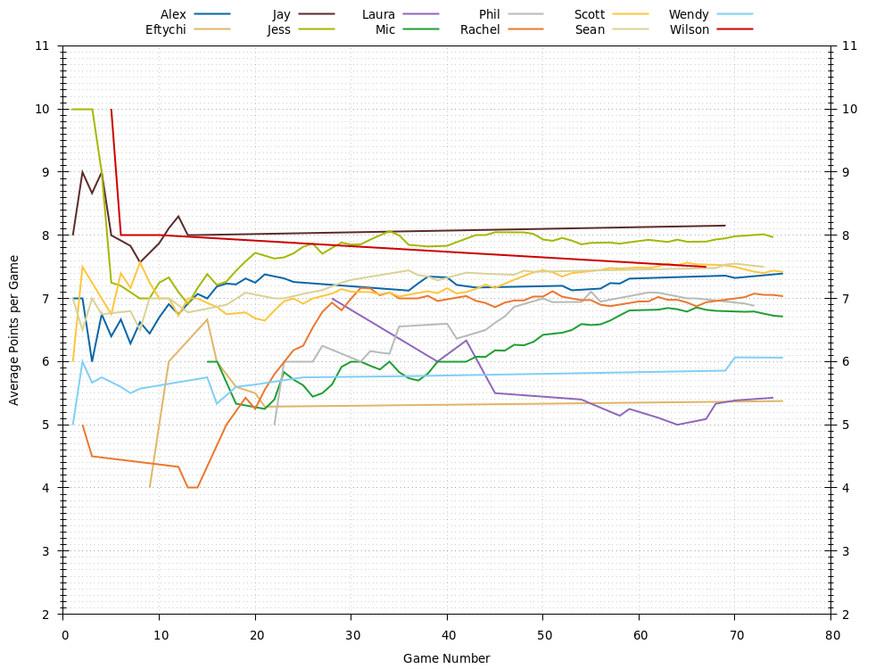

# Catan Leaderboard
Last updated 2020-10-13 02:23 UTC.

## Players

### Players: All Games
| **Player**                     | **Games** | **Rating** | **Points** | **1st Place** | **2nd Place** | **3rd Place** | **1st or 2nd Place** | **1st, 2nd, or 3rd Place** |
| :---                           | :---:     | :---:      | :---:      | :---:         | :---:         | :---:         | :---:                | :---:                      |
| [Alex](Alex/README.md)         | 46        | 1052       | 7.7        | 11 , 24%      | 16 , 35%      | 12 , 26%      | 27 , 59%             | 39 , 85%                   |
| [Eftychi](Eftychi/README.md)   | 11        | 902        | 5.6        | 0 , 0%        | 2 , 18%       | 3 , 27%       | 2 , 18%              | 5 , 45%                    |
| [Jay](Jay/README.md)           | 14        | 1097       | 7.9        | 6 , 43%       | 3 , 21%       | 3 , 21%       | 9 , 64%              | 12 , 86%                   |
| [Jessica](Jessica/README.md)   | 74        | 1080       | 8.0        | 28 , 38%      | 22 , 30%      | 14 , 19%      | 50 , 68%             | 64 , 86%                   |
| [Laura](Laura/README.md)       | 7         | 856        | 5.3        | 0 , 0%        | 0 , 0%        | 1 , 14%       | 0 , 0%               | 1 , 14%                    |
| [Mic](Mic/README.md)           | 70        | 994        | 6.4        | 4 , 6%        | 22 , 31%      | 23 , 33%      | 26 , 37%             | 49 , 70%                   |
| [PA](PA/README.md)             | 1         | 1031       | 10         | 1 , 100%      | 0 , 0%        | 0 , 0%        | 1 , 100%             | 1 , 100%                   |
| [Phil](Phil/README.md)         | 31        | 974        | 6.6        | 3 , 10%       | 9 , 29%       | 15 , 48%      | 12 , 39%             | 27 , 87%                   |
| [Rachel](Rachel/README.md)     | 66        | 968        | 7.2        | 16 , 24%      | 16 , 24%      | 20 , 30%      | 32 , 48%             | 52 , 79%                   |
| [Scott](Scott/README.md)       | 73        | 1145       | 7.6        | 18 , 25%      | 27 , 37%      | 16 , 22%      | 45 , 62%             | 61 , 84%                   |
| [Sean](Sean/README.md)         | 42        | 984        | 7.3        | 6 , 14%       | 15 , 36%      | 10 , 24%      | 21 , 50%             | 31 , 74%                   |
| [Victoria](Victoria/README.md) | 2         | 955        | 3.0        | 0 , 0%        | 0 , 0%        | 0 , 0%        | 0 , 0%               | 0 , 0%                     |
| [Wendy](Wendy/README.md)       | 18        | 942        | 5.8        | 0 , 0%        | 3 , 17%       | 7 , 39%       | 3 , 17%              | 10 , 56%                   |
| [Wilson](Wilson/README.md)     | 5         | 1018       | 7.6        | 1 , 20%       | 2 , 40%       | 1 , 20%       | 3 , 60%              | 4 , 80%                    |

### Players: 3-4 Player Games
| **Player**                   | **Games** | **Rating** | **Points** | **1st Place** | **2nd Place** | **3rd Place** | **1st or 2nd Place** | **1st, 2nd, or 3rd Place** |
| :---                         | :---:     | :---:      | :---:      | :---:         | :---:         | :---:         | :---:                | :---:                      |
| [Alex](Alex/README.md)       | 10        | 1105       | 9.2        | 6 , 60%       | 2 , 20%       | 2 , 20%       | 8 , 80%              | 10 , 100%                  |
| [Eftychi](Eftychi/README.md) | 2         | 1000       | 7.5        | 0 , 0%        | 1 , 50%       | 1 , 50%       | 1 , 50%              | 2 , 100%                   |
| [Jessica](Jessica/README.md) | 19        | 1141       | 8.5        | 11 , 58%      | 5 , 26%       | 2 , 11%       | 16 , 84%             | 18 , 95%                   |
| [Laura](Laura/README.md)     | 1         | 963        | 5.0        | 0 , 0%        | 0 , 0%        | 0 , 0%        | 0 , 0%               | 0 , 0%                     |
| [Mic](Mic/README.md)         | 27        | 871        | 6.3        | 1 , 4%        | 12 , 44%      | 11 , 41%      | 13 , 48%             | 24 , 89%                   |
| [Phil](Phil/README.md)       | 11        | 882        | 6.1        | 1 , 9%        | 3 , 27%       | 6 , 55%       | 4 , 36%              | 10 , 91%                   |
| [Rachel](Rachel/README.md)   | 23        | 988        | 7.5        | 7 , 30%       | 7 , 30%       | 7 , 30%       | 14 , 61%             | 21 , 91%                   |
| [Scott](Scott/README.md)     | 18        | 1095       | 8.1        | 5 , 28%       | 12 , 67%      | 1 , 6%        | 17 , 94%             | 18 , 100%                  |
| [Sean](Sean/README.md)       | 13        | 981        | 7.0        | 3 , 23%       | 5 , 38%       | 2 , 15%       | 8 , 62%              | 10 , 77%                   |
| [Wendy](Wendy/README.md)     | 1         | 968        | 4.0        | 0 , 0%        | 0 , 0%        | 1 , 100%      | 0 , 0%               | 1 , 100%                   |
| [Wilson](Wilson/README.md)   | 2         | 1008       | 7.0        | 0 , 0%        | 2 , 100%      | 0 , 0%        | 2 , 100%             | 2 , 100%                   |

### Players: 5-6 Player Games
| **Player**                     | **Games** | **Rating** | **Points** | **1st Place** | **2nd Place** | **3rd Place** | **1st or 2nd Place** | **1st, 2nd, or 3rd Place** |
| :---                           | :---:     | :---:      | :---:      | :---:         | :---:         | :---:         | :---:                | :---:                      |
| [Alex](Alex/README.md)         | 32        | 1021       | 7.2        | 4 , 12%       | 13 , 41%      | 8 , 25%       | 17 , 53%             | 25 , 78%                   |
| [Eftychi](Eftychi/README.md)   | 7         | 925        | 5.3        | 0 , 0%        | 1 , 14%       | 2 , 29%       | 1 , 14%              | 3 , 43%                    |
| [Jay](Jay/README.md)           | 12        | 1108       | 8.0        | 5 , 42%       | 3 , 25%       | 3 , 25%       | 8 , 67%              | 11 , 92%                   |
| [Jessica](Jessica/README.md)   | 51        | 1059       | 7.9        | 17 , 33%      | 16 , 31%      | 12 , 24%      | 33 , 65%             | 45 , 88%                   |
| [Laura](Laura/README.md)       | 6         | 876        | 5.3        | 0 , 0%        | 0 , 0%        | 1 , 17%       | 0 , 0%               | 1 , 17%                    |
| [Mic](Mic/README.md)           | 39        | 995        | 6.6        | 3 , 8%        | 10 , 26%      | 10 , 26%      | 13 , 33%             | 23 , 59%                   |
| [PA](PA/README.md)             | 1         | 1032       | 10         | 1 , 100%      | 0 , 0%        | 0 , 0%        | 1 , 100%             | 1 , 100%                   |
| [Phil](Phil/README.md)         | 20        | 992        | 7.0        | 2 , 10%       | 6 , 30%       | 9 , 45%       | 8 , 40%              | 17 , 85%                   |
| [Rachel](Rachel/README.md)     | 40        | 952        | 6.9        | 7 , 18%       | 8 , 20%       | 13 , 32%      | 15 , 38%             | 28 , 70%                   |
| [Scott](Scott/README.md)       | 51        | 1108       | 7.5        | 13 , 25%      | 13 , 25%      | 13 , 25%      | 26 , 51%             | 39 , 76%                   |
| [Sean](Sean/README.md)         | 26        | 983        | 7.4        | 3 , 12%       | 9 , 35%       | 7 , 27%       | 12 , 46%             | 19 , 73%                   |
| [Victoria](Victoria/README.md) | 2         | 955        | 3.0        | 0 , 0%        | 0 , 0%        | 0 , 0%        | 0 , 0%               | 0 , 0%                     |
| [Wendy](Wendy/README.md)       | 13        | 984        | 5.8        | 0 , 0%        | 3 , 23%       | 5 , 38%       | 3 , 23%              | 8 , 62%                    |
| [Wilson](Wilson/README.md)     | 3         | 1010       | 8.0        | 1 , 33%       | 0 , 0%        | 1 , 33%       | 1 , 33%              | 2 , 67%                    |

### Players: 7-8 Player Games
| **Player**                   | **Games** | **Rating** | **Points** | **1st Place** | **2nd Place** | **3rd Place** | **1st or 2nd Place** | **1st, 2nd, or 3rd Place** |
| :---                         | :---:     | :---:      | :---:      | :---:         | :---:         | :---:         | :---:                | :---:                      |
| [Alex](Alex/README.md)       | 4         | 1039       | 8.5        | 1 , 25%       | 1 , 25%       | 2 , 50%       | 2 , 50%              | 4 , 100%                   |
| [Eftychi](Eftychi/README.md) | 2         | 954        | 5.0        | 0 , 0%        | 0 , 0%        | 0 , 0%        | 0 , 0%               | 0 , 0%                     |
| [Jay](Jay/README.md)         | 2         | 1005       | 7.0        | 1 , 50%       | 0 , 0%        | 0 , 0%        | 1 , 50%              | 1 , 50%                    |
| [Jessica](Jessica/README.md) | 4         | 985        | 6.8        | 0 , 0%        | 1 , 25%       | 0 , 0%        | 1 , 25%              | 1 , 25%                    |
| [Mic](Mic/README.md)         | 4         | 945        | 5.8        | 0 , 0%        | 0 , 0%        | 2 , 50%       | 0 , 0%               | 2 , 50%                    |
| [Rachel](Rachel/README.md)   | 3         | 1077       | 9.3        | 2 , 67%       | 1 , 33%       | 0 , 0%        | 3 , 100%             | 3 , 100%                   |
| [Scott](Scott/README.md)     | 4         | 1043       | 7.8        | 0 , 0%        | 2 , 50%       | 2 , 50%       | 2 , 50%              | 4 , 100%                   |
| [Sean](Sean/README.md)       | 3         | 998        | 7.7        | 0 , 0%        | 1 , 33%       | 1 , 33%       | 1 , 33%              | 2 , 67%                    |
| [Wendy](Wendy/README.md)     | 4         | 954        | 6.2        | 0 , 0%        | 0 , 0%        | 1 , 25%       | 0 , 0%               | 1 , 25%                    |

## All Games

### All Games: Ratings

### All Games: Average Points per Game

### All Games: 1st Places

### All Games: 2nd Places

### All Games: 3rd Places

## 3-4 Player Games

### 3-4 Player Games: Ratings

### 3-4 Player Games: Average Points per Game

### 3-4 Player Games: 1st Places

### 3-4 Player Games: 2nd Places

### 3-4 Player Games: 3rd Places

## 5-6 Player Games

### 5-6 Player Games: Ratings

### 5-6 Player Games: Average Points per Game

### 5-6 Player Games: 1st Places

### 5-6 Player Games: 2nd Places

### 5-6 Player Games: 3rd Places

## 7-8 Player Games

### 7-8 Player Games: Ratings

### 7-8 Player Games: Average Points per Game

### 7-8 Player Games: 1st Places

### 7-8 Player Games: 2nd Places

### 7-8 Player Games: 3rd Places

## Game History

### Game History: All Games
| **Game** | **Date**   | **Players** | **Results**                                                                                                    |
| :---:    | :---:      | :---:       | :---                                                                                                           |
| 94       | 2020-10-12 | 6           | 1st Scott 10 , 2nd Alex 8 , 2nd Jessica 8 , 3rd Mic 7 , 4th Phil 4 , 4th Rachel 4                              |
| 93       | 2020-10-11 | 5           | 1st Phil 10 , 2nd Jessica 9 , 3rd Rachel 7 , 4th Mic 6 , 5th Laura 5                                           |
| 92       | 2020-10-11 | 5           | 1st Mic 10 , 2nd Phil 7 , 3rd Rachel 6 , 4th Jessica 5 , 4th Laura 5                                           |
| 91       | 2020-10-10 | 5           | 1st Jessica 10 , 2nd Alex 8 , 3rd Mic 7 , 4th Scott 4 , 4th Rachel 4                                           |
| 90       | 2020-10-10 | 5           | 1st Scott 10 , 2nd Mic 8 , 3rd Rachel 6 , 3rd Jessica 6 , 4th Alex 5                                           |
| 89       | 2020-10-06 | 5           | 1st Rachel 10 , 2nd Mic 7 , 2nd Jessica 7 , 3rd Scott 6 , 3rd Phil 6                                           |
| 88       | 2020-10-06 | 5           | 1st Mic 10 , 2nd Phil 9 , 2nd Scott 9 , 3rd Rachel 7 , 4th Jessica 4                                           |
| 87       | 2020-10-02 | 5           | 1st Scott 10 , 2nd Rachel 9 , 3rd Mic 8 , 4th Sean 7 , 4th Jessica 7                                           |
| 86       | 2020-10-02 | 5           | 1st Scott 10 , 2nd Sean 9 , 3rd Jessica 8 , 4th Rachel 7 , 5th Mic 6                                           |
| 85       | 2020-10-02 | 3           | 1st Rachel 11 , 2nd Sean 8 , 3rd Mic 7                                                                         |
| 84       | 2020-09-30 | 5           | 1st Scott 10 , 2nd Rachel 9 , 3rd Jessica 8 , 3rd Phil 8 , 4th Mic 6                                           |
| 83       | 2020-09-30 | 5           | 1st Scott 10 , 2nd Phil 9 , 2nd Mic 9 , 3rd Rachel 8 , 4th Sean 7                                              |
| 82       | 2020-09-29 | 6           | 1st Jessica 10 , 2nd Mic 9 , 3rd Phil 8 , 4th Scott 5 , 4th Rachel 5 , 5th Laura 3                             |
| 81       | 2020-09-28 | 4           | 1st Jessica 10 , 2nd Scott 8 , 3rd Mic 7 , 4th Sean 6                                                          |
| 80       | 2020-09-28 | 4           | 1st Scott 10 , 2nd Jessica 7 , 3rd Sean 5 , 4th Mic 4                                                          |
| 79       | 2020-09-27 | 4           | 1st Sean 10 , 2nd Mic 7 , 3rd Phil 6 , 4th Laura 5                                                             |
| 78       | 2020-09-25 | 3           | 1st Jessica 11 , 2nd Scott 8 , 3rd Mic 7                                                                       |
| 77       | 2020-09-23 | 6           | 1st Scott 10 , 2nd Jessica 8 , 2nd Phil 8 , 3rd Sean 7 , 4th Mic 6 , 4th Rachel 6                              |
| 76       | 2020-09-23 | 4           | 1st Sean 10 , 2nd Jessica 6 , 2nd Mic 6 , 3rd Rachel 4                                                         |
| 75       | 2020-09-22 | 3           | 1st Rachel 10 , 2nd Mic 5 , 3rd Phil 4                                                                         |
| 74       | 2020-09-22 | 3           | 1st Rachel 10 , 2nd Phil 7 , 3rd Mic 6                                                                         |
| 73       | 2020-09-22 | 3           | 1st Phil 10 , 2nd Mic 6 , 3rd Rachel 4                                                                         |
| 72       | 2020-09-21 | 5           | 1st Jessica 10 , 2nd Scott 9 , 3rd Mic 8 , 4th Alex 6 , 5th Rachel 5                                           |
| 71       | 2020-09-17 | 6           | 1st Sean 10 , 2nd Jessica 10 , 3rd Rachel 9 , 4th Scott 8 , 5th Laura 7 , 6th Mic 6                            |
| 70       | 2020-09-14 | 5           | 1st Jessica 10 , 2nd Mic 6 , 3rd Alex 4 , 3rd Phil 4 , 3rd Scott 4                                             |
| 69       | 2020-09-14 | 5           | 1st Scott 10 , 2nd Jessica 8 , 3rd Alex 7 , 3rd Phil 7 , 4th Mic 6                                             |
| 68       | 2020-09-11 | 4           | 1st Jessica 10 , 2nd Scott 9 , 3rd Mic 6 , 4th Rachel 5                                                        |
| 67       | 2020-09-11 | 6           | 1st Mic 10 , 2nd Jessica 8 , 3rd Sean 6 , 3rd Scott 6 , 4th Rachel 5 , 4th Laura 5                             |
| 66       | 2020-09-10 | 3           | 1st Scott 11 , 2nd Mic 6 , 2nd Rachel 6                                                                        |
| 65       | 2020-09-10 | 3           | 1st Mic 10 , 2nd Scott 7 , 3rd Rachel 6                                                                        |
| 64       | 2020-09-07 | 6           | 1st Alex 10 , 2nd Scott 8 , 2nd Rachel 8 , 2nd Mic 8 , 3rd Jessica 7 , 3rd Sean 7                              |
| 63       | 2020-09-07 | 5           | 1st Alex 10 , 2nd Scott 9 , 3rd Rachel 7 , 4th Sean 6 , 5th Mic 5                                              |
| 62       | 2020-09-04 | 4           | 1st Rachel 10 , 2nd Scott 9 , 3rd Alex 8 , 4th Jessica 6                                                       |
| 61       | 2020-09-04 | 7           | 1st Rachel 10 , 2nd Scott 9 , 3rd Alex 8 , 3rd Sean 8 , 4th Jessica 7 , 5th Wendy 6 , 6th Mic 5                |
| 60       | 2020-09-04 | 5           | 1st Sean 10 , 2nd Wendy 6 , 3rd Alex 4 , 3rd Mic 4 , 4th Jessica 3                                             |
| 59       | 2020-09-02 | 5           | 1st Phil 10 , 2nd Jessica 6 , 3rd Scott 5 , 3rd Rachel 5 , 4th Mic 3                                           |
| 58       | 2020-09-02 | 4           | 1st Jessica 10 , 2nd Scott 5 , 2nd Mic 5 , 3rd Phil 3                                                          |
| 57       | 2020-09-02 | 5           | 1st Jessica 10 , 2nd Scott 8 , 2nd Rachel 8 , 2nd Mic 8 , 3rd Phil 6                                           |
| 56       | 2020-09-01 | 4           | 1st Jessica 10 , 2nd Rachel 9 , 3rd Mic 8 , 4th Phil 5                                                         |
| 55       | 2020-09-01 | 4           | 1st Rachel 10 , 2nd Jessica 6 , 3rd Mic 5 , 3rd Phil 5                                                         |
| 54       | 2020-08-31 | 5           | 1st Jessica 10 , 2nd Scott 6 , 2nd Phil 6 , 3rd Mic 5 , 3rd Rachel 5                                           |
| 53       | 2020-08-31 | 5           | 1st Jessica 10 , 2nd Rachel 7 , 2nd Scott 7 , 2nd Phil 7 , 3rd Mic 5                                           |
| 52       | 2020-08-31 | 3           | 1st Rachel 10 , 2nd Mic 7 , 3rd Phil 4                                                                         |
| 51       | 2020-08-28 | 5           | 1st Rachel 10 , 2nd Jessica 8 , 3rd Scott 7 , 4th Mic 6 , 5th Phil 5                                           |
| 50       | 2020-08-28 | 4           | 1st Rachel 11 , 2nd Jessica 7 , 2nd Scott 7 , 3rd Mic 6                                                        |
| 49       | 2020-08-22 | 5           | 1st Jessica 10 , 2nd Scott 9 , 2nd Rachel 9 , 3rd Laura 7 , 3rd Mic 7                                          |
| 48       | 2020-08-22 | 5           | 1st Jessica 10 , 2nd Scott 9 , 2nd Sean 9 , 2nd Mic 9 , 3rd Rachel 5                                           |
| 47       | 2020-08-22 | 5           | 1st Rachel 10 , 2nd Sean 8 , 3rd Jessica 7 , 3rd Mic 7 , 4th Scott 6                                           |
| 46       | 2020-08-19 | 4           | 1st Jessica 10 , 2nd Scott 5 , 2nd Mic 5 , 2nd Rachel 5                                                        |
| 45       | 2020-08-19 | 4           | 1st Jessica 10 , 2nd Scott 8 , 2nd Mic 8 , 3rd Rachel 6                                                        |
| 44       | 2020-08-17 | 4           | 1st Jessica 10 , 2nd Sean 7 , 2nd Phil 7 , 2nd Mic 7                                                           |
| 43       | 2020-08-17 | 5           | 1st Rachel 10 , 2nd Sean 8 , 3rd Phil 7 , 4th Mic 6 , 5th Jessica 4                                            |
| 42       | 2020-08-17 | 4           | 1st Jessica 10 , 2nd Rachel 9 , 3rd Phil 8 , 4th Mic 3                                                         |
| 41       | 2020-08-11 | 5           | 1st Rachel 10 , 2nd Jessica 9 , 2nd Scott 9 , 3rd Phil 6 , 4th Mic 4                                           |
| 40       | 2020-08-11 | 4           | 1st Scott 10 , 2nd Jessica 8 , 3rd Rachel 7 , 3rd Mic 7                                                        |
| 39       | 2020-08-07 | 5           | 1st Rachel 10 , 2nd Jessica 9 , 3rd Scott 8 , 4th Alex 6 , 5th Mic 5                                           |
| 38       | 2020-08-07 | 7           | 1st Rachel 10 , 2nd Jessica 8 , 2nd Scott 8 , 3rd Alex 7 , 3rd Mic 7 , 4th Sean 6 , 4th Wendy 6                |
| 37       | 2020-08-07 | 6           | 1st Jessica 10 , 2nd Sean 8 , 3rd Wendy 7 , 3rd Rachel 7 , 4th Scott 5 , 4th Mic 5                             |
| 36       | 2020-08-05 | 6           | 1st Scott 10 , 2nd Jessica 8 , 2nd Mic 8 , 3rd Sean 7 , 3rd Phil 7 , 4th Alex 6                                |
| 35       | 2020-08-05 | 6           | 1st Scott 10 , 2nd Rachel 8 , 3rd Sean 6 , 3rd Jessica 6 , 3rd Mic 6 , 4th Phil 5                              |
| 34       | 2020-07-29 | 4           | 1st Scott 10 , 2nd Phil 8 , 3rd Mic 7 , 4th Rachel 6                                                           |
| 33       | 2020-07-26 | 4           | 1st Sean 10 , 2nd Alex 8 , 2nd Scott 8 , 3rd Mic 7                                                             |
| 32       | 2020-07-25 | 4           | 1st Alex 10 , 2nd Sean 9 , 3rd Eftychi 8 , 4th Mic 4                                                           |
| 31       | 2020-07-25 | 4           | 1st Alex 10 , 2nd Mic 9 , 3rd Rachel 7 , 4th Sean 6                                                            |
| 30       | 2020-07-25 | 4           | 1st Alex 10 , 2nd Sean 5 , 2nd Rachel 5 , 2nd Mic 5                                                            |
| 29       | 2020-07-18 | 5           | 1st Alex 10 , 2nd Rachel 8 , 3rd Scott 6 , 4th Mic 5 , 5th Eftychi 4                                           |
| 28       | 2020-07-04 | 8           | 1st Alex 10 , 2nd Rachel 8 , 3rd Scott 7 , 4th Jessica 6 , 4th Wendy 6 , 5th Eftychi 4 , 5th Jay 4 , 5th Mic 4 |
| 27       | 2020-07-04 | 8           | 1st Jay 10 , 2nd Alex 9 , 2nd Sean 9 , 3rd Scott 7 , 3rd Wendy 7 , 3rd Mic 7 , 4th Jessica 6 , 4th Eftychi 6   |
| 26       | 2020-07-04 | 4           | 1st Scott 10 , 2nd Eftychi 7 , 3rd Jessica 6 , 3rd Rachel 6                                                    |
| 25       | 2020-07-03 | 6           | 1st Jessica 10 , 2nd Alex 6 , 2nd Wendy 6 , 3rd Scott 5 , 3rd Eftychi 5 , 4th Rachel 4                         |
| 24       | 2020-07-03 | 5           | 1st Jessica 10 , 2nd Alex 9 , 2nd Sean 9 , 3rd Rachel 8 , 4th Scott 7                                          |
| 23       | 2020-07-03 | 4           | 1st Alex 10 , 2nd Rachel 7 , 2nd Scott 7 , 3rd Jessica 5                                                       |
| 22       | 2020-06-20 | 6           | 1st Jessica 10 , 2nd Eftychi 8 , 3rd Wendy 7 , 4th Alex 6 , 4th Scott 6 , 4th Mic 6                            |
| 21       | 2020-06-20 | 6           | 1st Alex 10 , 2nd Scott 6 , 2nd Mic 6 , 3rd Jessica 5 , 4th Eftychi 4 , 5th Wendy 2                            |
| 20       | 2020-06-20 | 6           | 1st Jessica 10 , 2nd Wendy 8 , 3rd Alex 7 , 3rd Scott 7 , 4th Eftychi 4 , 4th Mic 4                            |
| 19       | 2020-06-20 | 5           | 1st Rachel 10 , 2nd Alex 8 , 2nd Jessica 8 , 2nd Sean 8 , 3rd Scott 5                                          |
| 18       | 2020-06-13 | 4           | 1st Jessica 10 , 2nd Alex 9 , 2nd Rachel 9 , 3rd Scott 7                                                       |
| 17       | 2020-06-13 | 5           | 1st Jessica 10 , 2nd Alex 9 , 3rd Jay 8 , 4th Scott 7 , 5th Rachel 4                                           |
| 16       | 2020-06-06 | 6           | 1st Scott 10 , 2nd Alex 9 , 3rd Jay 5 , 3rd Jessica 5 , 3rd Sean 5 , 4th Rachel 3                              |
| 15       | 2020-06-06 | 5           | 1st Jay 10 , 2nd Alex 5 , 2nd Jessica 5 , 3rd Scott 4 , 3rd Rachel 4                                           |
| 14       | 2020-01-19 | 6           | 1st Jay 10 , 2nd Alex 9 , 3rd Jessica 8 , 3rd Eftychi 8 , 4th Sean 7 , 4th Scott 7                             |
| 13       | 2019-09-22 | 4           | 1st Alex 10 , 2nd Sean 6 , 2nd Scott 6 , 3rd Wendy 4                                                           |
| 12       | 2019-03-10 | 3           | 1st Alex 11 , 2nd Wilson 5 , 3rd Sean 4                                                                        |
| 11       | 2018-09-01 | 5           | 1st Jay 10 , 2nd Alex 9 , 2nd Jessica 9 , 3rd Wilson 8 , 4th Scott 5                                           |
| 10       | 2018-01-14 | 5           | 1st Sean 10 , 2nd Jessica 7 , 3rd Alex 5 , 3rd Scott 5 , 4th Eftychi 4                                         |
| 9        | 2017-10-08 | 6           | 1st Scott 10 , 2nd Alex 9 , 3rd Jay 6 , 3rd Jessica 6 , 3rd Wendy 6 , 4th Sean 5                               |
| 8        | 2017-08-25 | 6           | 1st PA 10 , 2nd Jay 7 , 2nd Sean 7 , 3rd Scott 6 , 4th Wendy 5 , 5th Alex 4                                    |
| 7        | 2017-06-10 | 6           | 1st Scott 10 , 2nd Alex 8 , 3rd Jessica 7 , 4th Wilson 6 , 5th Wendy 5 , 6th Victoria 3                        |
| 6        | 2017-06-10 | 6           | 1st Wilson 10 , 2nd Scott 6 , 3rd Alex 5 , 4th Jay 4 , 5th Victoria 3 , 6th Jessica 2                          |
| 5        | 2017-06-10 | 6           | 1st Jay 10 , 2nd Alex 9 , 3rd Jessica 7 , 4th Scott 6 , 4th Sean 6 , 4th Wendy 6                               |
| 4        | 2017-05-06 | 4           | 1st Jessica 10 , 2nd Wilson 9 , 3rd Alex 6 , 4th Sean 5                                                        |
| 3        | 2017-04-01 | 6           | 1st Jessica 10 , 2nd Jay 8 , 2nd Sean 8 , 3rd Wendy 5 , 4th Alex 4 , 4th Rachel 4                              |
| 2        | 2017-03-31 | 6           | 1st Jay 10 , 2nd Scott 9 , 3rd Alex 7 , 3rd Wendy 7 , 4th Sean 6 , 5th Rachel 5                                |
| 1        | 2017-03-17 | 6           | 1st Jessica 10 , 2nd Jay 8 , 3rd Alex 7 , 3rd Sean 7 , 4th Scott 6 , 5th Wendy 5                               |

### Game History: 3-4 Player Games
| **Game** | **Date**   | **Players** | **Results**                                                 |
| :---:    | :---:      | :---:       | :---                                                        |
| 34       | 2020-10-02 | 3           | 1st Rachel 11 , 2nd Sean 8 , 3rd Mic 7                      |
| 33       | 2020-09-28 | 4           | 1st Jessica 10 , 2nd Scott 8 , 3rd Mic 7 , 4th Sean 6       |
| 32       | 2020-09-28 | 4           | 1st Scott 10 , 2nd Jessica 7 , 3rd Sean 5 , 4th Mic 4       |
| 31       | 2020-09-27 | 4           | 1st Sean 10 , 2nd Mic 7 , 3rd Phil 6 , 4th Laura 5          |
| 30       | 2020-09-25 | 3           | 1st Jessica 11 , 2nd Scott 8 , 3rd Mic 7                    |
| 29       | 2020-09-23 | 4           | 1st Sean 10 , 2nd Jessica 6 , 2nd Mic 6 , 3rd Rachel 4      |
| 28       | 2020-09-22 | 3           | 1st Rachel 10 , 2nd Mic 5 , 3rd Phil 4                      |
| 27       | 2020-09-22 | 3           | 1st Rachel 10 , 2nd Phil 7 , 3rd Mic 6                      |
| 26       | 2020-09-22 | 3           | 1st Phil 10 , 2nd Mic 6 , 3rd Rachel 4                      |
| 25       | 2020-09-11 | 4           | 1st Jessica 10 , 2nd Scott 9 , 3rd Mic 6 , 4th Rachel 5     |
| 24       | 2020-09-10 | 3           | 1st Scott 11 , 2nd Mic 6 , 2nd Rachel 6                     |
| 23       | 2020-09-10 | 3           | 1st Mic 10 , 2nd Scott 7 , 3rd Rachel 6                     |
| 22       | 2020-09-04 | 4           | 1st Rachel 10 , 2nd Scott 9 , 3rd Alex 8 , 4th Jessica 6    |
| 21       | 2020-09-02 | 4           | 1st Jessica 10 , 2nd Scott 5 , 2nd Mic 5 , 3rd Phil 3       |
| 20       | 2020-09-01 | 4           | 1st Jessica 10 , 2nd Rachel 9 , 3rd Mic 8 , 4th Phil 5      |
| 19       | 2020-09-01 | 4           | 1st Rachel 10 , 2nd Jessica 6 , 3rd Mic 5 , 3rd Phil 5      |
| 18       | 2020-08-31 | 3           | 1st Rachel 10 , 2nd Mic 7 , 3rd Phil 4                      |
| 17       | 2020-08-28 | 4           | 1st Rachel 11 , 2nd Jessica 7 , 2nd Scott 7 , 3rd Mic 6     |
| 16       | 2020-08-19 | 4           | 1st Jessica 10 , 2nd Scott 5 , 2nd Mic 5 , 2nd Rachel 5     |
| 15       | 2020-08-19 | 4           | 1st Jessica 10 , 2nd Scott 8 , 2nd Mic 8 , 3rd Rachel 6     |
| 14       | 2020-08-17 | 4           | 1st Jessica 10 , 2nd Sean 7 , 2nd Phil 7 , 2nd Mic 7        |
| 13       | 2020-08-17 | 4           | 1st Jessica 10 , 2nd Rachel 9 , 3rd Phil 8 , 4th Mic 3      |
| 12       | 2020-08-11 | 4           | 1st Scott 10 , 2nd Jessica 8 , 3rd Rachel 7 , 3rd Mic 7     |
| 11       | 2020-07-29 | 4           | 1st Scott 10 , 2nd Phil 8 , 3rd Mic 7 , 4th Rachel 6        |
| 10       | 2020-07-26 | 4           | 1st Sean 10 , 2nd Alex 8 , 2nd Scott 8 , 3rd Mic 7          |
| 9        | 2020-07-25 | 4           | 1st Alex 10 , 2nd Sean 9 , 3rd Eftychi 8 , 4th Mic 4        |
| 8        | 2020-07-25 | 4           | 1st Alex 10 , 2nd Mic 9 , 3rd Rachel 7 , 4th Sean 6         |
| 7        | 2020-07-25 | 4           | 1st Alex 10 , 2nd Sean 5 , 2nd Rachel 5 , 2nd Mic 5         |
| 6        | 2020-07-04 | 4           | 1st Scott 10 , 2nd Eftychi 7 , 3rd Jessica 6 , 3rd Rachel 6 |
| 5        | 2020-07-03 | 4           | 1st Alex 10 , 2nd Rachel 7 , 2nd Scott 7 , 3rd Jessica 5    |
| 4        | 2020-06-13 | 4           | 1st Jessica 10 , 2nd Alex 9 , 2nd Rachel 9 , 3rd Scott 7    |
| 3        | 2019-09-22 | 4           | 1st Alex 10 , 2nd Sean 6 , 2nd Scott 6 , 3rd Wendy 4        |
| 2        | 2019-03-10 | 3           | 1st Alex 11 , 2nd Wilson 5 , 3rd Sean 4                     |
| 1        | 2017-05-06 | 4           | 1st Jessica 10 , 2nd Wilson 9 , 3rd Alex 6 , 4th Sean 5     |

### Game History: 5-6 Player Games
| **Game** | **Date**   | **Players** | **Results**                                                                             |
| :---:    | :---:      | :---:       | :---                                                                                    |
| 56       | 2020-10-12 | 6           | 1st Scott 10 , 2nd Alex 8 , 2nd Jessica 8 , 3rd Mic 7 , 4th Phil 4 , 4th Rachel 4       |
| 55       | 2020-10-11 | 5           | 1st Phil 10 , 2nd Jessica 9 , 3rd Rachel 7 , 4th Mic 6 , 5th Laura 5                    |
| 54       | 2020-10-11 | 5           | 1st Mic 10 , 2nd Phil 7 , 3rd Rachel 6 , 4th Jessica 5 , 4th Laura 5                    |
| 53       | 2020-10-10 | 5           | 1st Jessica 10 , 2nd Alex 8 , 3rd Mic 7 , 4th Scott 4 , 4th Rachel 4                    |
| 52       | 2020-10-10 | 5           | 1st Scott 10 , 2nd Mic 8 , 3rd Rachel 6 , 3rd Jessica 6 , 4th Alex 5                    |
| 51       | 2020-10-06 | 5           | 1st Rachel 10 , 2nd Mic 7 , 2nd Jessica 7 , 3rd Scott 6 , 3rd Phil 6                    |
| 50       | 2020-10-06 | 5           | 1st Mic 10 , 2nd Phil 9 , 2nd Scott 9 , 3rd Rachel 7 , 4th Jessica 4                    |
| 49       | 2020-10-02 | 5           | 1st Scott 10 , 2nd Rachel 9 , 3rd Mic 8 , 4th Sean 7 , 4th Jessica 7                    |
| 48       | 2020-10-02 | 5           | 1st Scott 10 , 2nd Sean 9 , 3rd Jessica 8 , 4th Rachel 7 , 5th Mic 6                    |
| 47       | 2020-09-30 | 5           | 1st Scott 10 , 2nd Rachel 9 , 3rd Jessica 8 , 3rd Phil 8 , 4th Mic 6                    |
| 46       | 2020-09-30 | 5           | 1st Scott 10 , 2nd Phil 9 , 2nd Mic 9 , 3rd Rachel 8 , 4th Sean 7                       |
| 45       | 2020-09-29 | 6           | 1st Jessica 10 , 2nd Mic 9 , 3rd Phil 8 , 4th Scott 5 , 4th Rachel 5 , 5th Laura 3      |
| 44       | 2020-09-23 | 6           | 1st Scott 10 , 2nd Jessica 8 , 2nd Phil 8 , 3rd Sean 7 , 4th Mic 6 , 4th Rachel 6       |
| 43       | 2020-09-21 | 5           | 1st Jessica 10 , 2nd Scott 9 , 3rd Mic 8 , 4th Alex 6 , 5th Rachel 5                    |
| 42       | 2020-09-17 | 6           | 1st Sean 10 , 2nd Jessica 10 , 3rd Rachel 9 , 4th Scott 8 , 5th Laura 7 , 6th Mic 6     |
| 41       | 2020-09-14 | 5           | 1st Jessica 10 , 2nd Mic 6 , 3rd Alex 4 , 3rd Phil 4 , 3rd Scott 4                      |
| 40       | 2020-09-14 | 5           | 1st Scott 10 , 2nd Jessica 8 , 3rd Alex 7 , 3rd Phil 7 , 4th Mic 6                      |
| 39       | 2020-09-11 | 6           | 1st Mic 10 , 2nd Jessica 8 , 3rd Sean 6 , 3rd Scott 6 , 4th Rachel 5 , 4th Laura 5      |
| 38       | 2020-09-07 | 6           | 1st Alex 10 , 2nd Scott 8 , 2nd Rachel 8 , 2nd Mic 8 , 3rd Jessica 7 , 3rd Sean 7       |
| 37       | 2020-09-07 | 5           | 1st Alex 10 , 2nd Scott 9 , 3rd Rachel 7 , 4th Sean 6 , 5th Mic 5                       |
| 36       | 2020-09-04 | 5           | 1st Sean 10 , 2nd Wendy 6 , 3rd Alex 4 , 3rd Mic 4 , 4th Jessica 3                      |
| 35       | 2020-09-02 | 5           | 1st Phil 10 , 2nd Jessica 6 , 3rd Scott 5 , 3rd Rachel 5 , 4th Mic 3                    |
| 34       | 2020-09-02 | 5           | 1st Jessica 10 , 2nd Scott 8 , 2nd Rachel 8 , 2nd Mic 8 , 3rd Phil 6                    |
| 33       | 2020-08-31 | 5           | 1st Jessica 10 , 2nd Scott 6 , 2nd Phil 6 , 3rd Mic 5 , 3rd Rachel 5                    |
| 32       | 2020-08-31 | 5           | 1st Jessica 10 , 2nd Rachel 7 , 2nd Scott 7 , 2nd Phil 7 , 3rd Mic 5                    |
| 31       | 2020-08-28 | 5           | 1st Rachel 10 , 2nd Jessica 8 , 3rd Scott 7 , 4th Mic 6 , 5th Phil 5                    |
| 30       | 2020-08-22 | 5           | 1st Jessica 10 , 2nd Scott 9 , 2nd Rachel 9 , 3rd Laura 7 , 3rd Mic 7                   |
| 29       | 2020-08-22 | 5           | 1st Jessica 10 , 2nd Scott 9 , 2nd Sean 9 , 2nd Mic 9 , 3rd Rachel 5                    |
| 28       | 2020-08-22 | 5           | 1st Rachel 10 , 2nd Sean 8 , 3rd Jessica 7 , 3rd Mic 7 , 4th Scott 6                    |
| 27       | 2020-08-17 | 5           | 1st Rachel 10 , 2nd Sean 8 , 3rd Phil 7 , 4th Mic 6 , 5th Jessica 4                     |
| 26       | 2020-08-11 | 5           | 1st Rachel 10 , 2nd Jessica 9 , 2nd Scott 9 , 3rd Phil 6 , 4th Mic 4                    |
| 25       | 2020-08-07 | 5           | 1st Rachel 10 , 2nd Jessica 9 , 3rd Scott 8 , 4th Alex 6 , 5th Mic 5                    |
| 24       | 2020-08-07 | 6           | 1st Jessica 10 , 2nd Sean 8 , 3rd Wendy 7 , 3rd Rachel 7 , 4th Scott 5 , 4th Mic 5      |
| 23       | 2020-08-05 | 6           | 1st Scott 10 , 2nd Jessica 8 , 2nd Mic 8 , 3rd Sean 7 , 3rd Phil 7 , 4th Alex 6         |
| 22       | 2020-08-05 | 6           | 1st Scott 10 , 2nd Rachel 8 , 3rd Sean 6 , 3rd Jessica 6 , 3rd Mic 6 , 4th Phil 5       |
| 21       | 2020-07-18 | 5           | 1st Alex 10 , 2nd Rachel 8 , 3rd Scott 6 , 4th Mic 5 , 5th Eftychi 4                    |
| 20       | 2020-07-03 | 6           | 1st Jessica 10 , 2nd Alex 6 , 2nd Wendy 6 , 3rd Scott 5 , 3rd Eftychi 5 , 4th Rachel 4  |
| 19       | 2020-07-03 | 5           | 1st Jessica 10 , 2nd Alex 9 , 2nd Sean 9 , 3rd Rachel 8 , 4th Scott 7                   |
| 18       | 2020-06-20 | 6           | 1st Jessica 10 , 2nd Eftychi 8 , 3rd Wendy 7 , 4th Alex 6 , 4th Scott 6 , 4th Mic 6     |
| 17       | 2020-06-20 | 6           | 1st Alex 10 , 2nd Scott 6 , 2nd Mic 6 , 3rd Jessica 5 , 4th Eftychi 4 , 5th Wendy 2     |
| 16       | 2020-06-20 | 6           | 1st Jessica 10 , 2nd Wendy 8 , 3rd Alex 7 , 3rd Scott 7 , 4th Eftychi 4 , 4th Mic 4     |
| 15       | 2020-06-20 | 5           | 1st Rachel 10 , 2nd Alex 8 , 2nd Jessica 8 , 2nd Sean 8 , 3rd Scott 5                   |
| 14       | 2020-06-13 | 5           | 1st Jessica 10 , 2nd Alex 9 , 3rd Jay 8 , 4th Scott 7 , 5th Rachel 4                    |
| 13       | 2020-06-06 | 6           | 1st Scott 10 , 2nd Alex 9 , 3rd Jay 5 , 3rd Jessica 5 , 3rd Sean 5 , 4th Rachel 3       |
| 12       | 2020-06-06 | 5           | 1st Jay 10 , 2nd Alex 5 , 2nd Jessica 5 , 3rd Scott 4 , 3rd Rachel 4                    |
| 11       | 2020-01-19 | 6           | 1st Jay 10 , 2nd Alex 9 , 3rd Jessica 8 , 3rd Eftychi 8 , 4th Sean 7 , 4th Scott 7      |
| 10       | 2018-09-01 | 5           | 1st Jay 10 , 2nd Alex 9 , 2nd Jessica 9 , 3rd Wilson 8 , 4th Scott 5                    |
| 9        | 2018-01-14 | 5           | 1st Sean 10 , 2nd Jessica 7 , 3rd Alex 5 , 3rd Scott 5 , 4th Eftychi 4                  |
| 8        | 2017-10-08 | 6           | 1st Scott 10 , 2nd Alex 9 , 3rd Jay 6 , 3rd Jessica 6 , 3rd Wendy 6 , 4th Sean 5        |
| 7        | 2017-08-25 | 6           | 1st PA 10 , 2nd Jay 7 , 2nd Sean 7 , 3rd Scott 6 , 4th Wendy 5 , 5th Alex 4             |
| 6        | 2017-06-10 | 6           | 1st Scott 10 , 2nd Alex 8 , 3rd Jessica 7 , 4th Wilson 6 , 5th Wendy 5 , 6th Victoria 3 |
| 5        | 2017-06-10 | 6           | 1st Wilson 10 , 2nd Scott 6 , 3rd Alex 5 , 4th Jay 4 , 5th Victoria 3 , 6th Jessica 2   |
| 4        | 2017-06-10 | 6           | 1st Jay 10 , 2nd Alex 9 , 3rd Jessica 7 , 4th Scott 6 , 4th Sean 6 , 4th Wendy 6        |
| 3        | 2017-04-01 | 6           | 1st Jessica 10 , 2nd Jay 8 , 2nd Sean 8 , 3rd Wendy 5 , 4th Alex 4 , 4th Rachel 4       |
| 2        | 2017-03-31 | 6           | 1st Jay 10 , 2nd Scott 9 , 3rd Alex 7 , 3rd Wendy 7 , 4th Sean 6 , 5th Rachel 5         |
| 1        | 2017-03-17 | 6           | 1st Jessica 10 , 2nd Jay 8 , 3rd Alex 7 , 3rd Sean 7 , 4th Scott 6 , 5th Wendy 5        |

### Game History: 7-8 Player Games
| **Game** | **Date**   | **Players** | **Results**                                                                                                    |
| :---:    | :---:      | :---:       | :---                                                                                                           |
| 4        | 2020-09-04 | 7           | 1st Rachel 10 , 2nd Scott 9 , 3rd Alex 8 , 3rd Sean 8 , 4th Jessica 7 , 5th Wendy 6 , 6th Mic 5                |
| 3        | 2020-08-07 | 7           | 1st Rachel 10 , 2nd Jessica 8 , 2nd Scott 8 , 3rd Alex 7 , 3rd Mic 7 , 4th Sean 6 , 4th Wendy 6                |
| 2        | 2020-07-04 | 8           | 1st Alex 10 , 2nd Rachel 8 , 3rd Scott 7 , 4th Jessica 6 , 4th Wendy 6 , 5th Eftychi 4 , 5th Jay 4 , 5th Mic 4 |
| 1        | 2020-07-04 | 8           | 1st Jay 10 , 2nd Alex 9 , 2nd Sean 9 , 3rd Scott 7 , 3rd Wendy 7 , 3rd Mic 7 , 4th Jessica 6 , 4th Eftychi 6   |

