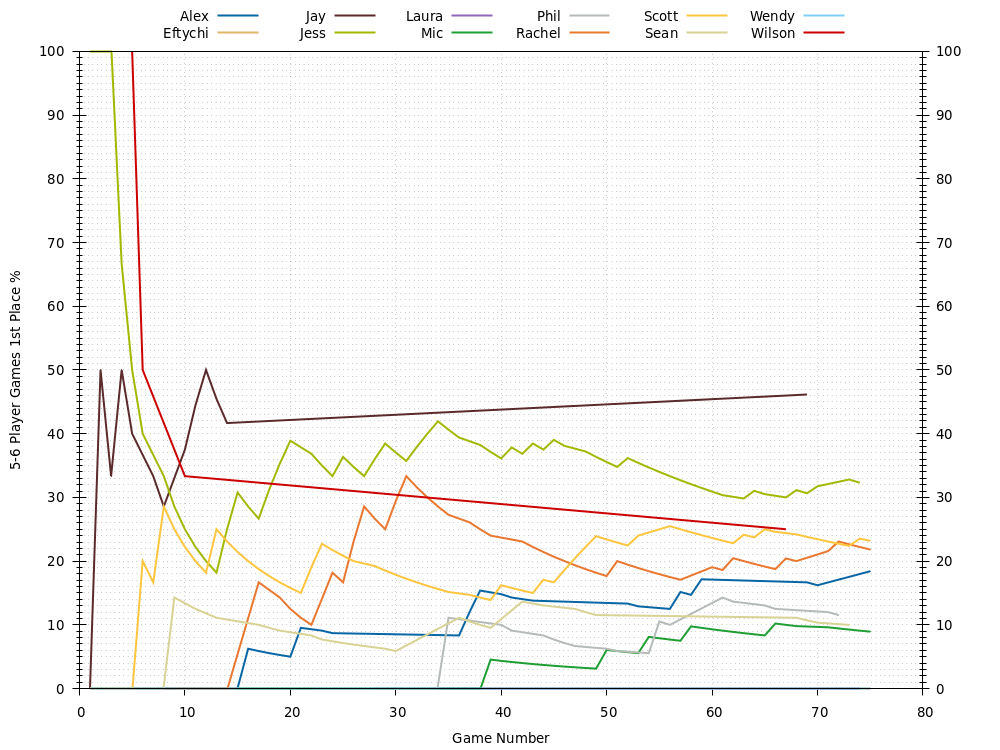
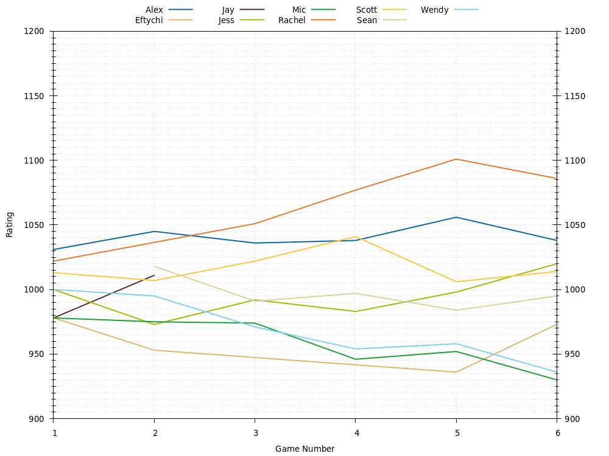

# Catan Leaderboard
Last updated 2021-01-27 03:45 UTC.

## Players

### Players: All Games
| **Player**                     | **Games** | **Avg Rating** | **Avg Points** | **1st Place** | **2nd Place** | **3rd Place** | **1st or 2nd Place** | **1st, 2nd, or 3rd Place** |
| :---                           | :---:     | :---:          | :---:          | :---:         | :---:         | :---:         | :---:                | :---:                      |
| [Alex](Alex/README.md)         | 53        | 1074           | 7.79           | 26% (14)      | 34% (18)      | 25% (13)      | 60% (32)             | 85% (45)                   |
| [Eftychi](Eftychi/README.md)   | 14        | 934            | 5.86           | 7% (1)        | 14% (2)       | 29% (4)       | 21% (3)              | 50% (7)                    |
| [Jay](Jay/README.md)           | 14        | 1082           | 7.86           | 43% (6)       | 21% (3)       | 21% (3)       | 64% (9)              | 86% (12)                   |
| [Jess](Jess/README.md)         | 92        | 1098           | 7.99           | 35% (32)      | 34% (31)      | 21% (19)      | 68% (63)             | 89% (82)                   |
| [Laura](Laura/README.md)       | 18        | 889            | 6.33           | 17% (3)       | 11% (2)       | 28% (5)       | 28% (5)              | 56% (10)                   |
| [Mic](Mic/README.md)           | 104       | 922            | 6.61           | 8% (8)        | 35% (36)      | 33% (34)      | 42% (44)             | 75% (78)                   |
| [PA](PA/README.md)             | 1         | 1031           | 10.0           | 100% (1)      | 0% (0)        | 0% (0)        | 100% (1)             | 100% (1)                   |
| [Phil](Phil/README.md)         | 50        | 941            | 7.00           | 12% (6)       | 44% (22)      | 34% (17)      | 56% (28)             | 90% (45)                   |
| [Rachel](Rachel/README.md)     | 104       | 996            | 7.56           | 29% (30)      | 26% (27)      | 28% (29)      | 55% (57)             | 83% (86)                   |
| [Scott](Scott/README.md)       | 94        | 1053           | 7.68           | 28% (26)      | 34% (32)      | 22% (21)      | 62% (58)             | 84% (79)                   |
| [Sean](Sean/README.md)         | 47        | 988            | 7.32           | 15% (7)       | 34% (16)      | 26% (12)      | 49% (23)             | 74% (35)                   |
| [Stuart](Stuart/README.md)     | 1         | 1011           | 9.00           | 0% (0)        | 100% (1)      | 0% (0)        | 100% (1)             | 100% (1)                   |
| [Valerie](Valerie/README.md)   | 3         | 963            | 6.67           | 33% (1)       | 0% (0)        | 33% (1)       | 33% (1)              | 67% (2)                    |
| [Victoria](Victoria/README.md) | 2         | 970            | 3.00           | 0% (0)        | 0% (0)        | 0% (0)        | 0% (0)               | 0% (0)                     |
| [Wendy](Wendy/README.md)       | 20        | 941            | 5.75           | 0% (0)        | 15% (3)       | 35% (7)       | 15% (3)              | 50% (10)                   |
| [Wilson](Wilson/README.md)     | 5         | 1025           | 7.60           | 20% (1)       | 40% (2)       | 20% (1)       | 60% (3)              | 80% (4)                    |

### Players: 3-4 Player Games
| **Player**                   | **Games** | **Avg Rating** | **Avg Points** | **1st Place** | **2nd Place** | **3rd Place** | **1st or 2nd Place** | **1st, 2nd, or 3rd Place** |
| :---                         | :---:     | :---:          | :---:          | :---:         | :---:         | :---:         | :---:                | :---:                      |
| [Alex](Alex/README.md)       | 12        | 1081           | 9.08           | 58% (7)       | 17% (2)       | 25% (3)       | 75% (9)              | 100% (12)                  |
| [Eftychi](Eftychi/README.md) | 3         | 994            | 7.00           | 0% (0)        | 33% (1)       | 67% (2)       | 33% (1)              | 100% (3)                   |
| [Jess](Jess/README.md)       | 30        | 1094           | 8.27           | 50% (15)      | 33% (10)      | 13% (4)       | 83% (25)             | 97% (29)                   |
| [Laura](Laura/README.md)     | 10        | 952            | 7.20           | 30% (3)       | 20% (2)       | 30% (3)       | 50% (5)              | 80% (8)                    |
| [Mic](Mic/README.md)         | 54        | 903            | 6.54           | 7% (4)        | 44% (24)      | 39% (21)      | 52% (28)             | 91% (49)                   |
| [Phil](Phil/README.md)       | 29        | 905            | 6.90           | 10% (3)       | 55% (16)      | 28% (8)       | 66% (19)             | 93% (27)                   |
| [Rachel](Rachel/README.md)   | 56        | 979            | 7.88           | 34% (19)      | 32% (18)      | 27% (15)      | 66% (37)             | 93% (52)                   |
| [Scott](Scott/README.md)     | 32        | 1073           | 8.16           | 41% (13)      | 47% (15)      | 9% (3)        | 88% (28)             | 97% (31)                   |
| [Sean](Sean/README.md)       | 16        | 971            | 7.19           | 25% (4)       | 38% (6)       | 19% (3)       | 62% (10)             | 81% (13)                   |
| [Valerie](Valerie/README.md) | 3         | 958            | 6.67           | 33% (1)       | 0% (0)        | 33% (1)       | 33% (1)              | 67% (2)                    |
| [Wendy](Wendy/README.md)     | 1         | 968            | 4.00           | 0% (0)        | 0% (0)        | 100% (1)      | 0% (0)               | 100% (1)                   |
| [Wilson](Wilson/README.md)   | 2         | 1009           | 7.00           | 0% (0)        | 100% (2)      | 0% (0)        | 100% (2)             | 100% (2)                   |

### Players: 5-6 Player Games
| **Player**                     | **Games** | **Avg Rating** | **Avg Points** | **1st Place** | **2nd Place** | **3rd Place** | **1st or 2nd Place** | **1st, 2nd, or 3rd Place** |
| :---                           | :---:     | :---:          | :---:          | :---:         | :---:         | :---:         | :---:                | :---:                      |
| [Alex](Alex/README.md)         | 35        | 1034           | 7.31           | 17% (6)       | 40% (14)      | 23% (8)       | 57% (20)             | 80% (28)                   |
| [Eftychi](Eftychi/README.md)   | 7         | 955            | 5.29           | 0% (0)        | 14% (1)       | 29% (2)       | 14% (1)              | 43% (3)                    |
| [Jay](Jay/README.md)           | 12        | 1081           | 8.00           | 42% (5)       | 25% (3)       | 25% (3)       | 67% (8)              | 92% (11)                   |
| [Jess](Jess/README.md)         | 56        | 1087           | 7.93           | 30% (17)      | 34% (19)      | 25% (14)      | 64% (36)             | 89% (50)                   |
| [Laura](Laura/README.md)       | 8         | 908            | 5.25           | 0% (0)        | 0% (0)        | 25% (2)       | 0% (0)               | 25% (2)                    |
| [Mic](Mic/README.md)           | 44        | 934            | 6.82           | 9% (4)        | 27% (12)      | 25% (11)      | 36% (16)             | 61% (27)                   |
| [PA](PA/README.md)             | 1         | 1032           | 10.0           | 100% (1)      | 0% (0)        | 0% (0)        | 100% (1)             | 100% (1)                   |
| [Phil](Phil/README.md)         | 21        | 967            | 7.14           | 14% (3)       | 29% (6)       | 43% (9)       | 43% (9)              | 86% (18)                   |
| [Rachel](Rachel/README.md)     | 43        | 977            | 6.98           | 19% (8)       | 19% (8)       | 33% (14)      | 37% (16)             | 70% (30)                   |
| [Scott](Scott/README.md)       | 56        | 1019           | 7.48           | 23% (13)      | 27% (15)      | 27% (15)      | 50% (28)             | 77% (43)                   |
| [Sean](Sean/README.md)         | 26        | 998            | 7.42           | 12% (3)       | 35% (9)       | 27% (7)       | 46% (12)             | 73% (19)                   |
| [Stuart](Stuart/README.md)     | 1         | 1010           | 9.00           | 0% (0)        | 100% (1)      | 0% (0)        | 100% (1)             | 100% (1)                   |
| [Victoria](Victoria/README.md) | 2         | 969            | 3.00           | 0% (0)        | 0% (0)        | 0% (0)        | 0% (0)               | 0% (0)                     |
| [Wendy](Wendy/README.md)       | 13        | 954            | 5.77           | 0% (0)        | 23% (3)       | 38% (5)       | 23% (3)              | 62% (8)                    |
| [Wilson](Wilson/README.md)     | 3         | 1022           | 8.00           | 33% (1)       | 0% (0)        | 33% (1)       | 33% (1)              | 67% (2)                    |

### Players: 7-8 Player Games
| **Player**                   | **Games** | **Avg Rating** | **Avg Points** | **1st Place** | **2nd Place** | **3rd Place** | **1st or 2nd Place** | **1st, 2nd, or 3rd Place** |
| :---                         | :---:     | :---:          | :---:          | :---:         | :---:         | :---:         | :---:                | :---:                      |
| [Alex](Alex/README.md)       | 6         | 1041           | 8.00           | 17% (1)       | 33% (2)       | 33% (2)       | 50% (3)              | 83% (5)                    |
| [Eftychi](Eftychi/README.md) | 4         | 960            | 6.00           | 25% (1)       | 0% (0)        | 0% (0)        | 25% (1)              | 25% (1)                    |
| [Jay](Jay/README.md)         | 2         | 994            | 7.00           | 50% (1)       | 0% (0)        | 0% (0)        | 50% (1)              | 50% (1)                    |
| [Jess](Jess/README.md)       | 6         | 994            | 7.17           | 0% (0)        | 33% (2)       | 17% (1)       | 33% (2)              | 50% (3)                    |
| [Mic](Mic/README.md)         | 6         | 959            | 5.67           | 0% (0)        | 0% (0)        | 33% (2)       | 0% (0)               | 33% (2)                    |
| [Rachel](Rachel/README.md)   | 5         | 1068           | 9.00           | 60% (3)       | 20% (1)       | 0% (0)        | 80% (4)              | 80% (4)                    |
| [Scott](Scott/README.md)     | 6         | 1017           | 7.00           | 0% (0)        | 33% (2)       | 50% (3)       | 33% (2)              | 83% (5)                    |
| [Sean](Sean/README.md)       | 5         | 997            | 7.20           | 0% (0)        | 20% (1)       | 40% (2)       | 20% (1)              | 60% (3)                    |
| [Wendy](Wendy/README.md)     | 6         | 969            | 6.00           | 0% (0)        | 0% (0)        | 17% (1)       | 0% (0)               | 17% (1)                    |

## All Games

### All Games: Ratings

### All Games: Average Points per Game

### All Games: 1st Places

### All Games: 2nd Places

### All Games: 3rd Places

## 3-4 Player Games

### 3-4 Player Games: Ratings

### 3-4 Player Games: Average Points per Game

### 3-4 Player Games: 1st Places

### 3-4 Player Games: 2nd Places

### 3-4 Player Games: 3rd Places

## 5-6 Player Games

### 5-6 Player Games: Ratings

### 5-6 Player Games: Average Points per Game

### 5-6 Player Games: 1st Places

### 5-6 Player Games: 2nd Places

### 5-6 Player Games: 3rd Places

## 7-8 Player Games

### 7-8 Player Games: Ratings

### 7-8 Player Games: Average Points per Game

### 7-8 Player Games: 1st Places

### 7-8 Player Games: 2nd Places

### 7-8 Player Games: 3rd Places

## Game History

### Game History: All Games
| **Game** | **Date**   | **Players** | **Results**                                                                                                  |
| :---:    | :---:      | :---:       | :---                                                                                                         |
| 136      | 2021-01-26 | 4           | 1st Rachel 10 , 2nd Laura 7 , 2nd Scott 7 , 3rd Mic 5                                                        |
| 135      | 2021-01-18 | 8           | 1st Eftychi 10 , 2nd Jess 9 , 3rd Sean 8 , 3rd Scott 8 , 4th Rachel 7 , 5th Alex 6 , 6th Mic 5 , 6th Wendy 5 |
| 134      | 2021-01-18 | 8           | 1st Rachel 10 , 2nd Alex 8 , 3rd Jess 7 , 4th Mic 6 , 4th Wendy 6 , 5th Sean 5 , 6th Eftychi 4 , 7th Scott 3 |
| 133      | 2021-01-14 | 3           | 1st Rachel 10 , 2nd Jess 7 , 3rd Eftychi 6                                                                   |
| 132      | 2020-12-31 | 3           | 1st Rachel 11 , 2nd Scott 6 , 3rd Laura 5                                                                    |
| 131      | 2020-12-25 | 4           | 1st Scott 10 , 2nd Jess 8 , 2nd Mic 8 , 3rd Rachel 5                                                         |
| 130      | 2020-12-23 | 3           | 1st Valerie 10 , 2nd Phil 9 , 3rd Rachel 5                                                                   |
| 129      | 2020-12-23 | 3           | 1st Rachel 10 , 2nd Phil 8 , 3rd Valerie 5                                                                   |
| 128      | 2020-12-23 | 4           | 1st Phil 10 , 2nd Rachel 8 , 3rd Jess 6 , 4th Valerie 5                                                      |
| 127      | 2020-12-17 | 3           | 1st Scott 10 , 2nd Rachel 9 , 2nd Phil 9                                                                     |
| 126      | 2020-12-02 | 3           | 1st Rachel 10 , 2nd Mic 6 , 3rd Phil 4                                                                       |
| 125      | 2020-12-02 | 3           | 1st Sean 10 , 2nd Phil 7 , 3rd Mic 5                                                                         |
| 124      | 2020-11-27 | 4           | 1st Scott 10 , 2nd Sean 9 , 3rd Mic 8 , 4th Rachel 6                                                         |
| 123      | 2020-11-22 | 3           | 1st Scott 10 , 2nd Rachel 8 , 3rd Sean 5                                                                     |
| 122      | 2020-11-02 | 4           | 1st Jess 10 , 2nd Rachel 9 , 3rd Scott 7 , 3rd Mic 7                                                         |
| 121      | 2020-11-02 | 4           | 1st Jess 10 , 2nd Scott 6 , 3rd Mic 4 , 3rd Rachel 4                                                         |
| 120      | 2020-10-31 | 3           | 1st Rachel 10 , 2nd Laura 7 , 3rd Mic 6                                                                      |
| 119      | 2020-10-31 | 3           | 1st Laura 10 , 2nd Mic 9 , 3rd Rachel 6                                                                      |
| 118      | 2020-10-30 | 4           | 1st Jess 10 , 2nd Rachel 8 , 2nd Mic 8 , 3rd Scott 7                                                         |
| 117      | 2020-10-30 | 4           | 1st Rachel 10 , 2nd Jess 6 , 3rd Mic 4 , 4th Scott 3                                                         |
| 116      | 2020-10-30 | 3           | 1st Scott 10 , 2nd Mic 6 , 2nd Jess 6                                                                        |
| 115      | 2020-10-28 | 5           | 1st Phil 11 , 2nd Jess 9 , 3rd Scott 7 , 3rd Rachel 7 , 3rd Mic 7                                            |
| 114      | 2020-10-28 | 4           | 1st Jess 11 , 2nd Rachel 8 , 2nd Phil 8 , 3rd Mic 7                                                          |
| 113      | 2020-10-27 | 4           | 1st Scott 10 , 2nd Rachel 5 , 2nd Jess 5 , 2nd Mic 5                                                         |
| 112      | 2020-10-27 | 4           | 1st Scott 10 , 2nd Rachel 8 , 3rd Jess 7 , 4th Mic 5                                                         |
| 111      | 2020-10-25 | 4           | 1st Mic 10 , 2nd Rachel 8 , 2nd Phil 8 , 3rd Laura 6                                                         |
| 110      | 2020-10-25 | 4           | 1st Rachel 10 , 2nd Phil 7 , 3rd Mic 5 , 4th Laura 4                                                         |
| 109      | 2020-10-24 | 5           | 1st Rachel 11 , 2nd Jess 9 , 2nd Stuart 9 , 3rd Scott 8 , 4th Mic 7                                          |
| 108      | 2020-10-23 | 3           | 1st Rachel 10 , 2nd Mic 9 , 3rd Laura 8                                                                      |
| 107      | 2020-10-23 | 3           | 1st Laura 10 , 2nd Mic 8 , 3rd Rachel 7                                                                      |
| 106      | 2020-10-22 | 3           | 1st Mic 10 , 2nd Phil 9 , 3rd Rachel 7                                                                       |
| 105      | 2020-10-20 | 4           | 1st Laura 10 , 2nd Mic 9 , 3rd Rachel 6 , 4th Phil 4                                                         |
| 104      | 2020-10-20 | 3           | 1st Rachel 10 , 2nd Phil 7 , 2nd Mic 7                                                                       |
| 103      | 2020-10-19 | 3           | 1st Rachel 10 , 2nd Phil 6 , 3rd Mic 4                                                                       |
| 102      | 2020-10-19 | 3           | 1st Mic 10 , 2nd Rachel 9 , 2nd Phil 9                                                                       |
| 101      | 2020-10-19 | 3           | 1st Rachel 10 , 2nd Phil 6 , 2nd Mic 6                                                                       |
| 100      | 2020-10-18 | 4           | 1st Phil 10 , 2nd Mic 8 , 3rd Alex 7 , 4th Rachel 6                                                          |
| 99       | 2020-10-18 | 3           | 1st Alex 10 , 2nd Rachel 9 , 3rd Phil 5                                                                      |
| 98       | 2020-10-16 | 5           | 1st Alex 10 , 2nd Mic 10 , 3rd Jess 9 , 4th Scott 8 , 5th Laura 6                                            |
| 97       | 2020-10-16 | 5           | 1st Mic 10 , 2nd Alex 7 , 2nd Jess 7 , 2nd Scott 7 , 3rd Laura 4                                             |
| 96       | 2020-10-14 | 4           | 1st Scott 10 , 2nd Phil 7 , 3rd Rachel 6 , 4th Mic 4                                                         |
| 95       | 2020-10-12 | 5           | 1st Alex 10 , 2nd Scott 9 , 2nd Mic 9 , 3rd Jess 8 , 4th Rachel 6                                            |
| 94       | 2020-10-12 | 6           | 1st Scott 10 , 2nd Alex 8 , 2nd Jess 8 , 3rd Mic 7 , 4th Phil 4 , 4th Rachel 4                               |
| 93       | 2020-10-11 | 5           | 1st Phil 10 , 2nd Jess 9 , 3rd Rachel 7 , 4th Mic 6 , 5th Laura 5                                            |
| 92       | 2020-10-11 | 5           | 1st Mic 10 , 2nd Phil 7 , 3rd Rachel 6 , 4th Jess 5 , 4th Laura 5                                            |
| 91       | 2020-10-10 | 5           | 1st Jess 10 , 2nd Alex 8 , 3rd Mic 7 , 4th Scott 4 , 4th Rachel 4                                            |
| 90       | 2020-10-10 | 5           | 1st Scott 10 , 2nd Mic 8 , 3rd Rachel 6 , 3rd Jess 6 , 4th Alex 5                                            |
| 89       | 2020-10-06 | 5           | 1st Rachel 10 , 2nd Mic 7 , 2nd Jess 7 , 3rd Scott 6 , 3rd Phil 6                                            |
| 88       | 2020-10-06 | 5           | 1st Mic 10 , 2nd Phil 9 , 2nd Scott 9 , 3rd Rachel 7 , 4th Jess 4                                            |
| 87       | 2020-10-02 | 5           | 1st Scott 10 , 2nd Sean 9 , 3rd Jess 8 , 4th Rachel 7 , 5th Mic 6                                            |
| 86       | 2020-10-02 | 5           | 1st Scott 10 , 2nd Rachel 9 , 3rd Mic 8 , 4th Sean 7 , 4th Jess 7                                            |
| 85       | 2020-10-02 | 3           | 1st Rachel 11 , 2nd Sean 8 , 3rd Mic 7                                                                       |
| 84       | 2020-09-30 | 5           | 1st Scott 10 , 2nd Phil 9 , 2nd Mic 9 , 3rd Rachel 8 , 4th Sean 7                                            |
| 83       | 2020-09-30 | 5           | 1st Scott 10 , 2nd Rachel 9 , 3rd Jess 8 , 3rd Phil 8 , 4th Mic 6                                            |
| 82       | 2020-09-29 | 6           | 1st Jess 10 , 2nd Mic 9 , 3rd Phil 8 , 4th Scott 5 , 4th Rachel 5 , 5th Laura 3                              |
| 81       | 2020-09-28 | 4           | 1st Jess 10 , 2nd Scott 8 , 3rd Mic 7 , 4th Sean 6                                                           |
| 80       | 2020-09-28 | 4           | 1st Scott 10 , 2nd Jess 7 , 3rd Sean 5 , 4th Mic 4                                                           |
| 79       | 2020-09-27 | 4           | 1st Sean 10 , 2nd Mic 7 , 3rd Phil 6 , 4th Laura 5                                                           |
| 78       | 2020-09-25 | 3           | 1st Jess 11 , 2nd Scott 8 , 3rd Mic 7                                                                        |
| 77       | 2020-09-23 | 4           | 1st Sean 10 , 2nd Jess 6 , 2nd Mic 6 , 3rd Rachel 4                                                          |
| 76       | 2020-09-23 | 6           | 1st Scott 10 , 2nd Jess 8 , 2nd Phil 8 , 3rd Sean 7 , 4th Mic 6 , 4th Rachel 6                               |
| 75       | 2020-09-22 | 3           | 1st Rachel 10 , 2nd Phil 7 , 3rd Mic 6                                                                       |
| 74       | 2020-09-22 | 3           | 1st Phil 10 , 2nd Mic 6 , 3rd Rachel 4                                                                       |
| 73       | 2020-09-22 | 3           | 1st Rachel 10 , 2nd Mic 5 , 3rd Phil 4                                                                       |
| 72       | 2020-09-21 | 5           | 1st Jess 10 , 2nd Scott 9 , 3rd Mic 8 , 4th Alex 6 , 5th Rachel 5                                            |
| 71       | 2020-09-17 | 6           | 1st Sean 10 , 2nd Jess 10 , 3rd Rachel 9 , 4th Scott 8 , 5th Laura 7 , 6th Mic 6                             |
| 70       | 2020-09-14 | 5           | 1st Jess 10 , 2nd Mic 6 , 3rd Alex 4 , 3rd Phil 4 , 3rd Scott 4                                              |
| 69       | 2020-09-14 | 5           | 1st Scott 10 , 2nd Jess 8 , 3rd Alex 7 , 3rd Phil 7 , 4th Mic 6                                              |
| 68       | 2020-09-11 | 4           | 1st Jess 10 , 2nd Scott 9 , 3rd Mic 6 , 4th Rachel 5                                                         |
| 67       | 2020-09-11 | 6           | 1st Mic 10 , 2nd Jess 8 , 3rd Sean 6 , 3rd Scott 6 , 4th Rachel 5 , 4th Laura 5                              |
| 66       | 2020-09-10 | 3           | 1st Scott 11 , 2nd Mic 6 , 2nd Rachel 6                                                                      |
| 65       | 2020-09-10 | 3           | 1st Mic 10 , 2nd Scott 7 , 3rd Rachel 6                                                                      |
| 64       | 2020-09-07 | 6           | 1st Alex 10 , 2nd Scott 8 , 2nd Rachel 8 , 2nd Mic 8 , 3rd Jess 7 , 3rd Sean 7                               |
| 63       | 2020-09-07 | 5           | 1st Alex 10 , 2nd Scott 9 , 3rd Rachel 7 , 4th Sean 6 , 5th Mic 5                                            |
| 62       | 2020-09-04 | 5           | 1st Sean 10 , 2nd Wendy 6 , 3rd Alex 4 , 3rd Mic 4 , 4th Jess 3                                              |
| 61       | 2020-09-04 | 7           | 1st Rachel 10 , 2nd Scott 9 , 3rd Alex 8 , 3rd Sean 8 , 4th Jess 7 , 5th Wendy 6 , 6th Mic 5                 |
| 60       | 2020-09-04 | 4           | 1st Rachel 10 , 2nd Scott 9 , 3rd Alex 8 , 4th Jess 6                                                        |
| 59       | 2020-09-02 | 5           | 1st Jess 10 , 2nd Scott 8 , 2nd Rachel 8 , 2nd Mic 8 , 3rd Phil 6                                            |
| 58       | 2020-09-02 | 5           | 1st Phil 10 , 2nd Jess 6 , 3rd Scott 5 , 3rd Rachel 5 , 4th Mic 3                                            |
| 57       | 2020-09-02 | 4           | 1st Jess 10 , 2nd Scott 5 , 2nd Mic 5 , 3rd Phil 3                                                           |
| 56       | 2020-09-01 | 4           | 1st Jess 10 , 2nd Rachel 9 , 3rd Mic 8 , 4th Phil 5                                                          |
| 55       | 2020-09-01 | 4           | 1st Rachel 10 , 2nd Jess 6 , 3rd Mic 5 , 3rd Phil 5                                                          |
| 54       | 2020-08-31 | 5           | 1st Jess 10 , 2nd Scott 6 , 2nd Phil 6 , 3rd Mic 5 , 3rd Rachel 5                                            |
| 53       | 2020-08-31 | 5           | 1st Jess 10 , 2nd Rachel 7 , 2nd Scott 7 , 2nd Phil 7 , 3rd Mic 5                                            |
| 52       | 2020-08-31 | 3           | 1st Rachel 10 , 2nd Mic 7 , 3rd Phil 4                                                                       |
| 51       | 2020-08-28 | 4           | 1st Rachel 11 , 2nd Jess 7 , 2nd Scott 7 , 3rd Mic 6                                                         |
| 50       | 2020-08-28 | 5           | 1st Rachel 10 , 2nd Jess 8 , 3rd Scott 7 , 4th Mic 6 , 5th Phil 5                                            |
| 49       | 2020-08-22 | 5           | 1st Rachel 10 , 2nd Sean 8 , 3rd Jess 7 , 3rd Mic 7 , 4th Scott 6                                            |
| 48       | 2020-08-22 | 5           | 1st Jess 10 , 2nd Scott 9 , 2nd Sean 9 , 2nd Mic 9 , 3rd Rachel 5                                            |
| 47       | 2020-08-22 | 5           | 1st Jess 10 , 2nd Scott 9 , 2nd Rachel 9 , 3rd Laura 7 , 3rd Mic 7                                           |
| 46       | 2020-08-19 | 4           | 1st Jess 10 , 2nd Scott 5 , 2nd Mic 5 , 2nd Rachel 5                                                         |
| 45       | 2020-08-19 | 4           | 1st Jess 10 , 2nd Scott 8 , 2nd Mic 8 , 3rd Rachel 6                                                         |
| 44       | 2020-08-17 | 4           | 1st Jess 10 , 2nd Sean 7 , 2nd Phil 7 , 2nd Mic 7                                                            |
| 43       | 2020-08-17 | 5           | 1st Rachel 10 , 2nd Sean 8 , 3rd Phil 7 , 4th Mic 6 , 5th Jess 4                                             |
| 42       | 2020-08-17 | 4           | 1st Jess 10 , 2nd Rachel 9 , 3rd Phil 8 , 4th Mic 3                                                          |
| 41       | 2020-08-11 | 5           | 1st Rachel 10 , 2nd Jess 9 , 2nd Scott 9 , 3rd Phil 6 , 4th Mic 4                                            |
| 40       | 2020-08-11 | 4           | 1st Scott 10 , 2nd Jess 8 , 3rd Rachel 7 , 3rd Mic 7                                                         |
| 39       | 2020-08-07 | 7           | 1st Rachel 10 , 2nd Jess 8 , 2nd Scott 8 , 3rd Alex 7 , 3rd Mic 7 , 4th Sean 6 , 4th Wendy 6                 |
| 38       | 2020-08-07 | 6           | 1st Jess 10 , 2nd Sean 8 , 3rd Wendy 7 , 3rd Rachel 7 , 4th Scott 5 , 4th Mic 5                              |
| 37       | 2020-08-07 | 5           | 1st Rachel 10 , 2nd Jess 9 , 3rd Scott 8 , 4th Alex 6 , 5th Mic 5                                            |
| 36       | 2020-08-05 | 6           | 1st Scott 10 , 2nd Jess 8 , 2nd Mic 8 , 3rd Sean 7 , 3rd Phil 7 , 4th Alex 6                                 |
| 35       | 2020-08-05 | 6           | 1st Scott 10 , 2nd Rachel 8 , 3rd Sean 6 , 3rd Jess 6 , 3rd Mic 6 , 4th Phil 5                               |
| 34       | 2020-07-29 | 4           | 1st Scott 10 , 2nd Phil 8 , 3rd Mic 7 , 4th Rachel 6                                                         |
| 33       | 2020-07-26 | 4           | 1st Sean 10 , 2nd Alex 8 , 2nd Scott 8 , 3rd Mic 7                                                           |
| 32       | 2020-07-25 | 4           | 1st Alex 10 , 2nd Sean 9 , 3rd Eftychi 8 , 4th Mic 4                                                         |
| 31       | 2020-07-25 | 4           | 1st Alex 10 , 2nd Mic 9 , 3rd Rachel 7 , 4th Sean 6                                                          |
| 30       | 2020-07-25 | 4           | 1st Alex 10 , 2nd Sean 5 , 2nd Rachel 5 , 2nd Mic 5                                                          |
| 29       | 2020-07-18 | 5           | 1st Alex 10 , 2nd Rachel 8 , 3rd Scott 6 , 4th Mic 5 , 5th Eftychi 4                                         |
| 28       | 2020-07-04 | 8           | 1st Jay 10 , 2nd Alex 9 , 2nd Sean 9 , 3rd Scott 7 , 3rd Wendy 7 , 3rd Mic 7 , 4th Jess 6 , 4th Eftychi 6    |
| 27       | 2020-07-04 | 8           | 1st Alex 10 , 2nd Rachel 8 , 3rd Scott 7 , 4th Jess 6 , 4th Wendy 6 , 5th Eftychi 4 , 5th Jay 4 , 5th Mic 4  |
| 26       | 2020-07-04 | 4           | 1st Scott 10 , 2nd Eftychi 7 , 3rd Jess 6 , 3rd Rachel 6                                                     |
| 25       | 2020-07-03 | 6           | 1st Jess 10 , 2nd Alex 6 , 2nd Wendy 6 , 3rd Scott 5 , 3rd Eftychi 5 , 4th Rachel 4                          |
| 24       | 2020-07-03 | 5           | 1st Jess 10 , 2nd Alex 9 , 2nd Sean 9 , 3rd Rachel 8 , 4th Scott 7                                           |
| 23       | 2020-07-03 | 4           | 1st Alex 10 , 2nd Rachel 7 , 2nd Scott 7 , 3rd Jess 5                                                        |
| 22       | 2020-06-20 | 6           | 1st Jess 10 , 2nd Eftychi 8 , 3rd Wendy 7 , 4th Alex 6 , 4th Scott 6 , 4th Mic 6                             |
| 21       | 2020-06-20 | 6           | 1st Alex 10 , 2nd Scott 6 , 2nd Mic 6 , 3rd Jess 5 , 4th Eftychi 4 , 5th Wendy 2                             |
| 20       | 2020-06-20 | 6           | 1st Jess 10 , 2nd Wendy 8 , 3rd Alex 7 , 3rd Scott 7 , 4th Eftychi 4 , 4th Mic 4                             |
| 19       | 2020-06-20 | 5           | 1st Rachel 10 , 2nd Alex 8 , 2nd Jess 8 , 2nd Sean 8 , 3rd Scott 5                                           |
| 18       | 2020-06-13 | 4           | 1st Jess 10 , 2nd Alex 9 , 2nd Rachel 9 , 3rd Scott 7                                                        |
| 17       | 2020-06-13 | 5           | 1st Jess 10 , 2nd Alex 9 , 3rd Jay 8 , 4th Scott 7 , 5th Rachel 4                                            |
| 16       | 2020-06-06 | 6           | 1st Scott 10 , 2nd Alex 9 , 3rd Jay 5 , 3rd Jess 5 , 3rd Sean 5 , 4th Rachel 3                               |
| 15       | 2020-06-06 | 5           | 1st Jay 10 , 2nd Alex 5 , 2nd Jess 5 , 3rd Scott 4 , 3rd Rachel 4                                            |
| 14       | 2020-01-19 | 6           | 1st Jay 10 , 2nd Alex 9 , 3rd Jess 8 , 3rd Eftychi 8 , 4th Sean 7 , 4th Scott 7                              |
| 13       | 2019-09-22 | 4           | 1st Alex 10 , 2nd Sean 6 , 2nd Scott 6 , 3rd Wendy 4                                                         |
| 12       | 2019-03-10 | 3           | 1st Alex 11 , 2nd Wilson 5 , 3rd Sean 4                                                                      |
| 11       | 2018-09-01 | 5           | 1st Jay 10 , 2nd Alex 9 , 2nd Jess 9 , 3rd Wilson 8 , 4th Scott 5                                            |
| 10       | 2018-01-14 | 5           | 1st Sean 10 , 2nd Jess 7 , 3rd Alex 5 , 3rd Scott 5 , 4th Eftychi 4                                          |
| 9        | 2017-10-08 | 6           | 1st Scott 10 , 2nd Alex 9 , 3rd Jay 6 , 3rd Jess 6 , 3rd Wendy 6 , 4th Sean 5                                |
| 8        | 2017-08-25 | 6           | 1st PA 10 , 2nd Jay 7 , 2nd Sean 7 , 3rd Scott 6 , 4th Wendy 5 , 5th Alex 4                                  |
| 7        | 2017-06-10 | 6           | 1st Scott 10 , 2nd Alex 8 , 3rd Jess 7 , 4th Wilson 6 , 5th Wendy 5 , 6th Victoria 3                         |
| 6        | 2017-06-10 | 6           | 1st Wilson 10 , 2nd Scott 6 , 3rd Alex 5 , 4th Jay 4 , 5th Victoria 3 , 6th Jess 2                           |
| 5        | 2017-06-10 | 6           | 1st Jay 10 , 2nd Alex 9 , 3rd Jess 7 , 4th Scott 6 , 4th Sean 6 , 4th Wendy 6                                |
| 4        | 2017-05-06 | 4           | 1st Jess 10 , 2nd Wilson 9 , 3rd Alex 6 , 4th Sean 5                                                         |
| 3        | 2017-04-01 | 6           | 1st Jess 10 , 2nd Jay 8 , 2nd Sean 8 , 3rd Wendy 5 , 4th Alex 4 , 4th Rachel 4                               |
| 2        | 2017-03-31 | 6           | 1st Jay 10 , 2nd Scott 9 , 3rd Alex 7 , 3rd Wendy 7 , 4th Sean 6 , 5th Rachel 5                              |
| 1        | 2017-03-17 | 6           | 1st Jess 10 , 2nd Jay 8 , 3rd Alex 7 , 3rd Sean 7 , 4th Scott 6 , 5th Wendy 5                                |

### Game History: 3-4 Player Games
| **Game** | **Date**   | **Players** | **Results**                                              |
| :---:    | :---:      | :---:       | :---                                                     |
| 69       | 2021-01-26 | 4           | 1st Rachel 10 , 2nd Laura 7 , 2nd Scott 7 , 3rd Mic 5    |
| 68       | 2021-01-14 | 3           | 1st Rachel 10 , 2nd Jess 7 , 3rd Eftychi 6               |
| 67       | 2020-12-31 | 3           | 1st Rachel 11 , 2nd Scott 6 , 3rd Laura 5                |
| 66       | 2020-12-25 | 4           | 1st Scott 10 , 2nd Jess 8 , 2nd Mic 8 , 3rd Rachel 5     |
| 65       | 2020-12-23 | 3           | 1st Valerie 10 , 2nd Phil 9 , 3rd Rachel 5               |
| 64       | 2020-12-23 | 3           | 1st Rachel 10 , 2nd Phil 8 , 3rd Valerie 5               |
| 63       | 2020-12-23 | 4           | 1st Phil 10 , 2nd Rachel 8 , 3rd Jess 6 , 4th Valerie 5  |
| 62       | 2020-12-17 | 3           | 1st Scott 10 , 2nd Rachel 9 , 2nd Phil 9                 |
| 61       | 2020-12-02 | 3           | 1st Rachel 10 , 2nd Mic 6 , 3rd Phil 4                   |
| 60       | 2020-12-02 | 3           | 1st Sean 10 , 2nd Phil 7 , 3rd Mic 5                     |
| 59       | 2020-11-27 | 4           | 1st Scott 10 , 2nd Sean 9 , 3rd Mic 8 , 4th Rachel 6     |
| 58       | 2020-11-22 | 3           | 1st Scott 10 , 2nd Rachel 8 , 3rd Sean 5                 |
| 57       | 2020-11-02 | 4           | 1st Jess 10 , 2nd Rachel 9 , 3rd Scott 7 , 3rd Mic 7     |
| 56       | 2020-11-02 | 4           | 1st Jess 10 , 2nd Scott 6 , 3rd Mic 4 , 3rd Rachel 4     |
| 55       | 2020-10-31 | 3           | 1st Rachel 10 , 2nd Laura 7 , 3rd Mic 6                  |
| 54       | 2020-10-31 | 3           | 1st Laura 10 , 2nd Mic 9 , 3rd Rachel 6                  |
| 53       | 2020-10-30 | 4           | 1st Jess 10 , 2nd Rachel 8 , 2nd Mic 8 , 3rd Scott 7     |
| 52       | 2020-10-30 | 4           | 1st Rachel 10 , 2nd Jess 6 , 3rd Mic 4 , 4th Scott 3     |
| 51       | 2020-10-30 | 3           | 1st Scott 10 , 2nd Mic 6 , 2nd Jess 6                    |
| 50       | 2020-10-28 | 4           | 1st Jess 11 , 2nd Rachel 8 , 2nd Phil 8 , 3rd Mic 7      |
| 49       | 2020-10-27 | 4           | 1st Scott 10 , 2nd Rachel 5 , 2nd Jess 5 , 2nd Mic 5     |
| 48       | 2020-10-27 | 4           | 1st Scott 10 , 2nd Rachel 8 , 3rd Jess 7 , 4th Mic 5     |
| 47       | 2020-10-25 | 4           | 1st Mic 10 , 2nd Rachel 8 , 2nd Phil 8 , 3rd Laura 6     |
| 46       | 2020-10-25 | 4           | 1st Rachel 10 , 2nd Phil 7 , 3rd Mic 5 , 4th Laura 4     |
| 45       | 2020-10-23 | 3           | 1st Rachel 10 , 2nd Mic 9 , 3rd Laura 8                  |
| 44       | 2020-10-23 | 3           | 1st Laura 10 , 2nd Mic 8 , 3rd Rachel 7                  |
| 43       | 2020-10-22 | 3           | 1st Mic 10 , 2nd Phil 9 , 3rd Rachel 7                   |
| 42       | 2020-10-20 | 4           | 1st Laura 10 , 2nd Mic 9 , 3rd Rachel 6 , 4th Phil 4     |
| 41       | 2020-10-20 | 3           | 1st Rachel 10 , 2nd Phil 7 , 2nd Mic 7                   |
| 40       | 2020-10-19 | 3           | 1st Rachel 10 , 2nd Phil 6 , 3rd Mic 4                   |
| 39       | 2020-10-19 | 3           | 1st Mic 10 , 2nd Rachel 9 , 2nd Phil 9                   |
| 38       | 2020-10-19 | 3           | 1st Rachel 10 , 2nd Phil 6 , 2nd Mic 6                   |
| 37       | 2020-10-18 | 4           | 1st Phil 10 , 2nd Mic 8 , 3rd Alex 7 , 4th Rachel 6      |
| 36       | 2020-10-18 | 3           | 1st Alex 10 , 2nd Rachel 9 , 3rd Phil 5                  |
| 35       | 2020-10-14 | 4           | 1st Scott 10 , 2nd Phil 7 , 3rd Rachel 6 , 4th Mic 4     |
| 34       | 2020-10-02 | 3           | 1st Rachel 11 , 2nd Sean 8 , 3rd Mic 7                   |
| 33       | 2020-09-28 | 4           | 1st Jess 10 , 2nd Scott 8 , 3rd Mic 7 , 4th Sean 6       |
| 32       | 2020-09-28 | 4           | 1st Scott 10 , 2nd Jess 7 , 3rd Sean 5 , 4th Mic 4       |
| 31       | 2020-09-27 | 4           | 1st Sean 10 , 2nd Mic 7 , 3rd Phil 6 , 4th Laura 5       |
| 30       | 2020-09-25 | 3           | 1st Jess 11 , 2nd Scott 8 , 3rd Mic 7                    |
| 29       | 2020-09-23 | 4           | 1st Sean 10 , 2nd Jess 6 , 2nd Mic 6 , 3rd Rachel 4      |
| 28       | 2020-09-22 | 3           | 1st Rachel 10 , 2nd Phil 7 , 3rd Mic 6                   |
| 27       | 2020-09-22 | 3           | 1st Phil 10 , 2nd Mic 6 , 3rd Rachel 4                   |
| 26       | 2020-09-22 | 3           | 1st Rachel 10 , 2nd Mic 5 , 3rd Phil 4                   |
| 25       | 2020-09-11 | 4           | 1st Jess 10 , 2nd Scott 9 , 3rd Mic 6 , 4th Rachel 5     |
| 24       | 2020-09-10 | 3           | 1st Scott 11 , 2nd Mic 6 , 2nd Rachel 6                  |
| 23       | 2020-09-10 | 3           | 1st Mic 10 , 2nd Scott 7 , 3rd Rachel 6                  |
| 22       | 2020-09-04 | 4           | 1st Rachel 10 , 2nd Scott 9 , 3rd Alex 8 , 4th Jess 6    |
| 21       | 2020-09-02 | 4           | 1st Jess 10 , 2nd Scott 5 , 2nd Mic 5 , 3rd Phil 3       |
| 20       | 2020-09-01 | 4           | 1st Jess 10 , 2nd Rachel 9 , 3rd Mic 8 , 4th Phil 5      |
| 19       | 2020-09-01 | 4           | 1st Rachel 10 , 2nd Jess 6 , 3rd Mic 5 , 3rd Phil 5      |
| 18       | 2020-08-31 | 3           | 1st Rachel 10 , 2nd Mic 7 , 3rd Phil 4                   |
| 17       | 2020-08-28 | 4           | 1st Rachel 11 , 2nd Jess 7 , 2nd Scott 7 , 3rd Mic 6     |
| 16       | 2020-08-19 | 4           | 1st Jess 10 , 2nd Scott 5 , 2nd Mic 5 , 2nd Rachel 5     |
| 15       | 2020-08-19 | 4           | 1st Jess 10 , 2nd Scott 8 , 2nd Mic 8 , 3rd Rachel 6     |
| 14       | 2020-08-17 | 4           | 1st Jess 10 , 2nd Sean 7 , 2nd Phil 7 , 2nd Mic 7        |
| 13       | 2020-08-17 | 4           | 1st Jess 10 , 2nd Rachel 9 , 3rd Phil 8 , 4th Mic 3      |
| 12       | 2020-08-11 | 4           | 1st Scott 10 , 2nd Jess 8 , 3rd Rachel 7 , 3rd Mic 7     |
| 11       | 2020-07-29 | 4           | 1st Scott 10 , 2nd Phil 8 , 3rd Mic 7 , 4th Rachel 6     |
| 10       | 2020-07-26 | 4           | 1st Sean 10 , 2nd Alex 8 , 2nd Scott 8 , 3rd Mic 7       |
| 9        | 2020-07-25 | 4           | 1st Alex 10 , 2nd Sean 9 , 3rd Eftychi 8 , 4th Mic 4     |
| 8        | 2020-07-25 | 4           | 1st Alex 10 , 2nd Mic 9 , 3rd Rachel 7 , 4th Sean 6      |
| 7        | 2020-07-25 | 4           | 1st Alex 10 , 2nd Sean 5 , 2nd Rachel 5 , 2nd Mic 5      |
| 6        | 2020-07-04 | 4           | 1st Scott 10 , 2nd Eftychi 7 , 3rd Jess 6 , 3rd Rachel 6 |
| 5        | 2020-07-03 | 4           | 1st Alex 10 , 2nd Rachel 7 , 2nd Scott 7 , 3rd Jess 5    |
| 4        | 2020-06-13 | 4           | 1st Jess 10 , 2nd Alex 9 , 2nd Rachel 9 , 3rd Scott 7    |
| 3        | 2019-09-22 | 4           | 1st Alex 10 , 2nd Sean 6 , 2nd Scott 6 , 3rd Wendy 4     |
| 2        | 2019-03-10 | 3           | 1st Alex 11 , 2nd Wilson 5 , 3rd Sean 4                  |
| 1        | 2017-05-06 | 4           | 1st Jess 10 , 2nd Wilson 9 , 3rd Alex 6 , 4th Sean 5     |

### Game History: 5-6 Player Games
| **Game** | **Date**   | **Players** | **Results**                                                                          |
| :---:    | :---:      | :---:       | :---                                                                                 |
| 61       | 2020-10-28 | 5           | 1st Phil 11 , 2nd Jess 9 , 3rd Scott 7 , 3rd Rachel 7 , 3rd Mic 7                    |
| 60       | 2020-10-24 | 5           | 1st Rachel 11 , 2nd Jess 9 , 2nd Stuart 9 , 3rd Scott 8 , 4th Mic 7                  |
| 59       | 2020-10-16 | 5           | 1st Alex 10 , 2nd Mic 10 , 3rd Jess 9 , 4th Scott 8 , 5th Laura 6                    |
| 58       | 2020-10-16 | 5           | 1st Mic 10 , 2nd Alex 7 , 2nd Jess 7 , 2nd Scott 7 , 3rd Laura 4                     |
| 57       | 2020-10-12 | 5           | 1st Alex 10 , 2nd Scott 9 , 2nd Mic 9 , 3rd Jess 8 , 4th Rachel 6                    |
| 56       | 2020-10-12 | 6           | 1st Scott 10 , 2nd Alex 8 , 2nd Jess 8 , 3rd Mic 7 , 4th Phil 4 , 4th Rachel 4       |
| 55       | 2020-10-11 | 5           | 1st Phil 10 , 2nd Jess 9 , 3rd Rachel 7 , 4th Mic 6 , 5th Laura 5                    |
| 54       | 2020-10-11 | 5           | 1st Mic 10 , 2nd Phil 7 , 3rd Rachel 6 , 4th Jess 5 , 4th Laura 5                    |
| 53       | 2020-10-10 | 5           | 1st Jess 10 , 2nd Alex 8 , 3rd Mic 7 , 4th Scott 4 , 4th Rachel 4                    |
| 52       | 2020-10-10 | 5           | 1st Scott 10 , 2nd Mic 8 , 3rd Rachel 6 , 3rd Jess 6 , 4th Alex 5                    |
| 51       | 2020-10-06 | 5           | 1st Rachel 10 , 2nd Mic 7 , 2nd Jess 7 , 3rd Scott 6 , 3rd Phil 6                    |
| 50       | 2020-10-06 | 5           | 1st Mic 10 , 2nd Phil 9 , 2nd Scott 9 , 3rd Rachel 7 , 4th Jess 4                    |
| 49       | 2020-10-02 | 5           | 1st Scott 10 , 2nd Sean 9 , 3rd Jess 8 , 4th Rachel 7 , 5th Mic 6                    |
| 48       | 2020-10-02 | 5           | 1st Scott 10 , 2nd Rachel 9 , 3rd Mic 8 , 4th Sean 7 , 4th Jess 7                    |
| 47       | 2020-09-30 | 5           | 1st Scott 10 , 2nd Phil 9 , 2nd Mic 9 , 3rd Rachel 8 , 4th Sean 7                    |
| 46       | 2020-09-30 | 5           | 1st Scott 10 , 2nd Rachel 9 , 3rd Jess 8 , 3rd Phil 8 , 4th Mic 6                    |
| 45       | 2020-09-29 | 6           | 1st Jess 10 , 2nd Mic 9 , 3rd Phil 8 , 4th Scott 5 , 4th Rachel 5 , 5th Laura 3      |
| 44       | 2020-09-23 | 6           | 1st Scott 10 , 2nd Jess 8 , 2nd Phil 8 , 3rd Sean 7 , 4th Mic 6 , 4th Rachel 6       |
| 43       | 2020-09-21 | 5           | 1st Jess 10 , 2nd Scott 9 , 3rd Mic 8 , 4th Alex 6 , 5th Rachel 5                    |
| 42       | 2020-09-17 | 6           | 1st Sean 10 , 2nd Jess 10 , 3rd Rachel 9 , 4th Scott 8 , 5th Laura 7 , 6th Mic 6     |
| 41       | 2020-09-14 | 5           | 1st Jess 10 , 2nd Mic 6 , 3rd Alex 4 , 3rd Phil 4 , 3rd Scott 4                      |
| 40       | 2020-09-14 | 5           | 1st Scott 10 , 2nd Jess 8 , 3rd Alex 7 , 3rd Phil 7 , 4th Mic 6                      |
| 39       | 2020-09-11 | 6           | 1st Mic 10 , 2nd Jess 8 , 3rd Sean 6 , 3rd Scott 6 , 4th Rachel 5 , 4th Laura 5      |
| 38       | 2020-09-07 | 6           | 1st Alex 10 , 2nd Scott 8 , 2nd Rachel 8 , 2nd Mic 8 , 3rd Jess 7 , 3rd Sean 7       |
| 37       | 2020-09-07 | 5           | 1st Alex 10 , 2nd Scott 9 , 3rd Rachel 7 , 4th Sean 6 , 5th Mic 5                    |
| 36       | 2020-09-04 | 5           | 1st Sean 10 , 2nd Wendy 6 , 3rd Alex 4 , 3rd Mic 4 , 4th Jess 3                      |
| 35       | 2020-09-02 | 5           | 1st Jess 10 , 2nd Scott 8 , 2nd Rachel 8 , 2nd Mic 8 , 3rd Phil 6                    |
| 34       | 2020-09-02 | 5           | 1st Phil 10 , 2nd Jess 6 , 3rd Scott 5 , 3rd Rachel 5 , 4th Mic 3                    |
| 33       | 2020-08-31 | 5           | 1st Jess 10 , 2nd Scott 6 , 2nd Phil 6 , 3rd Mic 5 , 3rd Rachel 5                    |
| 32       | 2020-08-31 | 5           | 1st Jess 10 , 2nd Rachel 7 , 2nd Scott 7 , 2nd Phil 7 , 3rd Mic 5                    |
| 31       | 2020-08-28 | 5           | 1st Rachel 10 , 2nd Jess 8 , 3rd Scott 7 , 4th Mic 6 , 5th Phil 5                    |
| 30       | 2020-08-22 | 5           | 1st Rachel 10 , 2nd Sean 8 , 3rd Jess 7 , 3rd Mic 7 , 4th Scott 6                    |
| 29       | 2020-08-22 | 5           | 1st Jess 10 , 2nd Scott 9 , 2nd Sean 9 , 2nd Mic 9 , 3rd Rachel 5                    |
| 28       | 2020-08-22 | 5           | 1st Jess 10 , 2nd Scott 9 , 2nd Rachel 9 , 3rd Laura 7 , 3rd Mic 7                   |
| 27       | 2020-08-17 | 5           | 1st Rachel 10 , 2nd Sean 8 , 3rd Phil 7 , 4th Mic 6 , 5th Jess 4                     |
| 26       | 2020-08-11 | 5           | 1st Rachel 10 , 2nd Jess 9 , 2nd Scott 9 , 3rd Phil 6 , 4th Mic 4                    |
| 25       | 2020-08-07 | 6           | 1st Jess 10 , 2nd Sean 8 , 3rd Wendy 7 , 3rd Rachel 7 , 4th Scott 5 , 4th Mic 5      |
| 24       | 2020-08-07 | 5           | 1st Rachel 10 , 2nd Jess 9 , 3rd Scott 8 , 4th Alex 6 , 5th Mic 5                    |
| 23       | 2020-08-05 | 6           | 1st Scott 10 , 2nd Jess 8 , 2nd Mic 8 , 3rd Sean 7 , 3rd Phil 7 , 4th Alex 6         |
| 22       | 2020-08-05 | 6           | 1st Scott 10 , 2nd Rachel 8 , 3rd Sean 6 , 3rd Jess 6 , 3rd Mic 6 , 4th Phil 5       |
| 21       | 2020-07-18 | 5           | 1st Alex 10 , 2nd Rachel 8 , 3rd Scott 6 , 4th Mic 5 , 5th Eftychi 4                 |
| 20       | 2020-07-03 | 6           | 1st Jess 10 , 2nd Alex 6 , 2nd Wendy 6 , 3rd Scott 5 , 3rd Eftychi 5 , 4th Rachel 4  |
| 19       | 2020-07-03 | 5           | 1st Jess 10 , 2nd Alex 9 , 2nd Sean 9 , 3rd Rachel 8 , 4th Scott 7                   |
| 18       | 2020-06-20 | 6           | 1st Jess 10 , 2nd Eftychi 8 , 3rd Wendy 7 , 4th Alex 6 , 4th Scott 6 , 4th Mic 6     |
| 17       | 2020-06-20 | 6           | 1st Alex 10 , 2nd Scott 6 , 2nd Mic 6 , 3rd Jess 5 , 4th Eftychi 4 , 5th Wendy 2     |
| 16       | 2020-06-20 | 6           | 1st Jess 10 , 2nd Wendy 8 , 3rd Alex 7 , 3rd Scott 7 , 4th Eftychi 4 , 4th Mic 4     |
| 15       | 2020-06-20 | 5           | 1st Rachel 10 , 2nd Alex 8 , 2nd Jess 8 , 2nd Sean 8 , 3rd Scott 5                   |
| 14       | 2020-06-13 | 5           | 1st Jess 10 , 2nd Alex 9 , 3rd Jay 8 , 4th Scott 7 , 5th Rachel 4                    |
| 13       | 2020-06-06 | 6           | 1st Scott 10 , 2nd Alex 9 , 3rd Jay 5 , 3rd Jess 5 , 3rd Sean 5 , 4th Rachel 3       |
| 12       | 2020-06-06 | 5           | 1st Jay 10 , 2nd Alex 5 , 2nd Jess 5 , 3rd Scott 4 , 3rd Rachel 4                    |
| 11       | 2020-01-19 | 6           | 1st Jay 10 , 2nd Alex 9 , 3rd Jess 8 , 3rd Eftychi 8 , 4th Sean 7 , 4th Scott 7      |
| 10       | 2018-09-01 | 5           | 1st Jay 10 , 2nd Alex 9 , 2nd Jess 9 , 3rd Wilson 8 , 4th Scott 5                    |
| 9        | 2018-01-14 | 5           | 1st Sean 10 , 2nd Jess 7 , 3rd Alex 5 , 3rd Scott 5 , 4th Eftychi 4                  |
| 8        | 2017-10-08 | 6           | 1st Scott 10 , 2nd Alex 9 , 3rd Jay 6 , 3rd Jess 6 , 3rd Wendy 6 , 4th Sean 5        |
| 7        | 2017-08-25 | 6           | 1st PA 10 , 2nd Jay 7 , 2nd Sean 7 , 3rd Scott 6 , 4th Wendy 5 , 5th Alex 4          |
| 6        | 2017-06-10 | 6           | 1st Scott 10 , 2nd Alex 8 , 3rd Jess 7 , 4th Wilson 6 , 5th Wendy 5 , 6th Victoria 3 |
| 5        | 2017-06-10 | 6           | 1st Wilson 10 , 2nd Scott 6 , 3rd Alex 5 , 4th Jay 4 , 5th Victoria 3 , 6th Jess 2   |
| 4        | 2017-06-10 | 6           | 1st Jay 10 , 2nd Alex 9 , 3rd Jess 7 , 4th Scott 6 , 4th Sean 6 , 4th Wendy 6        |
| 3        | 2017-04-01 | 6           | 1st Jess 10 , 2nd Jay 8 , 2nd Sean 8 , 3rd Wendy 5 , 4th Alex 4 , 4th Rachel 4       |
| 2        | 2017-03-31 | 6           | 1st Jay 10 , 2nd Scott 9 , 3rd Alex 7 , 3rd Wendy 7 , 4th Sean 6 , 5th Rachel 5      |
| 1        | 2017-03-17 | 6           | 1st Jess 10 , 2nd Jay 8 , 3rd Alex 7 , 3rd Sean 7 , 4th Scott 6 , 5th Wendy 5        |

### Game History: 7-8 Player Games
| **Game** | **Date**   | **Players** | **Results**                                                                                                  |
| :---:    | :---:      | :---:       | :---                                                                                                         |
| 6        | 2021-01-18 | 8           | 1st Eftychi 10 , 2nd Jess 9 , 3rd Sean 8 , 3rd Scott 8 , 4th Rachel 7 , 5th Alex 6 , 6th Mic 5 , 6th Wendy 5 |
| 5        | 2021-01-18 | 8           | 1st Rachel 10 , 2nd Alex 8 , 3rd Jess 7 , 4th Mic 6 , 4th Wendy 6 , 5th Sean 5 , 6th Eftychi 4 , 7th Scott 3 |
| 4        | 2020-09-04 | 7           | 1st Rachel 10 , 2nd Scott 9 , 3rd Alex 8 , 3rd Sean 8 , 4th Jess 7 , 5th Wendy 6 , 6th Mic 5                 |
| 3        | 2020-08-07 | 7           | 1st Rachel 10 , 2nd Jess 8 , 2nd Scott 8 , 3rd Alex 7 , 3rd Mic 7 , 4th Sean 6 , 4th Wendy 6                 |
| 2        | 2020-07-04 | 8           | 1st Jay 10 , 2nd Alex 9 , 2nd Sean 9 , 3rd Scott 7 , 3rd Wendy 7 , 3rd Mic 7 , 4th Jess 6 , 4th Eftychi 6    |
| 1        | 2020-07-04 | 8           | 1st Alex 10 , 2nd Rachel 8 , 3rd Scott 7 , 4th Jess 6 , 4th Wendy 6 , 5th Eftychi 4 , 5th Jay 4 , 5th Mic 4  |

