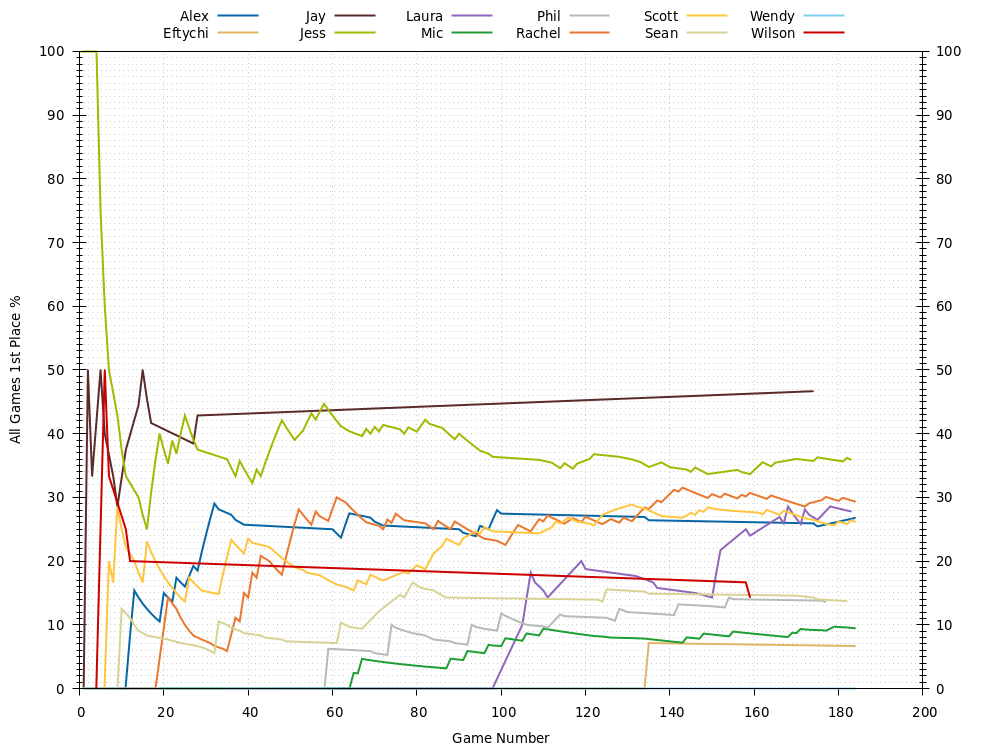
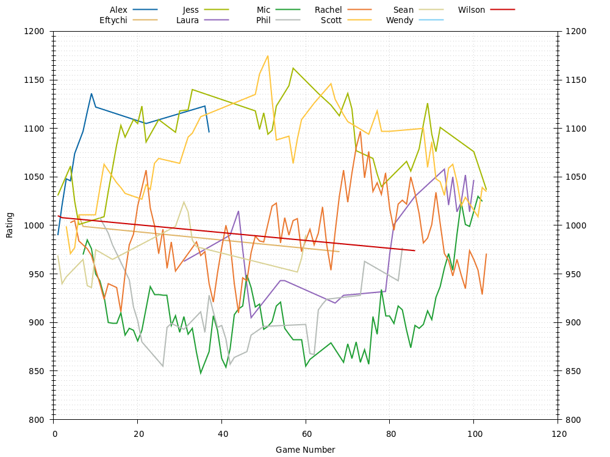
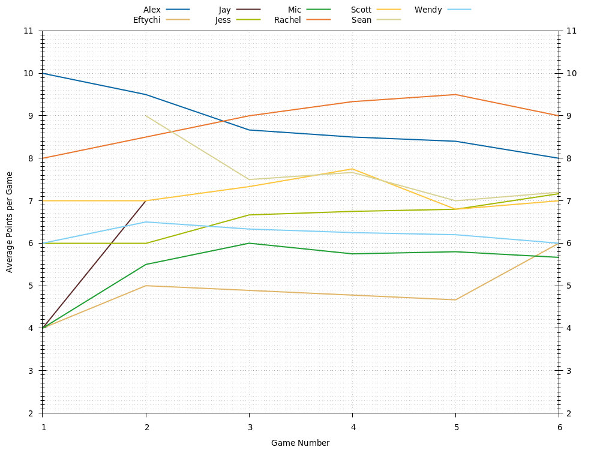

# Catan Leaderboard

Leaderboard for Catan games with friends! Uses https://github.com/acodcha/CatanLeaderboardGenerator to generate the leaderboard. Last updated 2021-12-26 04:36 UTC.

If you wish to participate in updating the leaderboard, contact me and I will add you as a collaborator to this project. As a collaborator, to update the leaderboard with new games, simply edit the `games.txt` file and make a pull request. The build system will automatically generate an updated leaderboard. Once I accept and merge the pull request, the leaderboard will be updated with your changes. See https://github.com/acodcha/CatanLeaderboardGenerator for more information about the `games.txt` file.

- [All Games](#all-games)
- [3-4 Player Games](#3-4-player-games)
- [5-6 Player Games](#5-6-player-games)
- [7-8 Player Games](#7-8-player-games)
- [License](#license)

## All Games

- [All Games Summary](#all-games-summary)
- [All Games Ratings](#all-games-ratings)
- [All Games Average Points](#all-games-average-points)
- [All Games Win Rates](#all-games-win-rates)
- [All Games History](#all-games-history)

[(Back to Top)](#)

### All Games Summary

| **Player**           | **Games** | **Current Rating** | **Avg Rating** | **Avg Points** | **1st Place** | **2nd Place** | **3rd Place** |
| :---                 | :---:     | :---:              | :---:          | :---:          | :---:         | :---:         | :---:         |
| [Alex](Alex)         | 56        | 1088               | 1075           | 7.80           | 27% (15)      | 34% (19)      | 23% (13)      |
| [Eftychi](Eftychi)   | 15        | 914                | 935            | 5.87           | 7% (1)        | 20% (3)       | 27% (4)       |
| [Jay](Jay)           | 15        | 1127               | 1085           | 8.00           | 47% (7)       | 20% (3)       | 20% (3)       |
| [Jess](Jess)         | 117       | 1072               | 1098           | 7.97           | 36% (42)      | 33% (39)      | 21% (24)      |
| [Laura](Laura)       | 36        | 1008               | 923            | 6.78           | 28% (10)      | 11% (4)       | 25% (9)       |
| [Mic](Mic)           | 148       | 968                | 927            | 6.76           | 9% (14)       | 36% (53)      | 34% (51)      |
| [PA](PA)             | 2         | 1046               | 1038           | 9.50           | 50% (1)       | 50% (1)       | 0% (0)        |
| [Phil](Phil)         | 59        | 1000               | 949            | 7.02           | 14% (8)       | 41% (24)      | 37% (22)      |
| [Rachel](Rachel)     | 150       | 1011               | 1003           | 7.49           | 29% (44)      | 28% (42)      | 27% (41)      |
| [Scott](Scott)       | 126       | 1010               | 1049           | 7.67           | 26% (33)      | 36% (45)      | 23% (29)      |
| [Sean](Sean)         | 51        | 1031               | 992            | 7.37           | 14% (7)       | 37% (19)      | 25% (13)      |
| [Stuart](Stuart)     | 1         | 1011               | 1011           | 9.00           | 0% (0)        | 100% (1)      | 0% (0)        |
| [Thompson](Thompson) | 5         | 870                | 920            | 4.20           | 0% (0)        | 0% (0)        | 20% (1)       |
| [Valerie](Valerie)   | 3         | 978                | 963            | 6.67           | 33% (1)       | 0% (0)        | 33% (1)       |
| [Victoria](Victoria) | 2         | 955                | 970            | 3.00           | 0% (0)        | 0% (0)        | 0% (0)        |
| [Wendy](Wendy)       | 23        | 945                | 940            | 5.96           | 0% (0)        | 22% (5)       | 35% (8)       |
| [Wilson](Wilson)     | 7         | 975                | 1012           | 6.86           | 14% (1)       | 29% (2)       | 29% (2)       |

[(Back to All Games)](#all-games)

### All Games Ratings

[(Back to All Games)](#all-games)

### All Games Average Points

[(Back to All Games)](#all-games)

### All Games Win Rates

[(Back to All Games)](#all-games)

### All Games History

| **Game** | **Date**   | **Points** | **Players** | **Results**                                                                                                  |
| :---:    | :---:      | :---:      | :---:       | :---                                                                                                         |
| 184      | 2021-12-11 | 10         | 6           | 1st Alex 10 , 2nd Mic 6 , 2nd Scott 6 , 2nd Rachel 6 , 2nd Wendy 6 , 2nd Eftychi 6                           |
| 183      | 2021-10-14 | 10         | 5           | 1st Scott 11 , 2nd Rachel 7 , 3rd Laura 6 , 4th Jess 5 , 4th Mic 5                                           |
| 182      | 2021-10-14 | 10         | 5           | 1st Jess 11 , 2nd Sean 6 , 2nd Scott 6 , 2nd Rachel 6 , 3rd Mic 5                                            |
| 181      | 2021-10-05 | 10         | 3           | 1st Rachel 10 , 2nd Scott 8 , 3rd Jess 6                                                                     |
| 180      | 2021-09-24 | 10         | 3           | 1st Scott 10 , 2nd Mic 8 , 3rd Rachel 7                                                                      |
| 179      | 2021-09-24 | 10         | 3           | 1st Mic 10 , 2nd Scott 8 , 2nd Rachel 8                                                                      |
| 178      | 2021-09-21 | 10         | 3           | 1st Laura 10 , 2nd Rachel 5 , 2nd Jess 5                                                                     |
| 177      | 2021-09-08 | 10         | 5           | 1st Rachel 10 , 2nd Mic 7 , 3rd Phil 6 , 4th Scott 5 , 5th Thompson 4                                        |
| 176      | 2021-09-08 | 10         | 5           | 1st Rachel 10 , 2nd Mic 6 , 3rd Phil 5 , 3rd Scott 5 , 4th Thompson 4                                        |
| 175      | 2021-09-06 | 10         | 6           | 1st Jess 10 , 2nd Wendy 9 , 3rd Sean 8 , 4th Alex 6 , 4th Laura 6 , 4th Scott 6                              |
| 174      | 2021-09-04 | 10         | 6           | 1st Jay 10 , 2nd Alex 9 , 2nd Jess 9 , 2nd Sean 9 , 3rd Scott 7 , 3rd Wendy 7                                |
| 173      | 2021-09-03 | 10         | 3           | 1st Rachel 10 , 2nd Mic 8 , 3rd Laura 5                                                                      |
| 172      | 2021-09-03 | 10         | 4           | 1st Laura 11 , 2nd Scott 9 , 3rd Mic 6 , 3rd Rachel 6                                                        |
| 171      | 2021-09-03 | 10         | 4           | 1st Mic 10 , 2nd Laura 6 , 3rd Rachel 4 , 3rd Scott 4                                                        |
| 170      | 2021-08-28 | 10         | 6           | 1st Jess 10 , 2nd Sean 9 , 3rd Rachel 8 , 3rd Laura 8 , 4th Scott 7 , 5th Mic 6                              |
| 169      | 2021-08-27 | 10         | 4           | 1st Mic 10 , 2nd Rachel 7 , 3rd Scott 6 , 4th Laura 5                                                        |
| 168      | 2021-08-27 | 10         | 4           | 1st Laura 10 , 2nd Scott 7 , 3rd Mic 6 , 3rd Rachel 6                                                        |
| 167      | 2021-08-13 | 10         | 4           | 1st Scott 10 , 2nd Mic 9 , 3rd Rachel 6 , 4th Laura 5                                                        |
| 166      | 2021-08-13 | 10         | 4           | 1st Laura 10 , 2nd Mic 8 , 3rd Scott 5 , 4th Rachel 2                                                        |
| 165      | 2021-08-09 | 10         | 4           | 1st Jess 10 , 2nd Scott 9 , 2nd Mic 9 , 3rd Rachel 8                                                         |
| 164      | 2021-08-09 | 10         | 4           | 1st Rachel 11 , 2nd Mic 9 , 3rd Jess 8 , 4th Scott 6                                                         |
| 163      | 2021-08-06 | 10         | 4           | 1st Scott 11 , 2nd Rachel 6 , 3rd Jess 5 , 3rd Mic 5                                                         |
| 162      | 2021-08-06 | 10         | 4           | 1st Jess 11 , 2nd Mic 9 , 2nd Rachel 9 , 3rd Scott 8                                                         |
| 161      | 2021-08-06 | 10         | 4           | 1st Jess 10 , 2nd Scott 6 , 3rd Mic 5 , 4th Rachel 4                                                         |
| 160      | 2021-07-22 | 10         | 3           | 1st Jess 10 , 2nd Mic 8 , 2nd Rachel 8                                                                       |
| 159      | 2021-03-20 | 10         | 5           | 1st Rachel 10 , 2nd Jess 8 , 3rd Wilson 6 , 3rd Laura 6 , 4th Mic 5                                          |
| 158      | 2021-03-20 | 10         | 4           | 1st Laura 10 , 2nd Mic 8 , 3rd Rachel 6 , 4th Wilson 4                                                       |
| 157      | 2021-03-17 | 10         | 3           | 1st Rachel 10 , 2nd Jess 6 , 3rd Mic 5                                                                       |
| 156      | 2021-03-17 | 10         | 3           | 1st Jess 10 , 2nd Rachel 7 , 3rd Mic 4                                                                       |
| 155      | 2021-03-15 | 10         | 5           | 1st Mic 10 , 2nd Phil 7 , 3rd Scott 6 , 4th Rachel 4 , 5th Thompson 3                                        |
| 154      | 2021-03-12 | 10         | 4           | 1st Phil 10 , 2nd Rachel 9 , 3rd Mic 7 , 4th Thompson 4                                                      |
| 153      | 2021-03-12 | 10         | 4           | 1st Rachel 10 , 2nd Mic 8 , 3rd Phil 6 , 3rd Thompson 6                                                      |
| 152      | 2021-03-05 | 10         | 3           | 1st Laura 10 , 2nd Rachel 6 , 2nd Mic 6                                                                      |
| 151      | 2021-03-05 | 10         | 4           | 1st Laura 10 , 2nd Scott 9 , 3rd Mic 8 , 4th Rachel 6                                                        |
| 150      | 2021-03-05 | 10         | 3           | 1st Rachel 10 , 2nd Laura 5 , 3rd Mic 4                                                                      |
| 149      | 2021-03-03 | 10         | 5           | 1st Scott 10 , 2nd Jess 6 , 3rd Rachel 5 , 3rd Phil 5 , 3rd Mic 5                                            |
| 148      | 2021-02-25 | 10         | 4           | 1st Mic 10 , 2nd Jess 9 , 2nd Rachel 9 , 2nd Scott 9                                                         |
| 147      | 2021-02-25 | 10         | 4           | 1st Scott 10 , 2nd Rachel 8 , 3rd Jess 7 , 4th Mic 6                                                         |
| 146      | 2021-02-19 | 10         | 5           | 1st Jess 11 , 2nd Rachel 7 , 3rd Scott 6 , 3rd Mic 6 , 4th Laura 4                                           |
| 145      | 2021-02-15 | 10         | 5           | 1st Scott 11 , 2nd PA 9 , 3rd Mic 8 , 4th Jess 6 , 5th Rachel 5                                              |
| 144      | 2021-02-12 | 10         | 3           | 1st Mic 10 , 2nd Jess 8 , 3rd Rachel 6                                                                       |
| 143      | 2021-02-12 | 10         | 3           | 1st Rachel 11 , 2nd Scott 9 , 3rd Mic 6                                                                      |
| 142      | 2021-02-08 | 10         | 3           | 1st Phil 10 , 2nd Mic 9 , 3rd Rachel 6                                                                       |
| 141      | 2021-02-08 | 10         | 3           | 1st Rachel 10 , 2nd Phil 9 , 3rd Mic 6                                                                       |
| 140      | 2021-02-05 | 10         | 3           | 1st Rachel 10 , 2nd Mic 6 , 3rd Jess 5                                                                       |
| 139      | 2021-02-05 | 10         | 3           | 1st Rachel 10 , 2nd Jess 7 , 3rd Mic 6                                                                       |
| 138      | 2021-02-02 | 10         | 4           | 1st Jess 10 , 2nd Mic 9 , 2nd Scott 9 , 3rd Rachel 5                                                         |
| 137      | 2021-01-26 | 10         | 4           | 1st Rachel 10 , 2nd Laura 7 , 2nd Scott 7 , 3rd Mic 5                                                        |
| 136      | 2021-01-26 | 10         | 5           | 1st Rachel 10 , 2nd Scott 9 , 3rd Mic 7 , 3rd Phil 7 , 4th Laura 4                                           |
| 135      | 2021-01-18 | 10         | 8           | 1st Eftychi 10 , 2nd Jess 9 , 3rd Sean 8 , 3rd Scott 8 , 4th Rachel 7 , 5th Alex 6 , 6th Mic 5 , 6th Wendy 5 |
| 134      | 2021-01-18 | 10         | 8           | 1st Rachel 10 , 2nd Alex 8 , 3rd Jess 7 , 4th Mic 6 , 4th Wendy 6 , 5th Sean 5 , 6th Eftychi 4 , 7th Scott 3 |
| 133      | 2021-01-14 | 10         | 3           | 1st Rachel 10 , 2nd Jess 7 , 3rd Eftychi 6                                                                   |
| 132      | 2020-12-31 | 10         | 3           | 1st Rachel 11 , 2nd Scott 6 , 3rd Laura 5                                                                    |
| 131      | 2020-12-25 | 10         | 4           | 1st Scott 10 , 2nd Jess 8 , 2nd Mic 8 , 3rd Rachel 5                                                         |
| 130      | 2020-12-23 | 10         | 3           | 1st Valerie 10 , 2nd Phil 9 , 3rd Rachel 5                                                                   |
| 129      | 2020-12-23 | 10         | 3           | 1st Rachel 10 , 2nd Phil 8 , 3rd Valerie 5                                                                   |
| 128      | 2020-12-23 | 10         | 4           | 1st Phil 10 , 2nd Rachel 8 , 3rd Jess 6 , 4th Valerie 5                                                      |
| 127      | 2020-12-17 | 10         | 3           | 1st Scott 10 , 2nd Rachel 9 , 2nd Phil 9                                                                     |
| 126      | 2020-12-02 | 10         | 3           | 1st Rachel 10 , 2nd Mic 6 , 3rd Phil 4                                                                       |
| 125      | 2020-12-02 | 10         | 3           | 1st Sean 10 , 2nd Phil 7 , 3rd Mic 5                                                                         |
| 124      | 2020-11-27 | 10         | 4           | 1st Scott 10 , 2nd Sean 9 , 3rd Mic 8 , 4th Rachel 6                                                         |
| 123      | 2020-11-22 | 10         | 3           | 1st Scott 10 , 2nd Rachel 8 , 3rd Sean 5                                                                     |
| 122      | 2020-11-02 | 10         | 4           | 1st Jess 10 , 2nd Rachel 9 , 3rd Scott 7 , 3rd Mic 7                                                         |
| 121      | 2020-11-02 | 10         | 4           | 1st Jess 10 , 2nd Scott 6 , 3rd Mic 4 , 3rd Rachel 4                                                         |
| 120      | 2020-10-31 | 10         | 3           | 1st Rachel 10 , 2nd Laura 7 , 3rd Mic 6                                                                      |
| 119      | 2020-10-31 | 10         | 3           | 1st Laura 10 , 2nd Mic 9 , 3rd Rachel 6                                                                      |
| 118      | 2020-10-30 | 10         | 4           | 1st Jess 10 , 2nd Rachel 8 , 2nd Mic 8 , 3rd Scott 7                                                         |
| 117      | 2020-10-30 | 10         | 4           | 1st Rachel 10 , 2nd Jess 6 , 3rd Mic 4 , 4th Scott 3                                                         |
| 116      | 2020-10-30 | 10         | 3           | 1st Scott 10 , 2nd Mic 6 , 2nd Jess 6                                                                        |
| 115      | 2020-10-28 | 10         | 4           | 1st Jess 11 , 2nd Rachel 8 , 2nd Phil 8 , 3rd Mic 7                                                          |
| 114      | 2020-10-28 | 10         | 5           | 1st Phil 11 , 2nd Jess 9 , 3rd Scott 7 , 3rd Rachel 7 , 3rd Mic 7                                            |
| 113      | 2020-10-27 | 10         | 4           | 1st Scott 10 , 2nd Rachel 5 , 2nd Jess 5 , 2nd Mic 5                                                         |
| 112      | 2020-10-27 | 10         | 4           | 1st Scott 10 , 2nd Rachel 8 , 3rd Jess 7 , 4th Mic 5                                                         |
| 111      | 2020-10-25 | 10         | 4           | 1st Rachel 10 , 2nd Phil 7 , 3rd Mic 5 , 4th Laura 4                                                         |
| 110      | 2020-10-25 | 10         | 4           | 1st Mic 10 , 2nd Rachel 8 , 2nd Phil 8 , 3rd Laura 6                                                         |
| 109      | 2020-10-24 | 10         | 5           | 1st Rachel 11 , 2nd Jess 9 , 2nd Stuart 9 , 3rd Scott 8 , 4th Mic 7                                          |
| 108      | 2020-10-23 | 10         | 3           | 1st Rachel 10 , 2nd Mic 9 , 3rd Laura 8                                                                      |
| 107      | 2020-10-23 | 10         | 3           | 1st Laura 10 , 2nd Mic 8 , 3rd Rachel 7                                                                      |
| 106      | 2020-10-22 | 10         | 3           | 1st Mic 10 , 2nd Phil 9 , 3rd Rachel 7                                                                       |
| 105      | 2020-10-20 | 10         | 4           | 1st Laura 10 , 2nd Mic 9 , 3rd Rachel 6 , 4th Phil 4                                                         |
| 104      | 2020-10-20 | 10         | 3           | 1st Rachel 10 , 2nd Phil 7 , 2nd Mic 7                                                                       |
| 103      | 2020-10-19 | 10         | 3           | 1st Rachel 10 , 2nd Phil 6 , 3rd Mic 4                                                                       |
| 102      | 2020-10-19 | 10         | 3           | 1st Rachel 10 , 2nd Phil 6 , 2nd Mic 6                                                                       |
| 101      | 2020-10-19 | 10         | 3           | 1st Mic 10 , 2nd Rachel 9 , 2nd Phil 9                                                                       |
| 100      | 2020-10-18 | 10         | 4           | 1st Phil 10 , 2nd Mic 8 , 3rd Alex 7 , 4th Rachel 6                                                          |
| 99       | 2020-10-18 | 10         | 3           | 1st Alex 10 , 2nd Rachel 9 , 3rd Phil 5                                                                      |
| 98       | 2020-10-16 | 10         | 5           | 1st Alex 10 , 2nd Mic 10 , 3rd Jess 9 , 4th Scott 8 , 5th Laura 6                                            |
| 97       | 2020-10-16 | 10         | 5           | 1st Mic 10 , 2nd Alex 7 , 2nd Jess 7 , 2nd Scott 7 , 3rd Laura 4                                             |
| 96       | 2020-10-14 | 10         | 4           | 1st Scott 10 , 2nd Phil 7 , 3rd Rachel 6 , 4th Mic 4                                                         |
| 95       | 2020-10-12 | 10         | 5           | 1st Alex 10 , 2nd Scott 9 , 2nd Mic 9 , 3rd Jess 8 , 4th Rachel 6                                            |
| 94       | 2020-10-12 | 10         | 6           | 1st Scott 10 , 2nd Alex 8 , 2nd Jess 8 , 3rd Mic 7 , 4th Phil 4 , 4th Rachel 4                               |
| 93       | 2020-10-11 | 10         | 5           | 1st Phil 10 , 2nd Jess 9 , 3rd Rachel 7 , 4th Mic 6 , 5th Laura 5                                            |
| 92       | 2020-10-11 | 10         | 5           | 1st Mic 10 , 2nd Phil 7 , 3rd Rachel 6 , 4th Jess 5 , 4th Laura 5                                            |
| 91       | 2020-10-10 | 10         | 5           | 1st Scott 10 , 2nd Mic 8 , 3rd Rachel 6 , 3rd Jess 6 , 4th Alex 5                                            |
| 90       | 2020-10-10 | 10         | 5           | 1st Jess 10 , 2nd Alex 8 , 3rd Mic 7 , 4th Scott 4 , 4th Rachel 4                                            |
| 89       | 2020-10-06 | 10         | 5           | 1st Rachel 10 , 2nd Mic 7 , 2nd Jess 7 , 3rd Scott 6 , 3rd Phil 6                                            |
| 88       | 2020-10-06 | 10         | 5           | 1st Mic 10 , 2nd Phil 9 , 2nd Scott 9 , 3rd Rachel 7 , 4th Jess 4                                            |
| 87       | 2020-10-02 | 10         | 5           | 1st Scott 10 , 2nd Rachel 9 , 3rd Mic 8 , 4th Sean 7 , 4th Jess 7                                            |
| 86       | 2020-10-02 | 10         | 5           | 1st Scott 10 , 2nd Sean 9 , 3rd Jess 8 , 4th Rachel 7 , 5th Mic 6                                            |
| 85       | 2020-10-02 | 10         | 3           | 1st Rachel 11 , 2nd Sean 8 , 3rd Mic 7                                                                       |
| 84       | 2020-09-30 | 10         | 5           | 1st Scott 10 , 2nd Phil 9 , 2nd Mic 9 , 3rd Rachel 8 , 4th Sean 7                                            |
| 83       | 2020-09-30 | 10         | 5           | 1st Scott 10 , 2nd Rachel 9 , 3rd Jess 8 , 3rd Phil 8 , 4th Mic 6                                            |
| 82       | 2020-09-29 | 10         | 6           | 1st Jess 10 , 2nd Mic 9 , 3rd Phil 8 , 4th Scott 5 , 4th Rachel 5 , 5th Laura 3                              |
| 81       | 2020-09-28 | 10         | 4           | 1st Jess 10 , 2nd Scott 8 , 3rd Mic 7 , 4th Sean 6                                                           |
| 80       | 2020-09-28 | 10         | 4           | 1st Scott 10 , 2nd Jess 7 , 3rd Sean 5 , 4th Mic 4                                                           |
| 79       | 2020-09-27 | 10         | 4           | 1st Sean 10 , 2nd Mic 7 , 3rd Phil 6 , 4th Laura 5                                                           |
| 78       | 2020-09-25 | 10         | 3           | 1st Jess 11 , 2nd Scott 8 , 3rd Mic 7                                                                        |
| 77       | 2020-09-23 | 10         | 6           | 1st Scott 10 , 2nd Jess 8 , 2nd Phil 8 , 3rd Sean 7 , 4th Mic 6 , 4th Rachel 6                               |
| 76       | 2020-09-23 | 10         | 4           | 1st Sean 10 , 2nd Jess 6 , 2nd Mic 6 , 3rd Rachel 4                                                          |
| 75       | 2020-09-22 | 10         | 3           | 1st Rachel 10 , 2nd Phil 7 , 3rd Mic 6                                                                       |
| 74       | 2020-09-22 | 10         | 3           | 1st Phil 10 , 2nd Mic 6 , 3rd Rachel 4                                                                       |
| 73       | 2020-09-22 | 10         | 3           | 1st Rachel 10 , 2nd Mic 5 , 3rd Phil 4                                                                       |
| 72       | 2020-09-21 | 10         | 5           | 1st Jess 10 , 2nd Scott 9 , 3rd Mic 8 , 4th Alex 6 , 5th Rachel 5                                            |
| 71       | 2020-09-17 | 10         | 6           | 1st Sean 10 , 2nd Jess 10 , 3rd Rachel 9 , 4th Scott 8 , 5th Laura 7 , 6th Mic 6                             |
| 70       | 2020-09-14 | 10         | 5           | 1st Jess 10 , 2nd Mic 6 , 3rd Alex 4 , 3rd Phil 4 , 3rd Scott 4                                              |
| 69       | 2020-09-14 | 10         | 5           | 1st Scott 10 , 2nd Jess 8 , 3rd Alex 7 , 3rd Phil 7 , 4th Mic 6                                              |
| 68       | 2020-09-11 | 10         | 4           | 1st Jess 10 , 2nd Scott 9 , 3rd Mic 6 , 4th Rachel 5                                                         |
| 67       | 2020-09-11 | 10         | 6           | 1st Mic 10 , 2nd Jess 8 , 3rd Sean 6 , 3rd Scott 6 , 4th Rachel 5 , 4th Laura 5                              |
| 66       | 2020-09-10 | 10         | 3           | 1st Scott 11 , 2nd Mic 6 , 2nd Rachel 6                                                                      |
| 65       | 2020-09-10 | 10         | 3           | 1st Mic 10 , 2nd Scott 7 , 3rd Rachel 6                                                                      |
| 64       | 2020-09-07 | 10         | 6           | 1st Alex 10 , 2nd Scott 8 , 2nd Rachel 8 , 2nd Mic 8 , 3rd Jess 7 , 3rd Sean 7                               |
| 63       | 2020-09-07 | 10         | 5           | 1st Alex 10 , 2nd Scott 9 , 3rd Rachel 7 , 4th Sean 6 , 5th Mic 5                                            |
| 62       | 2020-09-04 | 10         | 5           | 1st Sean 10 , 2nd Wendy 6 , 3rd Alex 4 , 3rd Mic 4 , 4th Jess 3                                              |
| 61       | 2020-09-04 | 10         | 7           | 1st Rachel 10 , 2nd Scott 9 , 3rd Alex 8 , 3rd Sean 8 , 4th Jess 7 , 5th Wendy 6 , 6th Mic 5                 |
| 60       | 2020-09-04 | 10         | 4           | 1st Rachel 10 , 2nd Scott 9 , 3rd Alex 8 , 4th Jess 6                                                        |
| 59       | 2020-09-02 | 10         | 5           | 1st Phil 10 , 2nd Jess 6 , 3rd Scott 5 , 3rd Rachel 5 , 4th Mic 3                                            |
| 58       | 2020-09-02 | 10         | 4           | 1st Jess 10 , 2nd Scott 5 , 2nd Mic 5 , 3rd Phil 3                                                           |
| 57       | 2020-09-02 | 10         | 5           | 1st Jess 10 , 2nd Scott 8 , 2nd Rachel 8 , 2nd Mic 8 , 3rd Phil 6                                            |
| 56       | 2020-09-01 | 10         | 4           | 1st Rachel 10 , 2nd Jess 6 , 3rd Mic 5 , 3rd Phil 5                                                          |
| 55       | 2020-09-01 | 10         | 4           | 1st Jess 10 , 2nd Rachel 9 , 3rd Mic 8 , 4th Phil 5                                                          |
| 54       | 2020-08-31 | 10         | 5           | 1st Jess 10 , 2nd Scott 6 , 2nd Phil 6 , 3rd Mic 5 , 3rd Rachel 5                                            |
| 53       | 2020-08-31 | 10         | 5           | 1st Jess 10 , 2nd Rachel 7 , 2nd Scott 7 , 2nd Phil 7 , 3rd Mic 5                                            |
| 52       | 2020-08-31 | 10         | 3           | 1st Rachel 10 , 2nd Mic 7 , 3rd Phil 4                                                                       |
| 51       | 2020-08-28 | 10         | 5           | 1st Rachel 10 , 2nd Jess 8 , 3rd Scott 7 , 4th Mic 6 , 5th Phil 5                                            |
| 50       | 2020-08-28 | 10         | 4           | 1st Rachel 11 , 2nd Jess 7 , 2nd Scott 7 , 3rd Mic 6                                                         |
| 49       | 2020-08-22 | 10         | 5           | 1st Rachel 10 , 2nd Sean 8 , 3rd Jess 7 , 3rd Mic 7 , 4th Scott 6                                            |
| 48       | 2020-08-22 | 10         | 5           | 1st Jess 10 , 2nd Scott 9 , 2nd Sean 9 , 2nd Mic 9 , 3rd Rachel 5                                            |
| 47       | 2020-08-22 | 10         | 5           | 1st Jess 10 , 2nd Scott 9 , 2nd Rachel 9 , 3rd Laura 7 , 3rd Mic 7                                           |
| 46       | 2020-08-19 | 10         | 4           | 1st Jess 10 , 2nd Scott 8 , 2nd Mic 8 , 3rd Rachel 6                                                         |
| 45       | 2020-08-19 | 10         | 4           | 1st Jess 10 , 2nd Scott 5 , 2nd Mic 5 , 2nd Rachel 5                                                         |
| 44       | 2020-08-17 | 10         | 4           | 1st Jess 10 , 2nd Sean 7 , 2nd Phil 7 , 2nd Mic 7                                                            |
| 43       | 2020-08-17 | 10         | 5           | 1st Rachel 10 , 2nd Sean 8 , 3rd Phil 7 , 4th Mic 6 , 5th Jess 4                                             |
| 42       | 2020-08-17 | 10         | 4           | 1st Jess 10 , 2nd Rachel 9 , 3rd Phil 8 , 4th Mic 3                                                          |
| 41       | 2020-08-11 | 10         | 5           | 1st Rachel 10 , 2nd Jess 9 , 2nd Scott 9 , 3rd Phil 6 , 4th Mic 4                                            |
| 40       | 2020-08-11 | 10         | 4           | 1st Scott 10 , 2nd Jess 8 , 3rd Rachel 7 , 3rd Mic 7                                                         |
| 39       | 2020-08-07 | 10         | 7           | 1st Rachel 10 , 2nd Jess 8 , 2nd Scott 8 , 3rd Alex 7 , 3rd Mic 7 , 4th Sean 6 , 4th Wendy 6                 |
| 38       | 2020-08-07 | 10         | 6           | 1st Jess 10 , 2nd Sean 8 , 3rd Wendy 7 , 3rd Rachel 7 , 4th Scott 5 , 4th Mic 5                              |
| 37       | 2020-08-07 | 10         | 5           | 1st Rachel 10 , 2nd Jess 9 , 3rd Scott 8 , 4th Alex 6 , 5th Mic 5                                            |
| 36       | 2020-08-05 | 10         | 6           | 1st Scott 10 , 2nd Jess 8 , 2nd Mic 8 , 3rd Sean 7 , 3rd Phil 7 , 4th Alex 6                                 |
| 35       | 2020-08-05 | 10         | 6           | 1st Scott 10 , 2nd Rachel 8 , 3rd Sean 6 , 3rd Jess 6 , 3rd Mic 6 , 4th Phil 5                               |
| 34       | 2020-07-29 | 10         | 4           | 1st Scott 10 , 2nd Phil 8 , 3rd Mic 7 , 4th Rachel 6                                                         |
| 33       | 2020-07-26 | 10         | 4           | 1st Sean 10 , 2nd Alex 8 , 2nd Scott 8 , 3rd Mic 7                                                           |
| 32       | 2020-07-25 | 10         | 4           | 1st Alex 10 , 2nd Sean 5 , 2nd Rachel 5 , 2nd Mic 5                                                          |
| 31       | 2020-07-25 | 10         | 4           | 1st Alex 10 , 2nd Mic 9 , 3rd Rachel 7 , 4th Sean 6                                                          |
| 30       | 2020-07-25 | 10         | 4           | 1st Alex 10 , 2nd Sean 9 , 3rd Eftychi 8 , 4th Mic 4                                                         |
| 29       | 2020-07-18 | 10         | 5           | 1st Alex 10 , 2nd Rachel 8 , 3rd Scott 6 , 4th Mic 5 , 5th Eftychi 4                                         |
| 28       | 2020-07-04 | 10         | 8           | 1st Jay 10 , 2nd Alex 9 , 2nd Sean 9 , 3rd Scott 7 , 3rd Wendy 7 , 3rd Mic 7 , 4th Jess 6 , 4th Eftychi 6    |
| 27       | 2020-07-04 | 10         | 8           | 1st Alex 10 , 2nd Rachel 8 , 3rd Scott 7 , 4th Jess 6 , 4th Wendy 6 , 5th Eftychi 4 , 5th Jay 4 , 5th Mic 4  |
| 26       | 2020-07-04 | 10         | 4           | 1st Scott 10 , 2nd Eftychi 7 , 3rd Jess 6 , 3rd Rachel 6                                                     |
| 25       | 2020-07-03 | 10         | 6           | 1st Jess 10 , 2nd Alex 6 , 2nd Wendy 6 , 3rd Scott 5 , 3rd Eftychi 5 , 4th Rachel 4                          |
| 24       | 2020-07-03 | 10         | 5           | 1st Jess 10 , 2nd Alex 9 , 2nd Sean 9 , 3rd Rachel 8 , 4th Scott 7                                           |
| 23       | 2020-07-03 | 10         | 4           | 1st Alex 10 , 2nd Rachel 7 , 2nd Scott 7 , 3rd Jess 5                                                        |
| 22       | 2020-06-20 | 10         | 6           | 1st Jess 10 , 2nd Wendy 8 , 3rd Alex 7 , 3rd Scott 7 , 4th Eftychi 4 , 4th Mic 4                             |
| 21       | 2020-06-20 | 10         | 5           | 1st Rachel 10 , 2nd Alex 8 , 2nd Jess 8 , 2nd Sean 8 , 3rd Scott 5                                           |
| 20       | 2020-06-20 | 10         | 6           | 1st Alex 10 , 2nd Scott 6 , 2nd Mic 6 , 3rd Jess 5 , 4th Eftychi 4 , 5th Wendy 2                             |
| 19       | 2020-06-20 | 10         | 6           | 1st Jess 10 , 2nd Eftychi 8 , 3rd Wendy 7 , 4th Alex 6 , 4th Scott 6 , 4th Mic 6                             |
| 18       | 2020-06-13 | 10         | 4           | 1st Jess 10 , 2nd Alex 9 , 2nd Rachel 9 , 3rd Scott 7                                                        |
| 17       | 2020-06-13 | 10         | 5           | 1st Jess 10 , 2nd Alex 9 , 3rd Jay 8 , 4th Scott 7 , 5th Rachel 4                                            |
| 16       | 2020-06-06 | 10         | 6           | 1st Scott 10 , 2nd Alex 9 , 3rd Jay 5 , 3rd Jess 5 , 3rd Sean 5 , 4th Rachel 3                               |
| 15       | 2020-06-06 | 10         | 5           | 1st Jay 10 , 2nd Alex 5 , 2nd Jess 5 , 3rd Scott 4 , 3rd Rachel 4                                            |
| 14       | 2020-01-19 | 10         | 6           | 1st Jay 10 , 2nd Alex 9 , 3rd Jess 8 , 3rd Eftychi 8 , 4th Sean 7 , 4th Scott 7                              |
| 13       | 2019-09-22 | 10         | 4           | 1st Alex 10 , 2nd Sean 6 , 2nd Scott 6 , 3rd Wendy 4                                                         |
| 12       | 2019-03-10 | 10         | 3           | 1st Alex 11 , 2nd Wilson 5 , 3rd Sean 4                                                                      |
| 11       | 2018-09-01 | 10         | 5           | 1st Jay 10 , 2nd Alex 9 , 2nd Jess 9 , 3rd Wilson 8 , 4th Scott 5                                            |
| 10       | 2018-01-14 | 10         | 5           | 1st Sean 10 , 2nd Jess 7 , 3rd Alex 5 , 3rd Scott 5 , 4th Eftychi 4                                          |
| 9        | 2017-10-08 | 10         | 6           | 1st Scott 10 , 2nd Alex 9 , 3rd Jay 6 , 3rd Jess 6 , 3rd Wendy 6 , 4th Sean 5                                |
| 8        | 2017-08-25 | 10         | 6           | 1st PA 10 , 2nd Jay 7 , 2nd Sean 7 , 3rd Scott 6 , 4th Wendy 5 , 5th Alex 4                                  |
| 7        | 2017-06-10 | 10         | 6           | 1st Scott 10 , 2nd Alex 8 , 3rd Jess 7 , 4th Wilson 6 , 5th Wendy 5 , 6th Victoria 3                         |
| 6        | 2017-06-10 | 10         | 6           | 1st Wilson 10 , 2nd Scott 6 , 3rd Alex 5 , 4th Jay 4 , 5th Victoria 3 , 6th Jess 2                           |
| 5        | 2017-06-10 | 10         | 6           | 1st Jay 10 , 2nd Alex 9 , 3rd Jess 7 , 4th Scott 6 , 4th Sean 6 , 4th Wendy 6                                |
| 4        | 2017-05-06 | 10         | 4           | 1st Jess 10 , 2nd Wilson 9 , 3rd Alex 6 , 4th Sean 5                                                         |
| 3        | 2017-04-01 | 10         | 6           | 1st Jess 10 , 2nd Jay 8 , 2nd Sean 8 , 3rd Wendy 5 , 4th Alex 4 , 4th Rachel 4                               |
| 2        | 2017-03-31 | 10         | 6           | 1st Jay 10 , 2nd Scott 9 , 3rd Alex 7 , 3rd Wendy 7 , 4th Sean 6 , 5th Rachel 5                              |
| 1        | 2017-03-17 | 10         | 6           | 1st Jess 10 , 2nd Jay 8 , 3rd Alex 7 , 3rd Sean 7 , 4th Scott 6 , 5th Wendy 5                                |

[(Back to All Games)](#all-games)

## 3-4 Player Games

- [3-4 Player Games Summary](#3-4-player-games-summary)
- [3-4 Player Games Ratings](#3-4-player-games-ratings)
- [3-4 Player Games Average Points](#3-4-player-games-average-points)
- [3-4 Player Games Win Rates](#3-4-player-games-win-rates)
- [3-4 Player Games History](#3-4-player-games-history)

[(Back to Top)](#)

### 3-4 Player Games Summary

| **Player**           | **Games** | **Current Rating** | **Avg Rating** | **Avg Points** | **1st Place** | **2nd Place** | **3rd Place** |
| :---                 | :---:     | :---:              | :---:          | :---:          | :---:         | :---:         | :---:         |
| [Alex](Alex)         | 12        | 1096               | 1081           | 9.00           | 58% (7)       | 17% (2)       | 25% (3)       |
| [Eftychi](Eftychi)   | 3         | 973                | 994            | 7.00           | 0% (0)        | 33% (1)       | 67% (2)       |
| [Jess](Jess)         | 46        | 1037               | 1090           | 8.09           | 46% (21)      | 33% (15)      | 20% (9)       |
| [Laura](Laura)       | 22        | 1047               | 988            | 7.64           | 45% (10)      | 18% (4)       | 18% (4)       |
| [Mic](Mic)           | 86        | 1025               | 911            | 6.87           | 10% (9)       | 44% (38)      | 38% (33)      |
| [Phil](Phil)         | 33        | 977                | 911            | 7.12           | 15% (5)       | 52% (17)      | 27% (9)       |
| [Rachel](Rachel)     | 90        | 971                | 990            | 7.69           | 32% (29)      | 32% (29)      | 28% (25)      |
| [Scott](Scott)       | 51        | 1035               | 1069           | 8.08           | 33% (17)      | 49% (25)      | 14% (7)       |
| [Sean](Sean)         | 16        | 990                | 971            | 7.19           | 25% (4)       | 38% (6)       | 19% (3)       |
| [Thompson](Thompson) | 2         | 943                | 959            | 5.00           | 0% (0)        | 0% (0)        | 50% (1)       |
| [Valerie](Valerie)   | 3         | 971                | 959            | 6.67           | 33% (1)       | 0% (0)        | 33% (1)       |
| [Wendy](Wendy)       | 1         | 968                | 968            | 4.00           | 0% (0)        | 0% (0)        | 100% (1)      |
| [Wilson](Wilson)     | 3         | 974                | 998            | 6.00           | 0% (0)        | 67% (2)       | 0% (0)        |

[(Back to 3-4 Player Games)](#3-4-player-games)

### 3-4 Player Games Ratings

[(Back to 3-4 Player Games)](#3-4-player-games)

### 3-4 Player Games Average Points

[(Back to 3-4 Player Games)](#3-4-player-games)

### 3-4 Player Games Win Rates

[(Back to 3-4 Player Games)](#3-4-player-games)

### 3-4 Player Games History

| **Game** | **Date**   | **Points** | **Players** | **Results**                                              |
| :---:    | :---:      | :---:      | :---:       | :---                                                     |
| 103      | 2021-10-05 | 10         | 3           | 1st Rachel 10 , 2nd Scott 8 , 3rd Jess 6                 |
| 102      | 2021-09-24 | 10         | 3           | 1st Scott 10 , 2nd Mic 8 , 3rd Rachel 7                  |
| 101      | 2021-09-24 | 10         | 3           | 1st Mic 10 , 2nd Scott 8 , 2nd Rachel 8                  |
| 100      | 2021-09-21 | 10         | 3           | 1st Laura 10 , 2nd Rachel 5 , 2nd Jess 5                 |
| 99       | 2021-09-03 | 10         | 3           | 1st Rachel 10 , 2nd Mic 8 , 3rd Laura 5                  |
| 98       | 2021-09-03 | 10         | 4           | 1st Laura 11 , 2nd Scott 9 , 3rd Mic 6 , 3rd Rachel 6    |
| 97       | 2021-09-03 | 10         | 4           | 1st Mic 10 , 2nd Laura 6 , 3rd Rachel 4 , 3rd Scott 4    |
| 96       | 2021-08-27 | 10         | 4           | 1st Mic 10 , 2nd Rachel 7 , 3rd Scott 6 , 4th Laura 5    |
| 95       | 2021-08-27 | 10         | 4           | 1st Laura 10 , 2nd Scott 7 , 3rd Mic 6 , 3rd Rachel 6    |
| 94       | 2021-08-13 | 10         | 4           | 1st Scott 10 , 2nd Mic 9 , 3rd Rachel 6 , 4th Laura 5    |
| 93       | 2021-08-13 | 10         | 4           | 1st Laura 10 , 2nd Mic 8 , 3rd Scott 5 , 4th Rachel 2    |
| 92       | 2021-08-09 | 10         | 4           | 1st Jess 10 , 2nd Scott 9 , 2nd Mic 9 , 3rd Rachel 8     |
| 91       | 2021-08-09 | 10         | 4           | 1st Rachel 11 , 2nd Mic 9 , 3rd Jess 8 , 4th Scott 6     |
| 90       | 2021-08-06 | 10         | 4           | 1st Scott 11 , 2nd Rachel 6 , 3rd Jess 5 , 3rd Mic 5     |
| 89       | 2021-08-06 | 10         | 4           | 1st Jess 11 , 2nd Mic 9 , 2nd Rachel 9 , 3rd Scott 8     |
| 88       | 2021-08-06 | 10         | 4           | 1st Jess 10 , 2nd Scott 6 , 3rd Mic 5 , 4th Rachel 4     |
| 87       | 2021-07-22 | 10         | 3           | 1st Jess 10 , 2nd Mic 8 , 2nd Rachel 8                   |
| 86       | 2021-03-20 | 10         | 4           | 1st Laura 10 , 2nd Mic 8 , 3rd Rachel 6 , 4th Wilson 4   |
| 85       | 2021-03-17 | 10         | 3           | 1st Rachel 10 , 2nd Jess 6 , 3rd Mic 5                   |
| 84       | 2021-03-17 | 10         | 3           | 1st Jess 10 , 2nd Rachel 7 , 3rd Mic 4                   |
| 83       | 2021-03-12 | 10         | 4           | 1st Phil 10 , 2nd Rachel 9 , 3rd Mic 7 , 4th Thompson 4  |
| 82       | 2021-03-12 | 10         | 4           | 1st Rachel 10 , 2nd Mic 8 , 3rd Phil 6 , 3rd Thompson 6  |
| 81       | 2021-03-05 | 10         | 3           | 1st Laura 10 , 2nd Rachel 6 , 2nd Mic 6                  |
| 80       | 2021-03-05 | 10         | 4           | 1st Laura 10 , 2nd Scott 9 , 3rd Mic 8 , 4th Rachel 6    |
| 79       | 2021-03-05 | 10         | 3           | 1st Rachel 10 , 2nd Laura 5 , 3rd Mic 4                  |
| 78       | 2021-02-25 | 10         | 4           | 1st Mic 10 , 2nd Jess 9 , 2nd Rachel 9 , 2nd Scott 9     |
| 77       | 2021-02-25 | 10         | 4           | 1st Scott 10 , 2nd Rachel 8 , 3rd Jess 7 , 4th Mic 6     |
| 76       | 2021-02-12 | 10         | 3           | 1st Mic 10 , 2nd Jess 8 , 3rd Rachel 6                   |
| 75       | 2021-02-12 | 10         | 3           | 1st Rachel 11 , 2nd Scott 9 , 3rd Mic 6                  |
| 74       | 2021-02-08 | 10         | 3           | 1st Phil 10 , 2nd Mic 9 , 3rd Rachel 6                   |
| 73       | 2021-02-08 | 10         | 3           | 1st Rachel 10 , 2nd Phil 9 , 3rd Mic 6                   |
| 72       | 2021-02-05 | 10         | 3           | 1st Rachel 10 , 2nd Mic 6 , 3rd Jess 5                   |
| 71       | 2021-02-05 | 10         | 3           | 1st Rachel 10 , 2nd Jess 7 , 3rd Mic 6                   |
| 70       | 2021-02-02 | 10         | 4           | 1st Jess 10 , 2nd Mic 9 , 2nd Scott 9 , 3rd Rachel 5     |
| 69       | 2021-01-26 | 10         | 4           | 1st Rachel 10 , 2nd Laura 7 , 2nd Scott 7 , 3rd Mic 5    |
| 68       | 2021-01-14 | 10         | 3           | 1st Rachel 10 , 2nd Jess 7 , 3rd Eftychi 6               |
| 67       | 2020-12-31 | 10         | 3           | 1st Rachel 11 , 2nd Scott 6 , 3rd Laura 5                |
| 66       | 2020-12-25 | 10         | 4           | 1st Scott 10 , 2nd Jess 8 , 2nd Mic 8 , 3rd Rachel 5     |
| 65       | 2020-12-23 | 10         | 3           | 1st Valerie 10 , 2nd Phil 9 , 3rd Rachel 5               |
| 64       | 2020-12-23 | 10         | 3           | 1st Rachel 10 , 2nd Phil 8 , 3rd Valerie 5               |
| 63       | 2020-12-23 | 10         | 4           | 1st Phil 10 , 2nd Rachel 8 , 3rd Jess 6 , 4th Valerie 5  |
| 62       | 2020-12-17 | 10         | 3           | 1st Scott 10 , 2nd Rachel 9 , 2nd Phil 9                 |
| 61       | 2020-12-02 | 10         | 3           | 1st Rachel 10 , 2nd Mic 6 , 3rd Phil 4                   |
| 60       | 2020-12-02 | 10         | 3           | 1st Sean 10 , 2nd Phil 7 , 3rd Mic 5                     |
| 59       | 2020-11-27 | 10         | 4           | 1st Scott 10 , 2nd Sean 9 , 3rd Mic 8 , 4th Rachel 6     |
| 58       | 2020-11-22 | 10         | 3           | 1st Scott 10 , 2nd Rachel 8 , 3rd Sean 5                 |
| 57       | 2020-11-02 | 10         | 4           | 1st Jess 10 , 2nd Rachel 9 , 3rd Scott 7 , 3rd Mic 7     |
| 56       | 2020-11-02 | 10         | 4           | 1st Jess 10 , 2nd Scott 6 , 3rd Mic 4 , 3rd Rachel 4     |
| 55       | 2020-10-31 | 10         | 3           | 1st Rachel 10 , 2nd Laura 7 , 3rd Mic 6                  |
| 54       | 2020-10-31 | 10         | 3           | 1st Laura 10 , 2nd Mic 9 , 3rd Rachel 6                  |
| 53       | 2020-10-30 | 10         | 4           | 1st Jess 10 , 2nd Rachel 8 , 2nd Mic 8 , 3rd Scott 7     |
| 52       | 2020-10-30 | 10         | 4           | 1st Rachel 10 , 2nd Jess 6 , 3rd Mic 4 , 4th Scott 3     |
| 51       | 2020-10-30 | 10         | 3           | 1st Scott 10 , 2nd Mic 6 , 2nd Jess 6                    |
| 50       | 2020-10-28 | 10         | 4           | 1st Jess 11 , 2nd Rachel 8 , 2nd Phil 8 , 3rd Mic 7      |
| 49       | 2020-10-27 | 10         | 4           | 1st Scott 10 , 2nd Rachel 5 , 2nd Jess 5 , 2nd Mic 5     |
| 48       | 2020-10-27 | 10         | 4           | 1st Scott 10 , 2nd Rachel 8 , 3rd Jess 7 , 4th Mic 5     |
| 47       | 2020-10-25 | 10         | 4           | 1st Rachel 10 , 2nd Phil 7 , 3rd Mic 5 , 4th Laura 4     |
| 46       | 2020-10-25 | 10         | 4           | 1st Mic 10 , 2nd Rachel 8 , 2nd Phil 8 , 3rd Laura 6     |
| 45       | 2020-10-23 | 10         | 3           | 1st Rachel 10 , 2nd Mic 9 , 3rd Laura 8                  |
| 44       | 2020-10-23 | 10         | 3           | 1st Laura 10 , 2nd Mic 8 , 3rd Rachel 7                  |
| 43       | 2020-10-22 | 10         | 3           | 1st Mic 10 , 2nd Phil 9 , 3rd Rachel 7                   |
| 42       | 2020-10-20 | 10         | 4           | 1st Laura 10 , 2nd Mic 9 , 3rd Rachel 6 , 4th Phil 4     |
| 41       | 2020-10-20 | 10         | 3           | 1st Rachel 10 , 2nd Phil 7 , 2nd Mic 7                   |
| 40       | 2020-10-19 | 10         | 3           | 1st Rachel 10 , 2nd Phil 6 , 3rd Mic 4                   |
| 39       | 2020-10-19 | 10         | 3           | 1st Rachel 10 , 2nd Phil 6 , 2nd Mic 6                   |
| 38       | 2020-10-19 | 10         | 3           | 1st Mic 10 , 2nd Rachel 9 , 2nd Phil 9                   |
| 37       | 2020-10-18 | 10         | 4           | 1st Phil 10 , 2nd Mic 8 , 3rd Alex 7 , 4th Rachel 6      |
| 36       | 2020-10-18 | 10         | 3           | 1st Alex 10 , 2nd Rachel 9 , 3rd Phil 5                  |
| 35       | 2020-10-14 | 10         | 4           | 1st Scott 10 , 2nd Phil 7 , 3rd Rachel 6 , 4th Mic 4     |
| 34       | 2020-10-02 | 10         | 3           | 1st Rachel 11 , 2nd Sean 8 , 3rd Mic 7                   |
| 33       | 2020-09-28 | 10         | 4           | 1st Jess 10 , 2nd Scott 8 , 3rd Mic 7 , 4th Sean 6       |
| 32       | 2020-09-28 | 10         | 4           | 1st Scott 10 , 2nd Jess 7 , 3rd Sean 5 , 4th Mic 4       |
| 31       | 2020-09-27 | 10         | 4           | 1st Sean 10 , 2nd Mic 7 , 3rd Phil 6 , 4th Laura 5       |
| 30       | 2020-09-25 | 10         | 3           | 1st Jess 11 , 2nd Scott 8 , 3rd Mic 7                    |
| 29       | 2020-09-23 | 10         | 4           | 1st Sean 10 , 2nd Jess 6 , 2nd Mic 6 , 3rd Rachel 4      |
| 28       | 2020-09-22 | 10         | 3           | 1st Rachel 10 , 2nd Phil 7 , 3rd Mic 6                   |
| 27       | 2020-09-22 | 10         | 3           | 1st Phil 10 , 2nd Mic 6 , 3rd Rachel 4                   |
| 26       | 2020-09-22 | 10         | 3           | 1st Rachel 10 , 2nd Mic 5 , 3rd Phil 4                   |
| 25       | 2020-09-11 | 10         | 4           | 1st Jess 10 , 2nd Scott 9 , 3rd Mic 6 , 4th Rachel 5     |
| 24       | 2020-09-10 | 10         | 3           | 1st Scott 11 , 2nd Mic 6 , 2nd Rachel 6                  |
| 23       | 2020-09-10 | 10         | 3           | 1st Mic 10 , 2nd Scott 7 , 3rd Rachel 6                  |
| 22       | 2020-09-04 | 10         | 4           | 1st Rachel 10 , 2nd Scott 9 , 3rd Alex 8 , 4th Jess 6    |
| 21       | 2020-09-02 | 10         | 4           | 1st Jess 10 , 2nd Scott 5 , 2nd Mic 5 , 3rd Phil 3       |
| 20       | 2020-09-01 | 10         | 4           | 1st Rachel 10 , 2nd Jess 6 , 3rd Mic 5 , 3rd Phil 5      |
| 19       | 2020-09-01 | 10         | 4           | 1st Jess 10 , 2nd Rachel 9 , 3rd Mic 8 , 4th Phil 5      |
| 18       | 2020-08-31 | 10         | 3           | 1st Rachel 10 , 2nd Mic 7 , 3rd Phil 4                   |
| 17       | 2020-08-28 | 10         | 4           | 1st Rachel 11 , 2nd Jess 7 , 2nd Scott 7 , 3rd Mic 6     |
| 16       | 2020-08-19 | 10         | 4           | 1st Jess 10 , 2nd Scott 8 , 2nd Mic 8 , 3rd Rachel 6     |
| 15       | 2020-08-19 | 10         | 4           | 1st Jess 10 , 2nd Scott 5 , 2nd Mic 5 , 2nd Rachel 5     |
| 14       | 2020-08-17 | 10         | 4           | 1st Jess 10 , 2nd Sean 7 , 2nd Phil 7 , 2nd Mic 7        |
| 13       | 2020-08-17 | 10         | 4           | 1st Jess 10 , 2nd Rachel 9 , 3rd Phil 8 , 4th Mic 3      |
| 12       | 2020-08-11 | 10         | 4           | 1st Scott 10 , 2nd Jess 8 , 3rd Rachel 7 , 3rd Mic 7     |
| 11       | 2020-07-29 | 10         | 4           | 1st Scott 10 , 2nd Phil 8 , 3rd Mic 7 , 4th Rachel 6     |
| 10       | 2020-07-26 | 10         | 4           | 1st Sean 10 , 2nd Alex 8 , 2nd Scott 8 , 3rd Mic 7       |
| 9        | 2020-07-25 | 10         | 4           | 1st Alex 10 , 2nd Sean 5 , 2nd Rachel 5 , 2nd Mic 5      |
| 8        | 2020-07-25 | 10         | 4           | 1st Alex 10 , 2nd Mic 9 , 3rd Rachel 7 , 4th Sean 6      |
| 7        | 2020-07-25 | 10         | 4           | 1st Alex 10 , 2nd Sean 9 , 3rd Eftychi 8 , 4th Mic 4     |
| 6        | 2020-07-04 | 10         | 4           | 1st Scott 10 , 2nd Eftychi 7 , 3rd Jess 6 , 3rd Rachel 6 |
| 5        | 2020-07-03 | 10         | 4           | 1st Alex 10 , 2nd Rachel 7 , 2nd Scott 7 , 3rd Jess 5    |
| 4        | 2020-06-13 | 10         | 4           | 1st Jess 10 , 2nd Alex 9 , 2nd Rachel 9 , 3rd Scott 7    |
| 3        | 2019-09-22 | 10         | 4           | 1st Alex 10 , 2nd Sean 6 , 2nd Scott 6 , 3rd Wendy 4     |
| 2        | 2019-03-10 | 10         | 3           | 1st Alex 11 , 2nd Wilson 5 , 3rd Sean 4                  |
| 1        | 2017-05-06 | 10         | 4           | 1st Jess 10 , 2nd Wilson 9 , 3rd Alex 6 , 4th Sean 5     |

[(Back to 3-4 Player Games)](#3-4-player-games)

## 5-6 Player Games

- [5-6 Player Games Summary](#5-6-player-games-summary)
- [5-6 Player Games Ratings](#5-6-player-games-ratings)
- [5-6 Player Games Average Points](#5-6-player-games-average-points)
- [5-6 Player Games Win Rates](#5-6-player-games-win-rates)
- [5-6 Player Games History](#5-6-player-games-history)

[(Back to Top)](#)

### 5-6 Player Games Summary

| **Player**           | **Games** | **Current Rating** | **Avg Rating** | **Avg Points** | **1st Place** | **2nd Place** | **3rd Place** |
| :---                 | :---:     | :---:              | :---:          | :---:          | :---:         | :---:         | :---:         |
| [Alex](Alex)         | 38        | 1078               | 1038           | 7.39           | 18% (7)       | 39% (15)      | 21% (8)       |
| [Eftychi](Eftychi)   | 8         | 921                | 959            | 5.38           | 0% (0)        | 25% (2)       | 25% (2)       |
| [Jay](Jay)           | 13        | 1133               | 1085           | 8.15           | 46% (6)       | 23% (3)       | 23% (3)       |
| [Jess](Jess)         | 65        | 1104               | 1088           | 7.97           | 32% (21)      | 34% (22)      | 22% (14)      |
| [Laura](Laura)       | 14        | 847                | 874            | 5.43           | 0% (0)        | 0% (0)        | 36% (5)       |
| [Mic](Mic)           | 56        | 937                | 942            | 6.71           | 9% (5)        | 27% (15)      | 29% (16)      |
| [PA](PA)             | 2         | 1046               | 1039           | 9.50           | 50% (1)       | 50% (1)       | 0% (0)        |
| [Phil](Phil)         | 26        | 1003               | 974            | 6.88           | 12% (3)       | 27% (7)       | 50% (13)      |
| [Rachel](Rachel)     | 55        | 1044               | 983            | 7.04           | 22% (12)      | 22% (12)      | 29% (16)      |
| [Scott](Scott)       | 69        | 1007               | 1020           | 7.42           | 23% (16)      | 26% (18)      | 28% (19)      |
| [Sean](Sean)         | 30        | 1022               | 1001           | 7.50           | 10% (3)       | 40% (12)      | 27% (8)       |
| [Stuart](Stuart)     | 1         | 1010               | 1010           | 9.00           | 0% (0)        | 100% (1)      | 0% (0)        |
| [Thompson](Thompson) | 3         | 914                | 941            | 3.67           | 0% (0)        | 0% (0)        | 0% (0)        |
| [Victoria](Victoria) | 2         | 955                | 969            | 3.00           | 0% (0)        | 0% (0)        | 0% (0)        |
| [Wendy](Wendy)       | 16        | 986                | 959            | 6.06           | 0% (0)        | 31% (5)       | 38% (6)       |
| [Wilson](Wilson)     | 4         | 999                | 1016           | 7.50           | 25% (1)       | 0% (0)        | 50% (2)       |

[(Back to 5-6 Player Games)](#5-6-player-games)

### 5-6 Player Games Ratings

[(Back to 5-6 Player Games)](#5-6-player-games)

### 5-6 Player Games Average Points

[(Back to 5-6 Player Games)](#5-6-player-games)

### 5-6 Player Games Win Rates

[(Back to 5-6 Player Games)](#5-6-player-games)

### 5-6 Player Games History

| **Game** | **Date**   | **Points** | **Players** | **Results**                                                                          |
| :---:    | :---:      | :---:      | :---:       | :---                                                                                 |
| 75       | 2021-12-11 | 10         | 6           | 1st Alex 10 , 2nd Mic 6 , 2nd Scott 6 , 2nd Rachel 6 , 2nd Wendy 6 , 2nd Eftychi 6   |
| 74       | 2021-10-14 | 10         | 5           | 1st Scott 11 , 2nd Rachel 7 , 3rd Laura 6 , 4th Jess 5 , 4th Mic 5                   |
| 73       | 2021-10-14 | 10         | 5           | 1st Jess 11 , 2nd Sean 6 , 2nd Scott 6 , 2nd Rachel 6 , 3rd Mic 5                    |
| 72       | 2021-09-08 | 10         | 5           | 1st Rachel 10 , 2nd Mic 7 , 3rd Phil 6 , 4th Scott 5 , 5th Thompson 4                |
| 71       | 2021-09-08 | 10         | 5           | 1st Rachel 10 , 2nd Mic 6 , 3rd Phil 5 , 3rd Scott 5 , 4th Thompson 4                |
| 70       | 2021-09-06 | 10         | 6           | 1st Jess 10 , 2nd Wendy 9 , 3rd Sean 8 , 4th Alex 6 , 4th Laura 6 , 4th Scott 6      |
| 69       | 2021-09-04 | 10         | 6           | 1st Jay 10 , 2nd Alex 9 , 2nd Jess 9 , 2nd Sean 9 , 3rd Scott 7 , 3rd Wendy 7        |
| 68       | 2021-08-28 | 10         | 6           | 1st Jess 10 , 2nd Sean 9 , 3rd Rachel 8 , 3rd Laura 8 , 4th Scott 7 , 5th Mic 6      |
| 67       | 2021-03-20 | 10         | 5           | 1st Rachel 10 , 2nd Jess 8 , 3rd Wilson 6 , 3rd Laura 6 , 4th Mic 5                  |
| 66       | 2021-03-15 | 10         | 5           | 1st Mic 10 , 2nd Phil 7 , 3rd Scott 6 , 4th Rachel 4 , 5th Thompson 3                |
| 65       | 2021-03-03 | 10         | 5           | 1st Scott 10 , 2nd Jess 6 , 3rd Rachel 5 , 3rd Phil 5 , 3rd Mic 5                    |
| 64       | 2021-02-19 | 10         | 5           | 1st Jess 11 , 2nd Rachel 7 , 3rd Scott 6 , 3rd Mic 6 , 4th Laura 4                   |
| 63       | 2021-02-15 | 10         | 5           | 1st Scott 11 , 2nd PA 9 , 3rd Mic 8 , 4th Jess 6 , 5th Rachel 5                      |
| 62       | 2021-01-26 | 10         | 5           | 1st Rachel 10 , 2nd Scott 9 , 3rd Mic 7 , 3rd Phil 7 , 4th Laura 4                   |
| 61       | 2020-10-28 | 10         | 5           | 1st Phil 11 , 2nd Jess 9 , 3rd Scott 7 , 3rd Rachel 7 , 3rd Mic 7                    |
| 60       | 2020-10-24 | 10         | 5           | 1st Rachel 11 , 2nd Jess 9 , 2nd Stuart 9 , 3rd Scott 8 , 4th Mic 7                  |
| 59       | 2020-10-16 | 10         | 5           | 1st Alex 10 , 2nd Mic 10 , 3rd Jess 9 , 4th Scott 8 , 5th Laura 6                    |
| 58       | 2020-10-16 | 10         | 5           | 1st Mic 10 , 2nd Alex 7 , 2nd Jess 7 , 2nd Scott 7 , 3rd Laura 4                     |
| 57       | 2020-10-12 | 10         | 5           | 1st Alex 10 , 2nd Scott 9 , 2nd Mic 9 , 3rd Jess 8 , 4th Rachel 6                    |
| 56       | 2020-10-12 | 10         | 6           | 1st Scott 10 , 2nd Alex 8 , 2nd Jess 8 , 3rd Mic 7 , 4th Phil 4 , 4th Rachel 4       |
| 55       | 2020-10-11 | 10         | 5           | 1st Phil 10 , 2nd Jess 9 , 3rd Rachel 7 , 4th Mic 6 , 5th Laura 5                    |
| 54       | 2020-10-11 | 10         | 5           | 1st Mic 10 , 2nd Phil 7 , 3rd Rachel 6 , 4th Jess 5 , 4th Laura 5                    |
| 53       | 2020-10-10 | 10         | 5           | 1st Scott 10 , 2nd Mic 8 , 3rd Rachel 6 , 3rd Jess 6 , 4th Alex 5                    |
| 52       | 2020-10-10 | 10         | 5           | 1st Jess 10 , 2nd Alex 8 , 3rd Mic 7 , 4th Scott 4 , 4th Rachel 4                    |
| 51       | 2020-10-06 | 10         | 5           | 1st Rachel 10 , 2nd Mic 7 , 2nd Jess 7 , 3rd Scott 6 , 3rd Phil 6                    |
| 50       | 2020-10-06 | 10         | 5           | 1st Mic 10 , 2nd Phil 9 , 2nd Scott 9 , 3rd Rachel 7 , 4th Jess 4                    |
| 49       | 2020-10-02 | 10         | 5           | 1st Scott 10 , 2nd Rachel 9 , 3rd Mic 8 , 4th Sean 7 , 4th Jess 7                    |
| 48       | 2020-10-02 | 10         | 5           | 1st Scott 10 , 2nd Sean 9 , 3rd Jess 8 , 4th Rachel 7 , 5th Mic 6                    |
| 47       | 2020-09-30 | 10         | 5           | 1st Scott 10 , 2nd Phil 9 , 2nd Mic 9 , 3rd Rachel 8 , 4th Sean 7                    |
| 46       | 2020-09-30 | 10         | 5           | 1st Scott 10 , 2nd Rachel 9 , 3rd Jess 8 , 3rd Phil 8 , 4th Mic 6                    |
| 45       | 2020-09-29 | 10         | 6           | 1st Jess 10 , 2nd Mic 9 , 3rd Phil 8 , 4th Scott 5 , 4th Rachel 5 , 5th Laura 3      |
| 44       | 2020-09-23 | 10         | 6           | 1st Scott 10 , 2nd Jess 8 , 2nd Phil 8 , 3rd Sean 7 , 4th Mic 6 , 4th Rachel 6       |
| 43       | 2020-09-21 | 10         | 5           | 1st Jess 10 , 2nd Scott 9 , 3rd Mic 8 , 4th Alex 6 , 5th Rachel 5                    |
| 42       | 2020-09-17 | 10         | 6           | 1st Sean 10 , 2nd Jess 10 , 3rd Rachel 9 , 4th Scott 8 , 5th Laura 7 , 6th Mic 6     |
| 41       | 2020-09-14 | 10         | 5           | 1st Jess 10 , 2nd Mic 6 , 3rd Alex 4 , 3rd Phil 4 , 3rd Scott 4                      |
| 40       | 2020-09-14 | 10         | 5           | 1st Scott 10 , 2nd Jess 8 , 3rd Alex 7 , 3rd Phil 7 , 4th Mic 6                      |
| 39       | 2020-09-11 | 10         | 6           | 1st Mic 10 , 2nd Jess 8 , 3rd Sean 6 , 3rd Scott 6 , 4th Rachel 5 , 4th Laura 5      |
| 38       | 2020-09-07 | 10         | 6           | 1st Alex 10 , 2nd Scott 8 , 2nd Rachel 8 , 2nd Mic 8 , 3rd Jess 7 , 3rd Sean 7       |
| 37       | 2020-09-07 | 10         | 5           | 1st Alex 10 , 2nd Scott 9 , 3rd Rachel 7 , 4th Sean 6 , 5th Mic 5                    |
| 36       | 2020-09-04 | 10         | 5           | 1st Sean 10 , 2nd Wendy 6 , 3rd Alex 4 , 3rd Mic 4 , 4th Jess 3                      |
| 35       | 2020-09-02 | 10         | 5           | 1st Phil 10 , 2nd Jess 6 , 3rd Scott 5 , 3rd Rachel 5 , 4th Mic 3                    |
| 34       | 2020-09-02 | 10         | 5           | 1st Jess 10 , 2nd Scott 8 , 2nd Rachel 8 , 2nd Mic 8 , 3rd Phil 6                    |
| 33       | 2020-08-31 | 10         | 5           | 1st Jess 10 , 2nd Scott 6 , 2nd Phil 6 , 3rd Mic 5 , 3rd Rachel 5                    |
| 32       | 2020-08-31 | 10         | 5           | 1st Jess 10 , 2nd Rachel 7 , 2nd Scott 7 , 2nd Phil 7 , 3rd Mic 5                    |
| 31       | 2020-08-28 | 10         | 5           | 1st Rachel 10 , 2nd Jess 8 , 3rd Scott 7 , 4th Mic 6 , 5th Phil 5                    |
| 30       | 2020-08-22 | 10         | 5           | 1st Rachel 10 , 2nd Sean 8 , 3rd Jess 7 , 3rd Mic 7 , 4th Scott 6                    |
| 29       | 2020-08-22 | 10         | 5           | 1st Jess 10 , 2nd Scott 9 , 2nd Sean 9 , 2nd Mic 9 , 3rd Rachel 5                    |
| 28       | 2020-08-22 | 10         | 5           | 1st Jess 10 , 2nd Scott 9 , 2nd Rachel 9 , 3rd Laura 7 , 3rd Mic 7                   |
| 27       | 2020-08-17 | 10         | 5           | 1st Rachel 10 , 2nd Sean 8 , 3rd Phil 7 , 4th Mic 6 , 5th Jess 4                     |
| 26       | 2020-08-11 | 10         | 5           | 1st Rachel 10 , 2nd Jess 9 , 2nd Scott 9 , 3rd Phil 6 , 4th Mic 4                    |
| 25       | 2020-08-07 | 10         | 6           | 1st Jess 10 , 2nd Sean 8 , 3rd Wendy 7 , 3rd Rachel 7 , 4th Scott 5 , 4th Mic 5      |
| 24       | 2020-08-07 | 10         | 5           | 1st Rachel 10 , 2nd Jess 9 , 3rd Scott 8 , 4th Alex 6 , 5th Mic 5                    |
| 23       | 2020-08-05 | 10         | 6           | 1st Scott 10 , 2nd Jess 8 , 2nd Mic 8 , 3rd Sean 7 , 3rd Phil 7 , 4th Alex 6         |
| 22       | 2020-08-05 | 10         | 6           | 1st Scott 10 , 2nd Rachel 8 , 3rd Sean 6 , 3rd Jess 6 , 3rd Mic 6 , 4th Phil 5       |
| 21       | 2020-07-18 | 10         | 5           | 1st Alex 10 , 2nd Rachel 8 , 3rd Scott 6 , 4th Mic 5 , 5th Eftychi 4                 |
| 20       | 2020-07-03 | 10         | 6           | 1st Jess 10 , 2nd Alex 6 , 2nd Wendy 6 , 3rd Scott 5 , 3rd Eftychi 5 , 4th Rachel 4  |
| 19       | 2020-07-03 | 10         | 5           | 1st Jess 10 , 2nd Alex 9 , 2nd Sean 9 , 3rd Rachel 8 , 4th Scott 7                   |
| 18       | 2020-06-20 | 10         | 6           | 1st Jess 10 , 2nd Wendy 8 , 3rd Alex 7 , 3rd Scott 7 , 4th Eftychi 4 , 4th Mic 4     |
| 17       | 2020-06-20 | 10         | 5           | 1st Rachel 10 , 2nd Alex 8 , 2nd Jess 8 , 2nd Sean 8 , 3rd Scott 5                   |
| 16       | 2020-06-20 | 10         | 6           | 1st Alex 10 , 2nd Scott 6 , 2nd Mic 6 , 3rd Jess 5 , 4th Eftychi 4 , 5th Wendy 2     |
| 15       | 2020-06-20 | 10         | 6           | 1st Jess 10 , 2nd Eftychi 8 , 3rd Wendy 7 , 4th Alex 6 , 4th Scott 6 , 4th Mic 6     |
| 14       | 2020-06-13 | 10         | 5           | 1st Jess 10 , 2nd Alex 9 , 3rd Jay 8 , 4th Scott 7 , 5th Rachel 4                    |
| 13       | 2020-06-06 | 10         | 6           | 1st Scott 10 , 2nd Alex 9 , 3rd Jay 5 , 3rd Jess 5 , 3rd Sean 5 , 4th Rachel 3       |
| 12       | 2020-06-06 | 10         | 5           | 1st Jay 10 , 2nd Alex 5 , 2nd Jess 5 , 3rd Scott 4 , 3rd Rachel 4                    |
| 11       | 2020-01-19 | 10         | 6           | 1st Jay 10 , 2nd Alex 9 , 3rd Jess 8 , 3rd Eftychi 8 , 4th Sean 7 , 4th Scott 7      |
| 10       | 2018-09-01 | 10         | 5           | 1st Jay 10 , 2nd Alex 9 , 2nd Jess 9 , 3rd Wilson 8 , 4th Scott 5                    |
| 9        | 2018-01-14 | 10         | 5           | 1st Sean 10 , 2nd Jess 7 , 3rd Alex 5 , 3rd Scott 5 , 4th Eftychi 4                  |
| 8        | 2017-10-08 | 10         | 6           | 1st Scott 10 , 2nd Alex 9 , 3rd Jay 6 , 3rd Jess 6 , 3rd Wendy 6 , 4th Sean 5        |
| 7        | 2017-08-25 | 10         | 6           | 1st PA 10 , 2nd Jay 7 , 2nd Sean 7 , 3rd Scott 6 , 4th Wendy 5 , 5th Alex 4          |
| 6        | 2017-06-10 | 10         | 6           | 1st Scott 10 , 2nd Alex 8 , 3rd Jess 7 , 4th Wilson 6 , 5th Wendy 5 , 6th Victoria 3 |
| 5        | 2017-06-10 | 10         | 6           | 1st Wilson 10 , 2nd Scott 6 , 3rd Alex 5 , 4th Jay 4 , 5th Victoria 3 , 6th Jess 2   |
| 4        | 2017-06-10 | 10         | 6           | 1st Jay 10 , 2nd Alex 9 , 3rd Jess 7 , 4th Scott 6 , 4th Sean 6 , 4th Wendy 6        |
| 3        | 2017-04-01 | 10         | 6           | 1st Jess 10 , 2nd Jay 8 , 2nd Sean 8 , 3rd Wendy 5 , 4th Alex 4 , 4th Rachel 4       |
| 2        | 2017-03-31 | 10         | 6           | 1st Jay 10 , 2nd Scott 9 , 3rd Alex 7 , 3rd Wendy 7 , 4th Sean 6 , 5th Rachel 5      |
| 1        | 2017-03-17 | 10         | 6           | 1st Jess 10 , 2nd Jay 8 , 3rd Alex 7 , 3rd Sean 7 , 4th Scott 6 , 5th Wendy 5        |

[(Back to 5-6 Player Games)](#5-6-player-games)

## 7-8 Player Games

- [7-8 Player Games Summary](#7-8-player-games-summary)
- [7-8 Player Games Ratings](#7-8-player-games-ratings)
- [7-8 Player Games Average Points](#7-8-player-games-average-points)
- [7-8 Player Games Win Rates](#7-8-player-games-win-rates)
- [7-8 Player Games History](#7-8-player-games-history)

[(Back to Top)](#)

### 7-8 Player Games Summary

| **Player**         | **Games** | **Current Rating** | **Avg Rating** | **Avg Points** | **1st Place** | **2nd Place** | **3rd Place** |
| :---               | :---:     | :---:              | :---:          | :---:          | :---:         | :---:         | :---:         |
| [Alex](Alex)       | 6         | 1038               | 1041           | 8.00           | 17% (1)       | 33% (2)       | 33% (2)       |
| [Eftychi](Eftychi) | 4         | 973                | 960            | 6.00           | 25% (1)       | 0% (0)        | 0% (0)        |
| [Jay](Jay)         | 2         | 1011               | 994            | 7.00           | 50% (1)       | 0% (0)        | 0% (0)        |
| [Jess](Jess)       | 6         | 1020               | 994            | 7.17           | 0% (0)        | 33% (2)       | 17% (1)       |
| [Mic](Mic)         | 6         | 930                | 959            | 5.67           | 0% (0)        | 0% (0)        | 33% (2)       |
| [Rachel](Rachel)   | 5         | 1086               | 1068           | 9.00           | 60% (3)       | 20% (1)       | 0% (0)        |
| [Scott](Scott)     | 6         | 1014               | 1017           | 7.00           | 0% (0)        | 33% (2)       | 50% (3)       |
| [Sean](Sean)       | 5         | 995                | 997            | 7.20           | 0% (0)        | 20% (1)       | 40% (2)       |
| [Wendy](Wendy)     | 6         | 936                | 969            | 6.00           | 0% (0)        | 0% (0)        | 17% (1)       |

[(Back to 7-8 Player Games)](#7-8-player-games)

### 7-8 Player Games Ratings

[(Back to 7-8 Player Games)](#7-8-player-games)

### 7-8 Player Games Average Points

[(Back to 7-8 Player Games)](#7-8-player-games)

### 7-8 Player Games Win Rates

[(Back to 7-8 Player Games)](#7-8-player-games)

### 7-8 Player Games History

| **Game** | **Date**   | **Points** | **Players** | **Results**                                                                                                  |
| :---:    | :---:      | :---:      | :---:       | :---                                                                                                         |
| 6        | 2021-01-18 | 10         | 8           | 1st Eftychi 10 , 2nd Jess 9 , 3rd Sean 8 , 3rd Scott 8 , 4th Rachel 7 , 5th Alex 6 , 6th Mic 5 , 6th Wendy 5 |
| 5        | 2021-01-18 | 10         | 8           | 1st Rachel 10 , 2nd Alex 8 , 3rd Jess 7 , 4th Mic 6 , 4th Wendy 6 , 5th Sean 5 , 6th Eftychi 4 , 7th Scott 3 |
| 4        | 2020-09-04 | 10         | 7           | 1st Rachel 10 , 2nd Scott 9 , 3rd Alex 8 , 3rd Sean 8 , 4th Jess 7 , 5th Wendy 6 , 6th Mic 5                 |
| 3        | 2020-08-07 | 10         | 7           | 1st Rachel 10 , 2nd Jess 8 , 2nd Scott 8 , 3rd Alex 7 , 3rd Mic 7 , 4th Sean 6 , 4th Wendy 6                 |
| 2        | 2020-07-04 | 10         | 8           | 1st Jay 10 , 2nd Alex 9 , 2nd Sean 9 , 3rd Scott 7 , 3rd Wendy 7 , 3rd Mic 7 , 4th Jess 6 , 4th Eftychi 6    |
| 1        | 2020-07-04 | 10         | 8           | 1st Alex 10 , 2nd Rachel 8 , 3rd Scott 7 , 4th Jess 6 , 4th Wendy 6 , 5th Eftychi 4 , 5th Jay 4 , 5th Mic 4  |

[(Back to 7-8 Player Games)](#7-8-player-games)

## License

This work is maintained by Alexandre Coderre-Chabot (https://github.com/acodcha) and licensed under the MIT License. For more details, see the `LICENSE` file or https://mit-license.org/. This work is based on the Catan board game (also known as Settlers of Catan) originally designed by Klaus Teuber. The contents, copyrights, and trademarks of everything involving Catan are exclusively held by its designers and publishers; I make no claim to any of these in any way.

[(Back to Top)](#)

