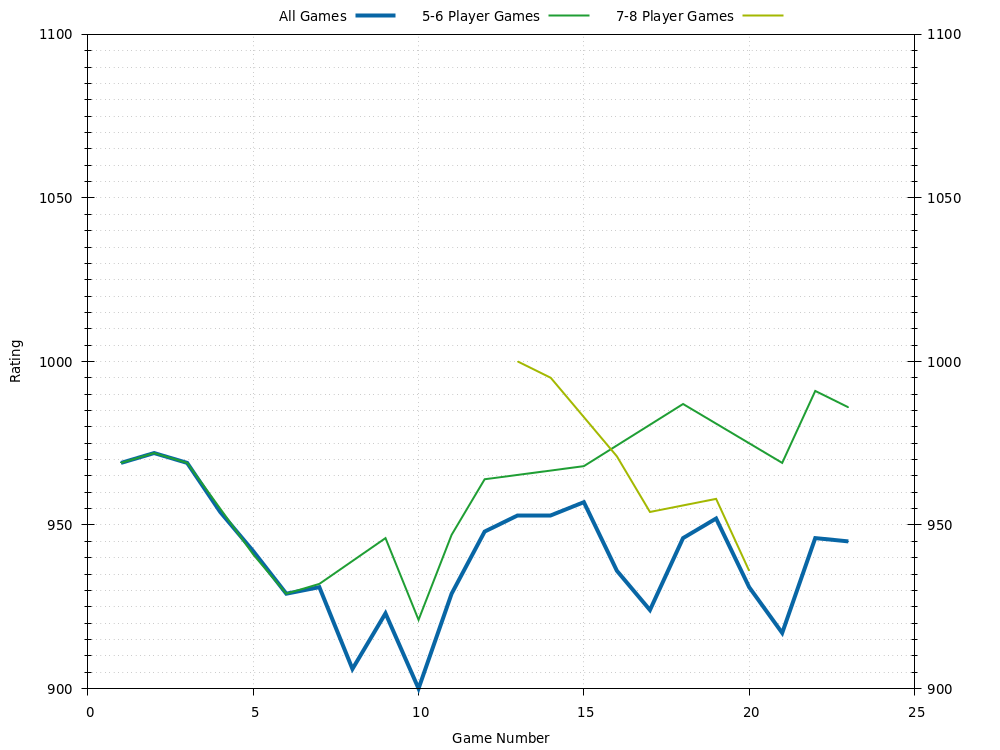
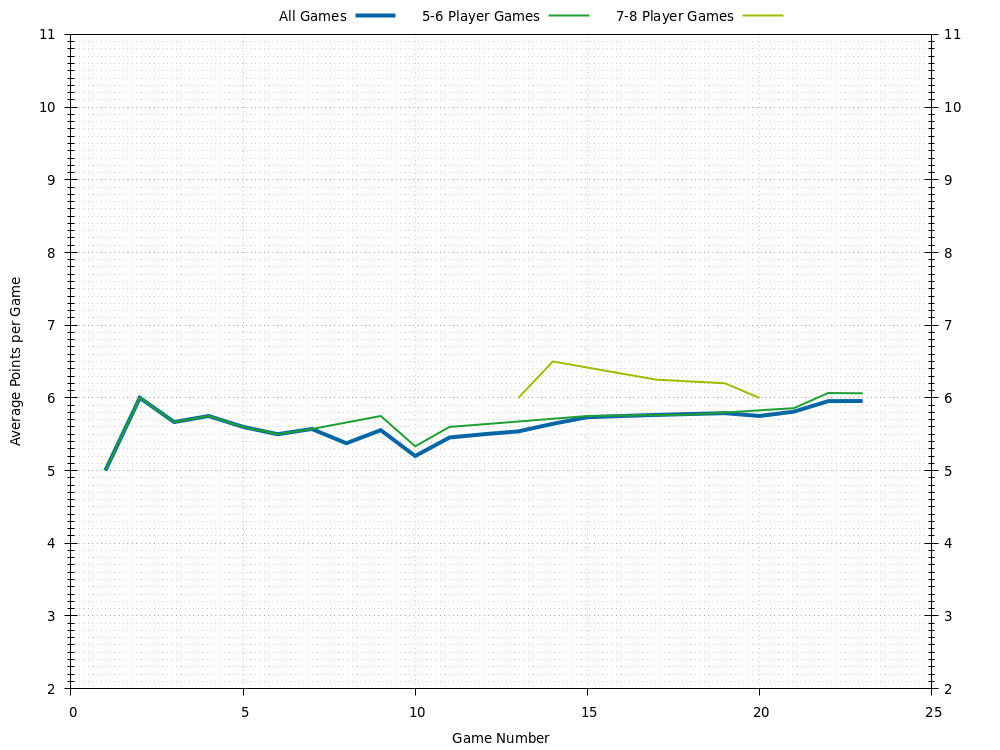
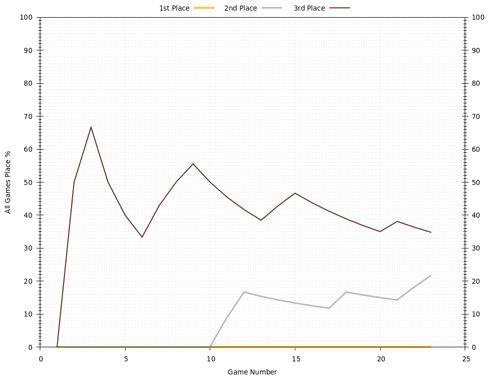

# Wendy
Last updated 2020-11-28 00:30 UTC.

[Go back to all players.](../README.md)

## Overview
| **Category**     | **Games** | **Avg Rating** | **Avg Points** | **1st Place** | **2nd Place** | **3rd Place** | **1st or 2nd Place** | **1st, 2nd, or 3rd Place** |
| :---:            | :---:     | :---:          | :---:          | :---:         | :---:         | :---:         | :---:                | :---:                      |
| All Games        | 18        | 941            | 5.78           | 0% (0)        | 17% (3)       | 39% (7)       | 17% (3)              | 56% (10)                   |
| 3-4 Player Games | 1         | 968            | 4.00           | 0% (0)        | 0% (0)        | 100% (1)      | 0% (0)               | 100% (1)                   |
| 5-6 Player Games | 13        | 954            | 5.77           | 0% (0)        | 23% (3)       | 38% (5)       | 23% (3)              | 62% (8)                    |
| 7-8 Player Games | 4         | 980            | 6.25           | 0% (0)        | 0% (0)        | 25% (1)       | 0% (0)               | 25% (1)                    |

## Ratings

## Average Points per Game

## Places

### Places: All Games

### Places: 3-4 Player Games

### Places: 5-6 Player Games

### Places: 7-8 Player Games

## Game History

### Game History: All Games
| **Game** | **Date**   | **Players** | **Results**                                                                                                 |
| :---:    | :---:      | :---:       | :---                                                                                                        |
| 18       | 2020-09-04 | 5           | 1st Sean 10 , 2nd Wendy 6 , 3rd Alex 4 , 3rd Mic 4 , 4th Jess 3                                             |
| 17       | 2020-09-04 | 7           | 1st Rachel 10 , 2nd Scott 9 , 3rd Alex 8 , 3rd Sean 8 , 4th Jess 7 , 5th Wendy 6 , 6th Mic 5                |
| 16       | 2020-08-07 | 7           | 1st Rachel 10 , 2nd Jess 8 , 2nd Scott 8 , 3rd Alex 7 , 3rd Mic 7 , 4th Sean 6 , 4th Wendy 6                |
| 15       | 2020-08-07 | 6           | 1st Jess 10 , 2nd Sean 8 , 3rd Wendy 7 , 3rd Rachel 7 , 4th Scott 5 , 4th Mic 5                             |
| 14       | 2020-07-04 | 8           | 1st Jay 10 , 2nd Alex 9 , 2nd Sean 9 , 3rd Scott 7 , 3rd Wendy 7 , 3rd Mic 7 , 4th Jess 6 , 4th Eftychi 6   |
| 13       | 2020-07-04 | 8           | 1st Alex 10 , 2nd Rachel 8 , 3rd Scott 7 , 4th Jess 6 , 4th Wendy 6 , 5th Eftychi 4 , 5th Jay 4 , 5th Mic 4 |
| 12       | 2020-07-03 | 6           | 1st Jess 10 , 2nd Alex 6 , 2nd Wendy 6 , 3rd Scott 5 , 3rd Eftychi 5 , 4th Rachel 4                         |
| 11       | 2020-06-20 | 6           | 1st Jess 10 , 2nd Eftychi 8 , 3rd Wendy 7 , 4th Alex 6 , 4th Scott 6 , 4th Mic 6                            |
| 10       | 2020-06-20 | 6           | 1st Alex 10 , 2nd Scott 6 , 2nd Mic 6 , 3rd Jess 5 , 4th Eftychi 4 , 5th Wendy 2                            |
| 9        | 2020-06-20 | 6           | 1st Jess 10 , 2nd Wendy 8 , 3rd Alex 7 , 3rd Scott 7 , 4th Eftychi 4 , 4th Mic 4                            |
| 8        | 2019-09-22 | 4           | 1st Alex 10 , 2nd Sean 6 , 2nd Scott 6 , 3rd Wendy 4                                                        |
| 7        | 2017-10-08 | 6           | 1st Scott 10 , 2nd Alex 9 , 3rd Jay 6 , 3rd Jess 6 , 3rd Wendy 6 , 4th Sean 5                               |
| 6        | 2017-08-25 | 6           | 1st PA 10 , 2nd Jay 7 , 2nd Sean 7 , 3rd Scott 6 , 4th Wendy 5 , 5th Alex 4                                 |
| 5        | 2017-06-10 | 6           | 1st Scott 10 , 2nd Alex 8 , 3rd Jess 7 , 4th Wilson 6 , 5th Wendy 5 , 6th Victoria 3                        |
| 4        | 2017-06-10 | 6           | 1st Jay 10 , 2nd Alex 9 , 3rd Jess 7 , 4th Scott 6 , 4th Sean 6 , 4th Wendy 6                               |
| 3        | 2017-04-01 | 6           | 1st Jess 10 , 2nd Jay 8 , 2nd Sean 8 , 3rd Wendy 5 , 4th Alex 4 , 4th Rachel 4                              |
| 2        | 2017-03-31 | 6           | 1st Jay 10 , 2nd Scott 9 , 3rd Alex 7 , 3rd Wendy 7 , 4th Sean 6 , 5th Rachel 5                             |
| 1        | 2017-03-17 | 6           | 1st Jess 10 , 2nd Jay 8 , 3rd Alex 7 , 3rd Sean 7 , 4th Scott 6 , 5th Wendy 5                               |

### Game History: 3-4 Player Games
| **Game** | **Date**   | **Players** | **Results**                                          |
| :---:    | :---:      | :---:       | :---                                                 |
| 1        | 2019-09-22 | 4           | 1st Alex 10 , 2nd Sean 6 , 2nd Scott 6 , 3rd Wendy 4 |

### Game History: 5-6 Player Games
| **Game** | **Date**   | **Players** | **Results**                                                                          |
| :---:    | :---:      | :---:       | :---                                                                                 |
| 13       | 2020-09-04 | 5           | 1st Sean 10 , 2nd Wendy 6 , 3rd Alex 4 , 3rd Mic 4 , 4th Jess 3                      |
| 12       | 2020-08-07 | 6           | 1st Jess 10 , 2nd Sean 8 , 3rd Wendy 7 , 3rd Rachel 7 , 4th Scott 5 , 4th Mic 5      |
| 11       | 2020-07-03 | 6           | 1st Jess 10 , 2nd Alex 6 , 2nd Wendy 6 , 3rd Scott 5 , 3rd Eftychi 5 , 4th Rachel 4  |
| 10       | 2020-06-20 | 6           | 1st Jess 10 , 2nd Eftychi 8 , 3rd Wendy 7 , 4th Alex 6 , 4th Scott 6 , 4th Mic 6     |
| 9        | 2020-06-20 | 6           | 1st Alex 10 , 2nd Scott 6 , 2nd Mic 6 , 3rd Jess 5 , 4th Eftychi 4 , 5th Wendy 2     |
| 8        | 2020-06-20 | 6           | 1st Jess 10 , 2nd Wendy 8 , 3rd Alex 7 , 3rd Scott 7 , 4th Eftychi 4 , 4th Mic 4     |
| 7        | 2017-10-08 | 6           | 1st Scott 10 , 2nd Alex 9 , 3rd Jay 6 , 3rd Jess 6 , 3rd Wendy 6 , 4th Sean 5        |
| 6        | 2017-08-25 | 6           | 1st PA 10 , 2nd Jay 7 , 2nd Sean 7 , 3rd Scott 6 , 4th Wendy 5 , 5th Alex 4          |
| 5        | 2017-06-10 | 6           | 1st Scott 10 , 2nd Alex 8 , 3rd Jess 7 , 4th Wilson 6 , 5th Wendy 5 , 6th Victoria 3 |
| 4        | 2017-06-10 | 6           | 1st Jay 10 , 2nd Alex 9 , 3rd Jess 7 , 4th Scott 6 , 4th Sean 6 , 4th Wendy 6        |
| 3        | 2017-04-01 | 6           | 1st Jess 10 , 2nd Jay 8 , 2nd Sean 8 , 3rd Wendy 5 , 4th Alex 4 , 4th Rachel 4       |
| 2        | 2017-03-31 | 6           | 1st Jay 10 , 2nd Scott 9 , 3rd Alex 7 , 3rd Wendy 7 , 4th Sean 6 , 5th Rachel 5      |
| 1        | 2017-03-17 | 6           | 1st Jess 10 , 2nd Jay 8 , 3rd Alex 7 , 3rd Sean 7 , 4th Scott 6 , 5th Wendy 5        |

### Game History: 7-8 Player Games
| **Game** | **Date**   | **Players** | **Results**                                                                                                 |
| :---:    | :---:      | :---:       | :---                                                                                                        |
| 4        | 2020-09-04 | 7           | 1st Rachel 10 , 2nd Scott 9 , 3rd Alex 8 , 3rd Sean 8 , 4th Jess 7 , 5th Wendy 6 , 6th Mic 5                |
| 3        | 2020-08-07 | 7           | 1st Rachel 10 , 2nd Jess 8 , 2nd Scott 8 , 3rd Alex 7 , 3rd Mic 7 , 4th Sean 6 , 4th Wendy 6                |
| 2        | 2020-07-04 | 8           | 1st Jay 10 , 2nd Alex 9 , 2nd Sean 9 , 3rd Scott 7 , 3rd Wendy 7 , 3rd Mic 7 , 4th Jess 6 , 4th Eftychi 6   |
| 1        | 2020-07-04 | 8           | 1st Alex 10 , 2nd Rachel 8 , 3rd Scott 7 , 4th Jess 6 , 4th Wendy 6 , 5th Eftychi 4 , 5th Jay 4 , 5th Mic 4 |

