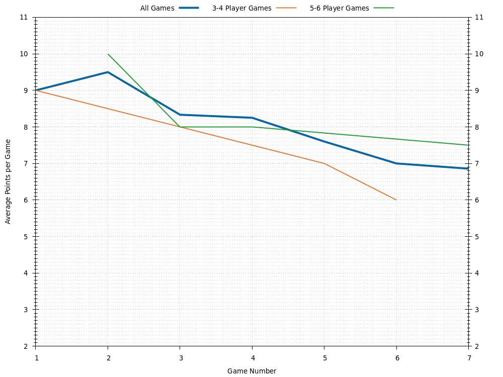

# Wilson
Last updated 2020-10-23 00:51 UTC.

[Go back to all players.](../README.md)

## Overview
| **Category**     | **Games** | **Avg Rating** | **Avg Points** | **1st Place** | **2nd Place** | **3rd Place** | **1st or 2nd Place** | **1st, 2nd, or 3rd Place** |
| :---:            | :---:     | :---:          | :---:          | :---:         | :---:         | :---:         | :---:                | :---:                      |
| All Games        | 5         | 1025           | 7.60           | 20% (1)       | 40% (2)       | 20% (1)       | 60% (3)              | 80% (4)                    |
| 3-4 Player Games | 2         | 1009           | 7.00           | 0% (0)        | 100% (2)      | 0% (0)        | 100% (2)             | 100% (2)                   |
| 5-6 Player Games | 3         | 1022           | 8.00           | 33% (1)       | 0% (0)        | 33% (1)       | 33% (1)              | 67% (2)                    |

## Ratings

## Average Points per Game

## Places

### Places: All Games

### Places: 3-4 Player Games

### Places: 5-6 Player Games

## Game History

### Game History: All Games
| **Game** | **Date**   | **Players** | **Results**                                                                          |
| :---:    | :---:      | :---:       | :---                                                                                 |
| 5        | 2019-03-10 | 3           | 1st Alex 11 , 2nd Wilson 5 , 3rd Sean 4                                              |
| 4        | 2018-09-01 | 5           | 1st Jay 10 , 2nd Alex 9 , 2nd Jess 9 , 3rd Wilson 8 , 4th Scott 5                    |
| 3        | 2017-06-10 | 6           | 1st Scott 10 , 2nd Alex 8 , 3rd Jess 7 , 4th Wilson 6 , 5th Wendy 5 , 6th Victoria 3 |
| 2        | 2017-06-10 | 6           | 1st Wilson 10 , 2nd Scott 6 , 3rd Alex 5 , 4th Jay 4 , 5th Victoria 3 , 6th Jess 2   |
| 1        | 2017-05-06 | 4           | 1st Jess 10 , 2nd Wilson 9 , 3rd Alex 6 , 4th Sean 5                                 |

### Game History: 3-4 Player Games
| **Game** | **Date**   | **Players** | **Results**                                          |
| :---:    | :---:      | :---:       | :---                                                 |
| 2        | 2019-03-10 | 3           | 1st Alex 11 , 2nd Wilson 5 , 3rd Sean 4              |
| 1        | 2017-05-06 | 4           | 1st Jess 10 , 2nd Wilson 9 , 3rd Alex 6 , 4th Sean 5 |

### Game History: 5-6 Player Games
| **Game** | **Date**   | **Players** | **Results**                                                                          |
| :---:    | :---:      | :---:       | :---                                                                                 |
| 3        | 2018-09-01 | 5           | 1st Jay 10 , 2nd Alex 9 , 2nd Jess 9 , 3rd Wilson 8 , 4th Scott 5                    |
| 2        | 2017-06-10 | 6           | 1st Scott 10 , 2nd Alex 8 , 3rd Jess 7 , 4th Wilson 6 , 5th Wendy 5 , 6th Victoria 3 |
| 1        | 2017-06-10 | 6           | 1st Wilson 10 , 2nd Scott 6 , 3rd Alex 5 , 4th Jay 4 , 5th Victoria 3 , 6th Jess 2   |

