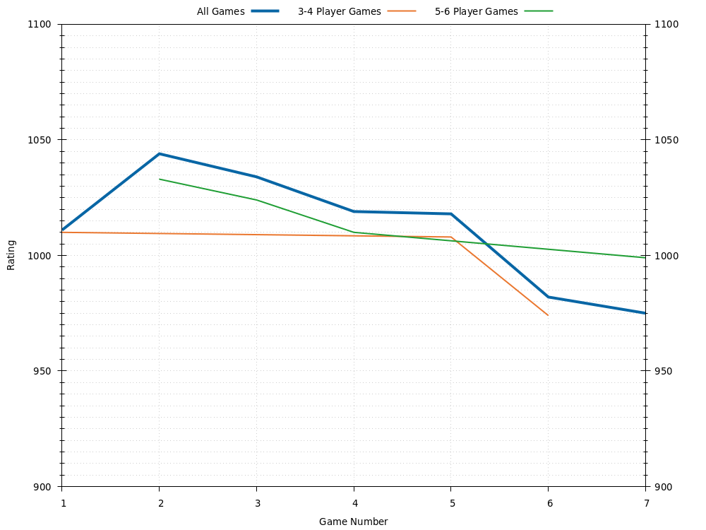
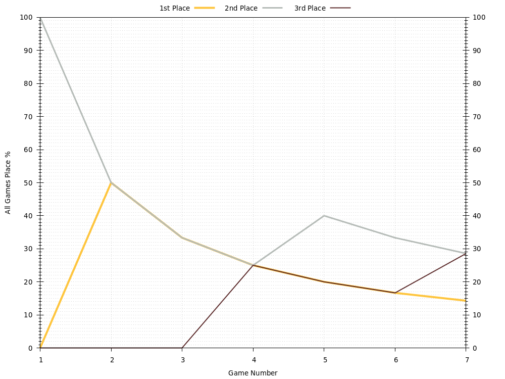

# Wilson
Last updated 2021-12-13 03:22 UTC.

[Go back to all players.](../README.md)

## Overview
| **Category**     | **Games** | **Current Rating** | **Avg Rating** | **Avg Points** | **1st Place** | **2nd Place** | **3rd Place** |
| :---:            | :---:     | :---:              | :---:          | :---:          | :---:         | :---:         | :---:         |
| All Games        | 7         | 975                | 1012           | 6.86           | 14% (1)       | 29% (2)       | 29% (2)       |
| 3-4 Player Games | 3         | 974                | 998            | 6.00           | 0% (0)        | 67% (2)       | 0% (0)        |
| 5-6 Player Games | 4         | 999                | 1016           | 7.50           | 25% (1)       | 0% (0)        | 50% (2)       |

## Ratings

## Average Points per Game

## Places

### Places: All Games

### Places: 3-4 Player Games

### Places: 5-6 Player Games

## Game History

### Game History: All Games
| **Game** | **Date**   | **Points** | **Players** | **Results**                                                                          |
| :---:    | :---:      | :---:      | :---:       | :---                                                                                 |
| 7        | 2021-03-20 | 10         | 5           | 1st Rachel 10 , 2nd Jess 8 , 3rd Wilson 6 , 3rd Laura 6 , 4th Mic 5                  |
| 6        | 2021-03-20 | 10         | 4           | 1st Laura 10 , 2nd Mic 8 , 3rd Rachel 6 , 4th Wilson 4                               |
| 5        | 2019-03-10 | 10         | 3           | 1st Alex 11 , 2nd Wilson 5 , 3rd Sean 4                                              |
| 4        | 2018-09-01 | 10         | 5           | 1st Jay 10 , 2nd Alex 9 , 2nd Jess 9 , 3rd Wilson 8 , 4th Scott 5                    |
| 3        | 2017-06-10 | 10         | 6           | 1st Scott 10 , 2nd Alex 8 , 3rd Jess 7 , 4th Wilson 6 , 5th Wendy 5 , 6th Victoria 3 |
| 2        | 2017-06-10 | 10         | 6           | 1st Wilson 10 , 2nd Scott 6 , 3rd Alex 5 , 4th Jay 4 , 5th Victoria 3 , 6th Jess 2   |
| 1        | 2017-05-06 | 10         | 4           | 1st Jess 10 , 2nd Wilson 9 , 3rd Alex 6 , 4th Sean 5                                 |

### Game History: 3-4 Player Games
| **Game** | **Date**   | **Points** | **Players** | **Results**                                            |
| :---:    | :---:      | :---:      | :---:       | :---                                                   |
| 3        | 2021-03-20 | 10         | 4           | 1st Laura 10 , 2nd Mic 8 , 3rd Rachel 6 , 4th Wilson 4 |
| 2        | 2019-03-10 | 10         | 3           | 1st Alex 11 , 2nd Wilson 5 , 3rd Sean 4                |
| 1        | 2017-05-06 | 10         | 4           | 1st Jess 10 , 2nd Wilson 9 , 3rd Alex 6 , 4th Sean 5   |

### Game History: 5-6 Player Games
| **Game** | **Date**   | **Points** | **Players** | **Results**                                                                          |
| :---:    | :---:      | :---:      | :---:       | :---                                                                                 |
| 4        | 2021-03-20 | 10         | 5           | 1st Rachel 10 , 2nd Jess 8 , 3rd Wilson 6 , 3rd Laura 6 , 4th Mic 5                  |
| 3        | 2018-09-01 | 10         | 5           | 1st Jay 10 , 2nd Alex 9 , 2nd Jess 9 , 3rd Wilson 8 , 4th Scott 5                    |
| 2        | 2017-06-10 | 10         | 6           | 1st Scott 10 , 2nd Alex 8 , 3rd Jess 7 , 4th Wilson 6 , 5th Wendy 5 , 6th Victoria 3 |
| 1        | 2017-06-10 | 10         | 6           | 1st Wilson 10 , 2nd Scott 6 , 3rd Alex 5 , 4th Jay 4 , 5th Victoria 3 , 6th Jess 2   |

