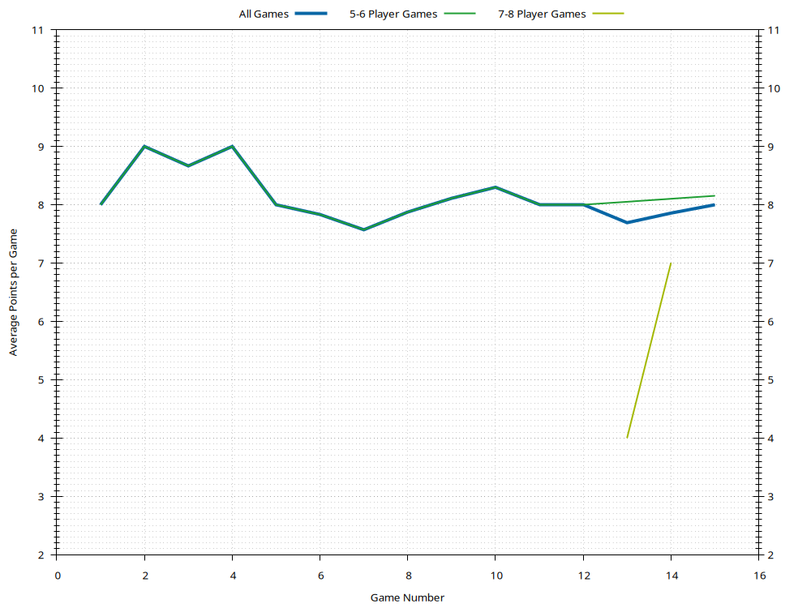

# Jay

Last updated 2022-08-28 06:24 UTC.

- [Summary](#summary)
- [Ratings](#ratings)
- [Average Points](#average-points)
- [Win Rates](#win-rates)
- [History](#history)

[(Back to Main Page)](../../#)

## Summary

| **Category**     | **Games** | **Current Rating** | **Avg Rating** | **Avg Points** | **1st Place** | **2nd Place** | **3rd Place** |
| :---:            | :---:     | :---:              | :---:          | :---:          | :---:         | :---:         | :---:         |
| All Games        | 15        | 1127               | 1085           | 8.00           | 47% (7)       | 20% (3)       | 20% (3)       |
| 5-6 Player Games | 13        | 1133               | 1085           | 8.15           | 46% (6)       | 23% (3)       | 23% (3)       |
| 7-8 Player Games | 2         | 1011               | 994            | 7.00           | 50% (1)       | 0% (0)        | 0% (0)        |

[(Back to Top)](#)

## Ratings

[(Back to Top)](#)

## Average Points

[(Back to Top)](#)

## Win Rates

[(Back to Top)](#)

## History

- [All Games History](#all-games-history)
- [3-4 Player Games History](#3-4-player-games-history)
- [5-6 Player Games History](#5-6-player-games-history)
- [7-8 Player Games History](#7-8-player-games-history)

[(Back to Top)](#)

### All Games History

| **Game** | **Date**   | **Points** | **Players** | **Results**                                                                                                 |
| :---:    | :---:      | :---:      | :---:       | :---                                                                                                        |
| 15       | 2021-09-04 | 10         | 6           | 1st Jay 10 , 2nd Alex 9 , 2nd Jess 9 , 2nd Sean 9 , 3rd Scott 7 , 3rd Wendy 7                               |
| 14       | 2020-07-04 | 10         | 8           | 1st Jay 10 , 2nd Alex 9 , 2nd Sean 9 , 3rd Scott 7 , 3rd Wendy 7 , 3rd Mic 7 , 4th Jess 6 , 4th Eftychi 6   |
| 13       | 2020-07-04 | 10         | 8           | 1st Alex 10 , 2nd Rachel 8 , 3rd Scott 7 , 4th Jess 6 , 4th Wendy 6 , 5th Eftychi 4 , 5th Jay 4 , 5th Mic 4 |
| 12       | 2020-06-13 | 10         | 5           | 1st Jess 10 , 2nd Alex 9 , 3rd Jay 8 , 4th Scott 7 , 5th Rachel 4                                           |
| 11       | 2020-06-06 | 10         | 6           | 1st Scott 10 , 2nd Alex 9 , 3rd Jay 5 , 3rd Jess 5 , 3rd Sean 5 , 4th Rachel 3                              |
| 10       | 2020-06-06 | 10         | 5           | 1st Jay 10 , 2nd Alex 5 , 2nd Jess 5 , 3rd Scott 4 , 3rd Rachel 4                                           |
| 9        | 2020-01-19 | 10         | 6           | 1st Jay 10 , 2nd Alex 9 , 3rd Jess 8 , 3rd Eftychi 8 , 4th Sean 7 , 4th Scott 7                             |
| 8        | 2018-09-01 | 10         | 5           | 1st Jay 10 , 2nd Alex 9 , 2nd Jess 9 , 3rd Wilson 8 , 4th Scott 5                                           |
| 7        | 2017-10-08 | 10         | 6           | 1st Scott 10 , 2nd Alex 9 , 3rd Jay 6 , 3rd Jess 6 , 3rd Wendy 6 , 4th Sean 5                               |
| 6        | 2017-08-25 | 10         | 6           | 1st PA 10 , 2nd Jay 7 , 2nd Sean 7 , 3rd Scott 6 , 4th Wendy 5 , 5th Alex 4                                 |
| 5        | 2017-06-10 | 10         | 6           | 1st Wilson 10 , 2nd Scott 6 , 3rd Alex 5 , 4th Jay 4 , 5th Victoria 3 , 6th Jess 2                          |
| 4        | 2017-06-10 | 10         | 6           | 1st Jay 10 , 2nd Alex 9 , 3rd Jess 7 , 4th Scott 6 , 4th Sean 6 , 4th Wendy 6                               |
| 3        | 2017-04-01 | 10         | 6           | 1st Jess 10 , 2nd Jay 8 , 2nd Sean 8 , 3rd Wendy 5 , 4th Alex 4 , 4th Rachel 4                              |
| 2        | 2017-03-31 | 10         | 6           | 1st Jay 10 , 2nd Scott 9 , 3rd Alex 7 , 3rd Wendy 7 , 4th Sean 6 , 5th Rachel 5                             |
| 1        | 2017-03-17 | 10         | 6           | 1st Jess 10 , 2nd Jay 8 , 3rd Alex 7 , 3rd Sean 7 , 4th Scott 6 , 5th Wendy 5                               |

[(Back to History)](#history)

### 3-4 Player Games History

[(Back to History)](#history)

### 5-6 Player Games History

| **Game** | **Date**   | **Points** | **Players** | **Results**                                                                        |
| :---:    | :---:      | :---:      | :---:       | :---                                                                               |
| 13       | 2021-09-04 | 10         | 6           | 1st Jay 10 , 2nd Alex 9 , 2nd Jess 9 , 2nd Sean 9 , 3rd Scott 7 , 3rd Wendy 7      |
| 12       | 2020-06-13 | 10         | 5           | 1st Jess 10 , 2nd Alex 9 , 3rd Jay 8 , 4th Scott 7 , 5th Rachel 4                  |
| 11       | 2020-06-06 | 10         | 6           | 1st Scott 10 , 2nd Alex 9 , 3rd Jay 5 , 3rd Jess 5 , 3rd Sean 5 , 4th Rachel 3     |
| 10       | 2020-06-06 | 10         | 5           | 1st Jay 10 , 2nd Alex 5 , 2nd Jess 5 , 3rd Scott 4 , 3rd Rachel 4                  |
| 9        | 2020-01-19 | 10         | 6           | 1st Jay 10 , 2nd Alex 9 , 3rd Jess 8 , 3rd Eftychi 8 , 4th Sean 7 , 4th Scott 7    |
| 8        | 2018-09-01 | 10         | 5           | 1st Jay 10 , 2nd Alex 9 , 2nd Jess 9 , 3rd Wilson 8 , 4th Scott 5                  |
| 7        | 2017-10-08 | 10         | 6           | 1st Scott 10 , 2nd Alex 9 , 3rd Jay 6 , 3rd Jess 6 , 3rd Wendy 6 , 4th Sean 5      |
| 6        | 2017-08-25 | 10         | 6           | 1st PA 10 , 2nd Jay 7 , 2nd Sean 7 , 3rd Scott 6 , 4th Wendy 5 , 5th Alex 4        |
| 5        | 2017-06-10 | 10         | 6           | 1st Wilson 10 , 2nd Scott 6 , 3rd Alex 5 , 4th Jay 4 , 5th Victoria 3 , 6th Jess 2 |
| 4        | 2017-06-10 | 10         | 6           | 1st Jay 10 , 2nd Alex 9 , 3rd Jess 7 , 4th Scott 6 , 4th Sean 6 , 4th Wendy 6      |
| 3        | 2017-04-01 | 10         | 6           | 1st Jess 10 , 2nd Jay 8 , 2nd Sean 8 , 3rd Wendy 5 , 4th Alex 4 , 4th Rachel 4     |
| 2        | 2017-03-31 | 10         | 6           | 1st Jay 10 , 2nd Scott 9 , 3rd Alex 7 , 3rd Wendy 7 , 4th Sean 6 , 5th Rachel 5    |
| 1        | 2017-03-17 | 10         | 6           | 1st Jess 10 , 2nd Jay 8 , 3rd Alex 7 , 3rd Sean 7 , 4th Scott 6 , 5th Wendy 5      |

[(Back to History)](#history)

### 7-8 Player Games History

| **Game** | **Date**   | **Points** | **Players** | **Results**                                                                                                 |
| :---:    | :---:      | :---:      | :---:       | :---                                                                                                        |
| 2        | 2020-07-04 | 10         | 8           | 1st Jay 10 , 2nd Alex 9 , 2nd Sean 9 , 3rd Scott 7 , 3rd Wendy 7 , 3rd Mic 7 , 4th Jess 6 , 4th Eftychi 6   |
| 1        | 2020-07-04 | 10         | 8           | 1st Alex 10 , 2nd Rachel 8 , 3rd Scott 7 , 4th Jess 6 , 4th Wendy 6 , 5th Eftychi 4 , 5th Jay 4 , 5th Mic 4 |

[(Back to History)](#history)

