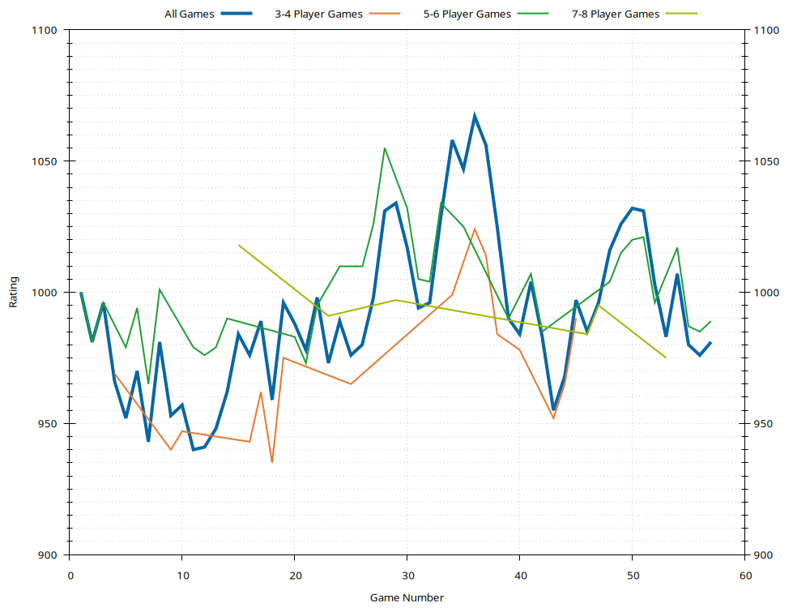
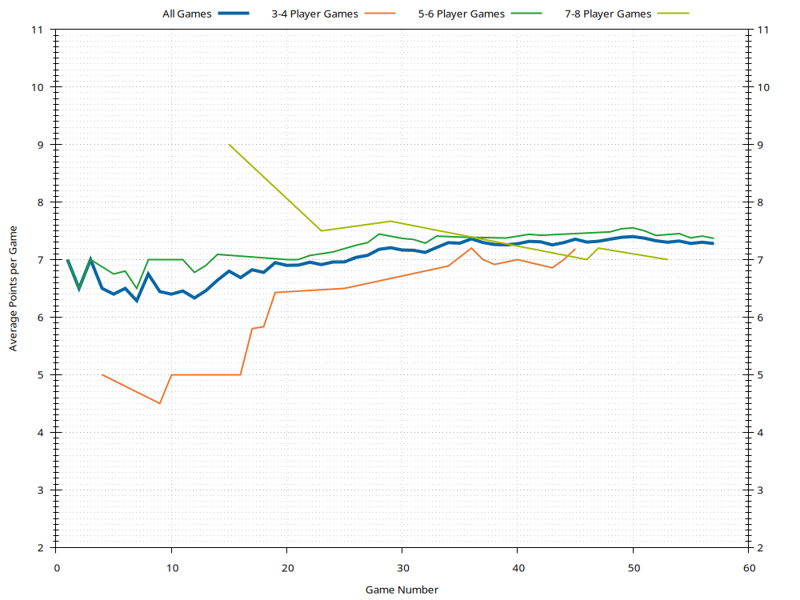
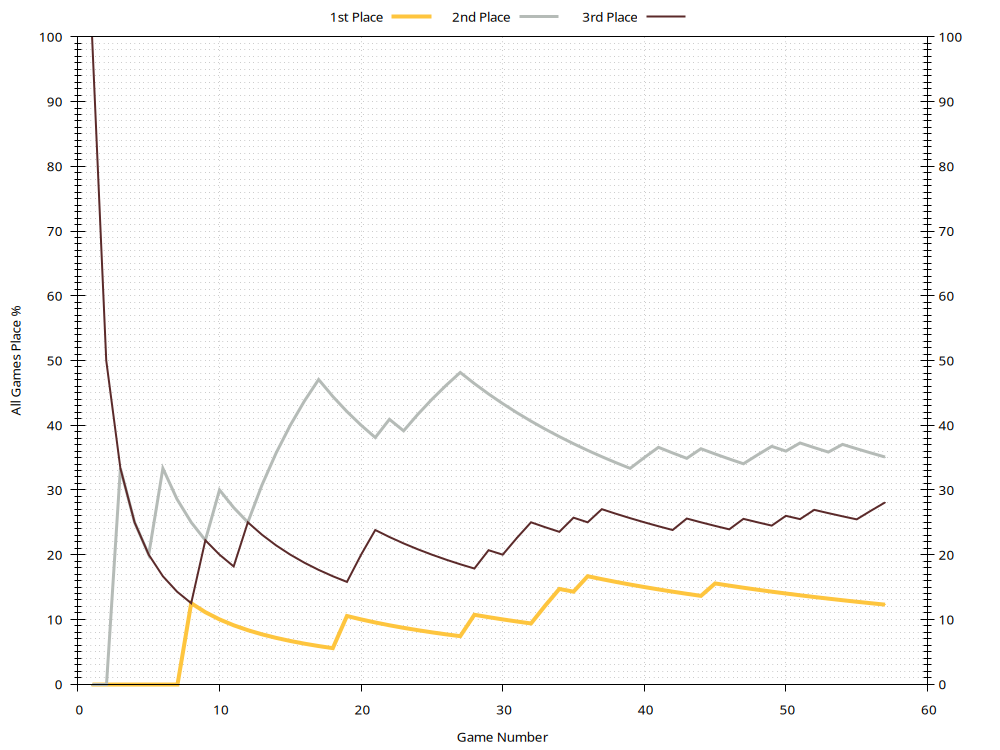

# Sean

Last updated 2022-01-04 04:32 UTC.

- [Summary](#summary)
- [Ratings](#ratings)
- [Average Points](#average-points)
- [Win Rates](#win-rates)
- [History](#history)

[(Back to Main Page)](../../#)

## Summary

| **Category**     | **Games** | **Current Rating** | **Avg Rating** | **Avg Points** | **1st Place** | **2nd Place** | **3rd Place** |
| :---:            | :---:     | :---:              | :---:          | :---:          | :---:         | :---:         | :---:         |
| All Games        | 51        | 1031               | 992            | 7.37           | 14% (7)       | 37% (19)      | 25% (13)      |
| 3-4 Player Games | 16        | 990                | 971            | 7.19           | 25% (4)       | 38% (6)       | 19% (3)       |
| 5-6 Player Games | 30        | 1021               | 1001           | 7.50           | 10% (3)       | 40% (12)      | 27% (8)       |
| 7-8 Player Games | 5         | 995                | 997            | 7.20           | 0% (0)        | 20% (1)       | 40% (2)       |

[(Back to Top)](#)

## Ratings

[(Back to Top)](#)

## Average Points

[(Back to Top)](#)

## Win Rates

[(Back to Top)](#)

## History

- [All Games History](#all-games-history)
- [3-4 Player Games History](#3-4-player-games-history)
- [5-6 Player Games History](#5-6-player-games-history)
- [7-8 Player Games History](#7-8-player-games-history)

[(Back to Top)](#)

### All Games History

| **Game** | **Date**   | **Points** | **Players** | **Results**                                                                                                  |
| :---:    | :---:      | :---:      | :---:       | :---                                                                                                         |
| 51       | 2021-10-14 | 10         | 5           | 1st Jess 11 , 2nd Sean 6 , 2nd Scott 6 , 2nd Rachel 6 , 3rd Mic 5                                            |
| 50       | 2021-09-06 | 10         | 6           | 1st Jess 10 , 2nd Wendy 9 , 3rd Sean 8 , 4th Alex 6 , 4th Laura 6 , 4th Scott 6                              |
| 49       | 2021-09-04 | 10         | 6           | 1st Jay 10 , 2nd Alex 9 , 2nd Jess 9 , 2nd Sean 9 , 3rd Scott 7 , 3rd Wendy 7                                |
| 48       | 2021-08-28 | 10         | 6           | 1st Jess 10 , 2nd Sean 9 , 3rd Rachel 8 , 3rd Laura 8 , 4th Scott 7 , 5th Mic 6                              |
| 47       | 2021-01-18 | 10         | 8           | 1st Eftychi 10 , 2nd Jess 9 , 3rd Sean 8 , 3rd Scott 8 , 4th Rachel 7 , 5th Alex 6 , 6th Mic 5 , 6th Wendy 5 |
| 46       | 2021-01-18 | 10         | 8           | 1st Rachel 10 , 2nd Alex 8 , 3rd Jess 7 , 4th Mic 6 , 4th Wendy 6 , 5th Sean 5 , 6th Eftychi 4 , 7th Scott 3 |
| 45       | 2020-12-02 | 10         | 3           | 1st Sean 10 , 2nd Phil 7 , 3rd Mic 5                                                                         |
| 44       | 2020-11-27 | 10         | 4           | 1st Scott 10 , 2nd Sean 9 , 3rd Mic 8 , 4th Rachel 6                                                         |
| 43       | 2020-11-22 | 10         | 3           | 1st Scott 10 , 2nd Rachel 8 , 3rd Sean 5                                                                     |
| 42       | 2020-10-02 | 10         | 5           | 1st Scott 10 , 2nd Rachel 9 , 3rd Mic 8 , 4th Sean 7 , 4th Jess 7                                            |
| 41       | 2020-10-02 | 10         | 5           | 1st Scott 10 , 2nd Sean 9 , 3rd Jess 8 , 4th Rachel 7 , 5th Mic 6                                            |
| 40       | 2020-10-02 | 10         | 3           | 1st Rachel 11 , 2nd Sean 8 , 3rd Mic 7                                                                       |
| 39       | 2020-09-30 | 10         | 5           | 1st Scott 10 , 2nd Phil 9 , 2nd Mic 9 , 3rd Rachel 8 , 4th Sean 7                                            |
| 38       | 2020-09-28 | 10         | 4           | 1st Jess 10 , 2nd Scott 8 , 3rd Mic 7 , 4th Sean 6                                                           |
| 37       | 2020-09-28 | 10         | 4           | 1st Scott 10 , 2nd Jess 7 , 3rd Sean 5 , 4th Mic 4                                                           |
| 36       | 2020-09-27 | 10         | 4           | 1st Sean 10 , 2nd Mic 7 , 3rd Phil 6 , 4th Laura 5                                                           |
| 35       | 2020-09-23 | 10         | 6           | 1st Scott 10 , 2nd Jess 8 , 2nd Phil 8 , 3rd Sean 7 , 4th Mic 6 , 4th Rachel 6                               |
| 34       | 2020-09-23 | 10         | 4           | 1st Sean 10 , 2nd Jess 6 , 2nd Mic 6 , 3rd Rachel 4                                                          |
| 33       | 2020-09-17 | 10         | 6           | 1st Sean 10 , 2nd Jess 10 , 3rd Rachel 9 , 4th Scott 8 , 5th Laura 7 , 6th Mic 6                             |
| 32       | 2020-09-11 | 10         | 6           | 1st Mic 10 , 2nd Jess 8 , 3rd Sean 6 , 3rd Scott 6 , 4th Rachel 5 , 4th Laura 5                              |
| 31       | 2020-09-07 | 10         | 6           | 1st Alex 10 , 2nd Scott 8 , 2nd Rachel 8 , 2nd Mic 8 , 3rd Jess 7 , 3rd Sean 7                               |
| 30       | 2020-09-07 | 10         | 5           | 1st Alex 10 , 2nd Scott 9 , 3rd Rachel 7 , 4th Sean 6 , 5th Mic 5                                            |
| 29       | 2020-09-04 | 10         | 5           | 1st Sean 10 , 2nd Wendy 6 , 3rd Alex 4 , 3rd Mic 4 , 4th Jess 3                                              |
| 28       | 2020-09-04 | 10         | 7           | 1st Rachel 10 , 2nd Scott 9 , 3rd Alex 8 , 3rd Sean 8 , 4th Jess 7 , 5th Wendy 6 , 6th Mic 5                 |
| 27       | 2020-08-22 | 10         | 5           | 1st Rachel 10 , 2nd Sean 8 , 3rd Jess 7 , 3rd Mic 7 , 4th Scott 6                                            |
| 26       | 2020-08-22 | 10         | 5           | 1st Jess 10 , 2nd Scott 9 , 2nd Sean 9 , 2nd Mic 9 , 3rd Rachel 5                                            |
| 25       | 2020-08-17 | 10         | 4           | 1st Jess 10 , 2nd Sean 7 , 2nd Phil 7 , 2nd Mic 7                                                            |
| 24       | 2020-08-17 | 10         | 5           | 1st Rachel 10 , 2nd Sean 8 , 3rd Phil 7 , 4th Mic 6 , 5th Jess 4                                             |
| 23       | 2020-08-07 | 10         | 7           | 1st Rachel 10 , 2nd Jess 8 , 2nd Scott 8 , 3rd Alex 7 , 3rd Mic 7 , 4th Sean 6 , 4th Wendy 6                 |
| 22       | 2020-08-07 | 10         | 6           | 1st Jess 10 , 2nd Sean 8 , 3rd Wendy 7 , 3rd Rachel 7 , 4th Scott 5 , 4th Mic 5                              |
| 21       | 2020-08-05 | 10         | 6           | 1st Scott 10 , 2nd Jess 8 , 2nd Mic 8 , 3rd Sean 7 , 3rd Phil 7 , 4th Alex 6                                 |
| 20       | 2020-08-05 | 10         | 6           | 1st Scott 10 , 2nd Rachel 8 , 3rd Sean 6 , 3rd Jess 6 , 3rd Mic 6 , 4th Phil 5                               |
| 19       | 2020-07-26 | 10         | 4           | 1st Sean 10 , 2nd Alex 8 , 2nd Scott 8 , 3rd Mic 7                                                           |
| 18       | 2020-07-25 | 10         | 4           | 1st Alex 10 , 2nd Sean 5 , 2nd Rachel 5 , 2nd Mic 5                                                          |
| 17       | 2020-07-25 | 10         | 4           | 1st Alex 10 , 2nd Mic 9 , 3rd Rachel 7 , 4th Sean 6                                                          |
| 16       | 2020-07-25 | 10         | 4           | 1st Alex 10 , 2nd Sean 9 , 3rd Eftychi 8 , 4th Mic 4                                                         |
| 15       | 2020-07-04 | 10         | 8           | 1st Jay 10 , 2nd Alex 9 , 2nd Sean 9 , 3rd Scott 7 , 3rd Wendy 7 , 3rd Mic 7 , 4th Jess 6 , 4th Eftychi 6    |
| 14       | 2020-07-03 | 10         | 5           | 1st Jess 10 , 2nd Alex 9 , 2nd Sean 9 , 3rd Rachel 8 , 4th Scott 7                                           |
| 13       | 2020-06-20 | 10         | 5           | 1st Rachel 10 , 2nd Alex 8 , 2nd Jess 8 , 2nd Sean 8 , 3rd Scott 5                                           |
| 12       | 2020-06-06 | 10         | 6           | 1st Scott 10 , 2nd Alex 9 , 3rd Jay 5 , 3rd Jess 5 , 3rd Sean 5 , 4th Rachel 3                               |
| 11       | 2020-01-19 | 10         | 6           | 1st Jay 10 , 2nd Alex 9 , 3rd Jess 8 , 3rd Eftychi 8 , 4th Sean 7 , 4th Scott 7                              |
| 10       | 2019-09-22 | 10         | 4           | 1st Alex 10 , 2nd Sean 6 , 2nd Scott 6 , 3rd Wendy 4                                                         |
| 9        | 2019-03-10 | 10         | 3           | 1st Alex 11 , 2nd Wilson 5 , 3rd Sean 4                                                                      |
| 8        | 2018-01-14 | 10         | 5           | 1st Sean 10 , 2nd Jess 7 , 3rd Alex 5 , 3rd Scott 5 , 4th Eftychi 4                                          |
| 7        | 2017-10-08 | 10         | 6           | 1st Scott 10 , 2nd Alex 9 , 3rd Jay 6 , 3rd Jess 6 , 3rd Wendy 6 , 4th Sean 5                                |
| 6        | 2017-08-25 | 10         | 6           | 1st PA 10 , 2nd Jay 7 , 2nd Sean 7 , 3rd Scott 6 , 4th Wendy 5 , 5th Alex 4                                  |
| 5        | 2017-06-10 | 10         | 6           | 1st Jay 10 , 2nd Alex 9 , 3rd Jess 7 , 4th Scott 6 , 4th Sean 6 , 4th Wendy 6                                |
| 4        | 2017-05-06 | 10         | 4           | 1st Jess 10 , 2nd Wilson 9 , 3rd Alex 6 , 4th Sean 5                                                         |
| 3        | 2017-04-01 | 10         | 6           | 1st Jess 10 , 2nd Jay 8 , 2nd Sean 8 , 3rd Wendy 5 , 4th Alex 4 , 4th Rachel 4                               |
| 2        | 2017-03-31 | 10         | 6           | 1st Jay 10 , 2nd Scott 9 , 3rd Alex 7 , 3rd Wendy 7 , 4th Sean 6 , 5th Rachel 5                              |
| 1        | 2017-03-17 | 10         | 6           | 1st Jess 10 , 2nd Jay 8 , 3rd Alex 7 , 3rd Sean 7 , 4th Scott 6 , 5th Wendy 5                                |

[(Back to History)](#history)

### 3-4 Player Games History

| **Game** | **Date**   | **Points** | **Players** | **Results**                                          |
| :---:    | :---:      | :---:      | :---:       | :---                                                 |
| 16       | 2020-12-02 | 10         | 3           | 1st Sean 10 , 2nd Phil 7 , 3rd Mic 5                 |
| 15       | 2020-11-27 | 10         | 4           | 1st Scott 10 , 2nd Sean 9 , 3rd Mic 8 , 4th Rachel 6 |
| 14       | 2020-11-22 | 10         | 3           | 1st Scott 10 , 2nd Rachel 8 , 3rd Sean 5             |
| 13       | 2020-10-02 | 10         | 3           | 1st Rachel 11 , 2nd Sean 8 , 3rd Mic 7               |
| 12       | 2020-09-28 | 10         | 4           | 1st Jess 10 , 2nd Scott 8 , 3rd Mic 7 , 4th Sean 6   |
| 11       | 2020-09-28 | 10         | 4           | 1st Scott 10 , 2nd Jess 7 , 3rd Sean 5 , 4th Mic 4   |
| 10       | 2020-09-27 | 10         | 4           | 1st Sean 10 , 2nd Mic 7 , 3rd Phil 6 , 4th Laura 5   |
| 9        | 2020-09-23 | 10         | 4           | 1st Sean 10 , 2nd Jess 6 , 2nd Mic 6 , 3rd Rachel 4  |
| 8        | 2020-08-17 | 10         | 4           | 1st Jess 10 , 2nd Sean 7 , 2nd Phil 7 , 2nd Mic 7    |
| 7        | 2020-07-26 | 10         | 4           | 1st Sean 10 , 2nd Alex 8 , 2nd Scott 8 , 3rd Mic 7   |
| 6        | 2020-07-25 | 10         | 4           | 1st Alex 10 , 2nd Sean 5 , 2nd Rachel 5 , 2nd Mic 5  |
| 5        | 2020-07-25 | 10         | 4           | 1st Alex 10 , 2nd Mic 9 , 3rd Rachel 7 , 4th Sean 6  |
| 4        | 2020-07-25 | 10         | 4           | 1st Alex 10 , 2nd Sean 9 , 3rd Eftychi 8 , 4th Mic 4 |
| 3        | 2019-09-22 | 10         | 4           | 1st Alex 10 , 2nd Sean 6 , 2nd Scott 6 , 3rd Wendy 4 |
| 2        | 2019-03-10 | 10         | 3           | 1st Alex 11 , 2nd Wilson 5 , 3rd Sean 4              |
| 1        | 2017-05-06 | 10         | 4           | 1st Jess 10 , 2nd Wilson 9 , 3rd Alex 6 , 4th Sean 5 |

[(Back to History)](#history)

### 5-6 Player Games History

| **Game** | **Date**   | **Points** | **Players** | **Results**                                                                      |
| :---:    | :---:      | :---:      | :---:       | :---                                                                             |
| 30       | 2021-10-14 | 10         | 5           | 1st Jess 11 , 2nd Sean 6 , 2nd Scott 6 , 2nd Rachel 6 , 3rd Mic 5                |
| 29       | 2021-09-06 | 10         | 6           | 1st Jess 10 , 2nd Wendy 9 , 3rd Sean 8 , 4th Alex 6 , 4th Laura 6 , 4th Scott 6  |
| 28       | 2021-09-04 | 10         | 6           | 1st Jay 10 , 2nd Alex 9 , 2nd Jess 9 , 2nd Sean 9 , 3rd Scott 7 , 3rd Wendy 7    |
| 27       | 2021-08-28 | 10         | 6           | 1st Jess 10 , 2nd Sean 9 , 3rd Rachel 8 , 3rd Laura 8 , 4th Scott 7 , 5th Mic 6  |
| 26       | 2020-10-02 | 10         | 5           | 1st Scott 10 , 2nd Rachel 9 , 3rd Mic 8 , 4th Sean 7 , 4th Jess 7                |
| 25       | 2020-10-02 | 10         | 5           | 1st Scott 10 , 2nd Sean 9 , 3rd Jess 8 , 4th Rachel 7 , 5th Mic 6                |
| 24       | 2020-09-30 | 10         | 5           | 1st Scott 10 , 2nd Phil 9 , 2nd Mic 9 , 3rd Rachel 8 , 4th Sean 7                |
| 23       | 2020-09-23 | 10         | 6           | 1st Scott 10 , 2nd Jess 8 , 2nd Phil 8 , 3rd Sean 7 , 4th Mic 6 , 4th Rachel 6   |
| 22       | 2020-09-17 | 10         | 6           | 1st Sean 10 , 2nd Jess 10 , 3rd Rachel 9 , 4th Scott 8 , 5th Laura 7 , 6th Mic 6 |
| 21       | 2020-09-11 | 10         | 6           | 1st Mic 10 , 2nd Jess 8 , 3rd Sean 6 , 3rd Scott 6 , 4th Rachel 5 , 4th Laura 5  |
| 20       | 2020-09-07 | 10         | 6           | 1st Alex 10 , 2nd Scott 8 , 2nd Rachel 8 , 2nd Mic 8 , 3rd Jess 7 , 3rd Sean 7   |
| 19       | 2020-09-07 | 10         | 5           | 1st Alex 10 , 2nd Scott 9 , 3rd Rachel 7 , 4th Sean 6 , 5th Mic 5                |
| 18       | 2020-09-04 | 10         | 5           | 1st Sean 10 , 2nd Wendy 6 , 3rd Alex 4 , 3rd Mic 4 , 4th Jess 3                  |
| 17       | 2020-08-22 | 10         | 5           | 1st Rachel 10 , 2nd Sean 8 , 3rd Jess 7 , 3rd Mic 7 , 4th Scott 6                |
| 16       | 2020-08-22 | 10         | 5           | 1st Jess 10 , 2nd Scott 9 , 2nd Sean 9 , 2nd Mic 9 , 3rd Rachel 5                |
| 15       | 2020-08-17 | 10         | 5           | 1st Rachel 10 , 2nd Sean 8 , 3rd Phil 7 , 4th Mic 6 , 5th Jess 4                 |
| 14       | 2020-08-07 | 10         | 6           | 1st Jess 10 , 2nd Sean 8 , 3rd Wendy 7 , 3rd Rachel 7 , 4th Scott 5 , 4th Mic 5  |
| 13       | 2020-08-05 | 10         | 6           | 1st Scott 10 , 2nd Jess 8 , 2nd Mic 8 , 3rd Sean 7 , 3rd Phil 7 , 4th Alex 6     |
| 12       | 2020-08-05 | 10         | 6           | 1st Scott 10 , 2nd Rachel 8 , 3rd Sean 6 , 3rd Jess 6 , 3rd Mic 6 , 4th Phil 5   |
| 11       | 2020-07-03 | 10         | 5           | 1st Jess 10 , 2nd Alex 9 , 2nd Sean 9 , 3rd Rachel 8 , 4th Scott 7               |
| 10       | 2020-06-20 | 10         | 5           | 1st Rachel 10 , 2nd Alex 8 , 2nd Jess 8 , 2nd Sean 8 , 3rd Scott 5               |
| 9        | 2020-06-06 | 10         | 6           | 1st Scott 10 , 2nd Alex 9 , 3rd Jay 5 , 3rd Jess 5 , 3rd Sean 5 , 4th Rachel 3   |
| 8        | 2020-01-19 | 10         | 6           | 1st Jay 10 , 2nd Alex 9 , 3rd Jess 8 , 3rd Eftychi 8 , 4th Sean 7 , 4th Scott 7  |
| 7        | 2018-01-14 | 10         | 5           | 1st Sean 10 , 2nd Jess 7 , 3rd Alex 5 , 3rd Scott 5 , 4th Eftychi 4              |
| 6        | 2017-10-08 | 10         | 6           | 1st Scott 10 , 2nd Alex 9 , 3rd Jay 6 , 3rd Jess 6 , 3rd Wendy 6 , 4th Sean 5    |
| 5        | 2017-08-25 | 10         | 6           | 1st PA 10 , 2nd Jay 7 , 2nd Sean 7 , 3rd Scott 6 , 4th Wendy 5 , 5th Alex 4      |
| 4        | 2017-06-10 | 10         | 6           | 1st Jay 10 , 2nd Alex 9 , 3rd Jess 7 , 4th Scott 6 , 4th Sean 6 , 4th Wendy 6    |
| 3        | 2017-04-01 | 10         | 6           | 1st Jess 10 , 2nd Jay 8 , 2nd Sean 8 , 3rd Wendy 5 , 4th Alex 4 , 4th Rachel 4   |
| 2        | 2017-03-31 | 10         | 6           | 1st Jay 10 , 2nd Scott 9 , 3rd Alex 7 , 3rd Wendy 7 , 4th Sean 6 , 5th Rachel 5  |
| 1        | 2017-03-17 | 10         | 6           | 1st Jess 10 , 2nd Jay 8 , 3rd Alex 7 , 3rd Sean 7 , 4th Scott 6 , 5th Wendy 5    |

[(Back to History)](#history)

### 7-8 Player Games History

| **Game** | **Date**   | **Points** | **Players** | **Results**                                                                                                  |
| :---:    | :---:      | :---:      | :---:       | :---                                                                                                         |
| 5        | 2021-01-18 | 10         | 8           | 1st Eftychi 10 , 2nd Jess 9 , 3rd Sean 8 , 3rd Scott 8 , 4th Rachel 7 , 5th Alex 6 , 6th Mic 5 , 6th Wendy 5 |
| 4        | 2021-01-18 | 10         | 8           | 1st Rachel 10 , 2nd Alex 8 , 3rd Jess 7 , 4th Mic 6 , 4th Wendy 6 , 5th Sean 5 , 6th Eftychi 4 , 7th Scott 3 |
| 3        | 2020-09-04 | 10         | 7           | 1st Rachel 10 , 2nd Scott 9 , 3rd Alex 8 , 3rd Sean 8 , 4th Jess 7 , 5th Wendy 6 , 6th Mic 5                 |
| 2        | 2020-08-07 | 10         | 7           | 1st Rachel 10 , 2nd Jess 8 , 2nd Scott 8 , 3rd Alex 7 , 3rd Mic 7 , 4th Sean 6 , 4th Wendy 6                 |
| 1        | 2020-07-04 | 10         | 8           | 1st Jay 10 , 2nd Alex 9 , 2nd Sean 9 , 3rd Scott 7 , 3rd Wendy 7 , 3rd Mic 7 , 4th Jess 6 , 4th Eftychi 6    |

[(Back to History)](#history)

