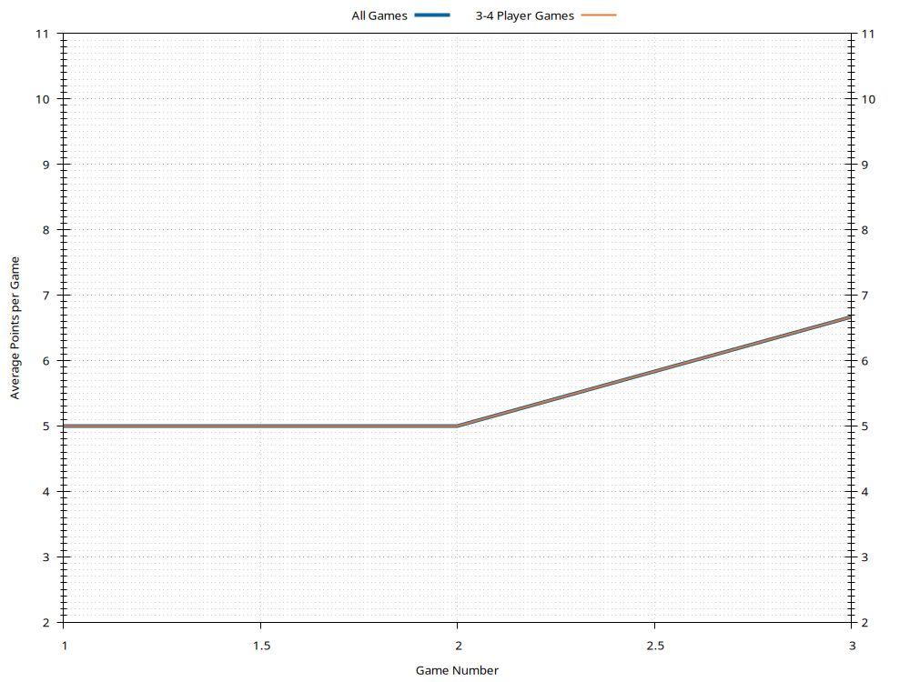
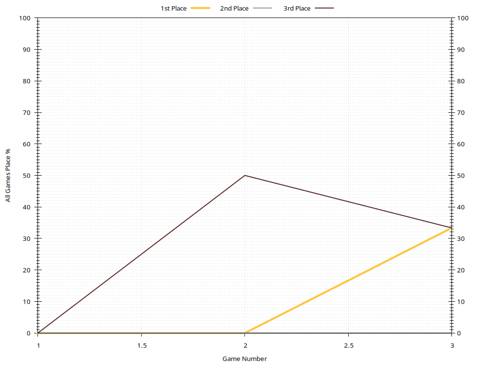

# Valerie

Last updated 2022-04-03 05:03 UTC.

- [Summary](#summary)
- [Ratings](#ratings)
- [Average Points](#average-points)
- [Win Rates](#win-rates)
- [History](#history)

[(Back to Main Page)](../../#)

## Summary

| **Category**     | **Games** | **Current Rating** | **Avg Rating** | **Avg Points** | **1st Place** | **2nd Place** | **3rd Place** |
| :---:            | :---:     | :---:              | :---:          | :---:          | :---:         | :---:         | :---:         |
| All Games        | 3         | 978                | 963            | 6.67           | 33% (1)       | 0% (0)        | 33% (1)       |
| 3-4 Player Games | 3         | 970                | 958            | 6.67           | 33% (1)       | 0% (0)        | 33% (1)       |

[(Back to Top)](#)

## Ratings

[(Back to Top)](#)

## Average Points

[(Back to Top)](#)

## Win Rates

[(Back to Top)](#)

## History

- [All Games History](#all-games-history)
- [3-4 Player Games History](#3-4-player-games-history)
- [5-6 Player Games History](#5-6-player-games-history)
- [7-8 Player Games History](#7-8-player-games-history)

[(Back to Top)](#)

### All Games History

| **Game** | **Date**   | **Points** | **Players** | **Results**                                             |
| :---:    | :---:      | :---:      | :---:       | :---                                                    |
| 3        | 2020-12-23 | 10         | 3           | 1st Valerie 10 , 2nd Phil 9 , 3rd Rachel 5              |
| 2        | 2020-12-23 | 10         | 3           | 1st Rachel 10 , 2nd Phil 8 , 3rd Valerie 5              |
| 1        | 2020-12-23 | 10         | 4           | 1st Phil 10 , 2nd Rachel 8 , 3rd Jess 6 , 4th Valerie 5 |

[(Back to History)](#history)

### 3-4 Player Games History

| **Game** | **Date**   | **Points** | **Players** | **Results**                                             |
| :---:    | :---:      | :---:      | :---:       | :---                                                    |
| 3        | 2020-12-23 | 10         | 3           | 1st Valerie 10 , 2nd Phil 9 , 3rd Rachel 5              |
| 2        | 2020-12-23 | 10         | 3           | 1st Rachel 10 , 2nd Phil 8 , 3rd Valerie 5              |
| 1        | 2020-12-23 | 10         | 4           | 1st Phil 10 , 2nd Rachel 8 , 3rd Jess 6 , 4th Valerie 5 |

[(Back to History)](#history)

### 5-6 Player Games History

[(Back to History)](#history)

### 7-8 Player Games History

[(Back to History)](#history)

