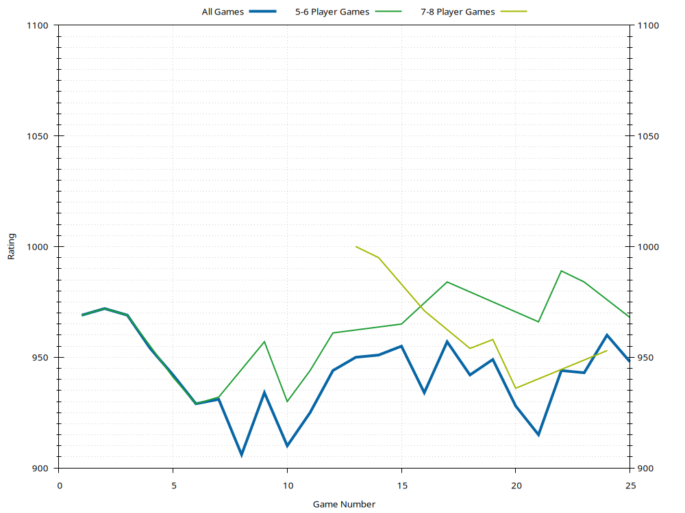
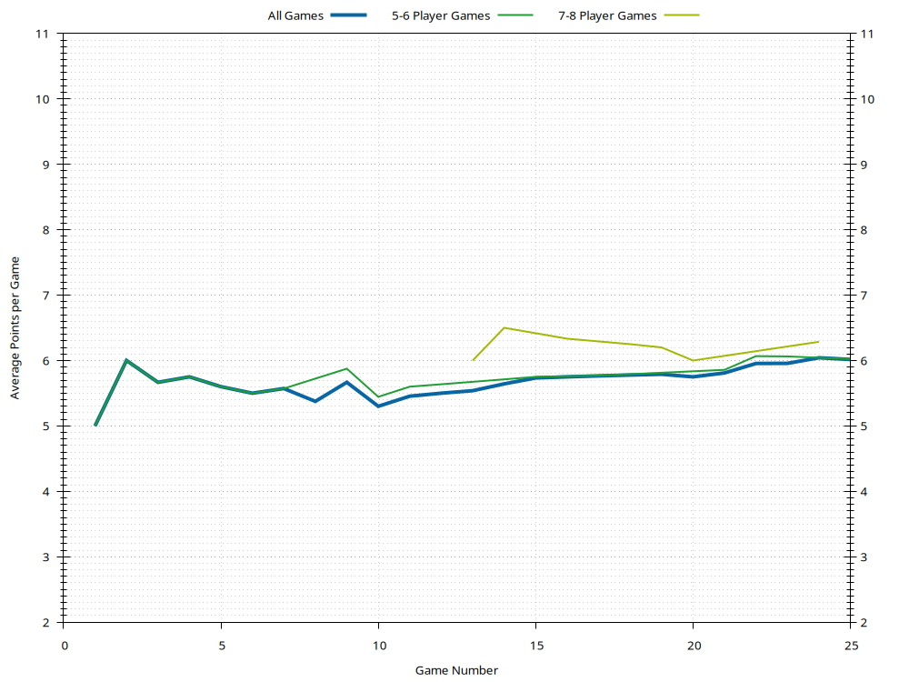
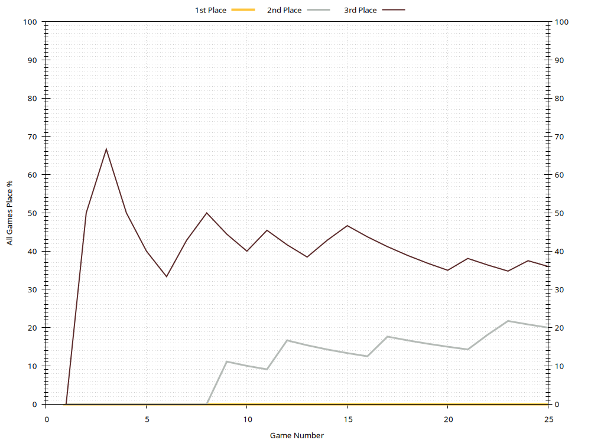

# Wendy

Last updated 2024-05-12 07:34 UTC.

- [Summary](#summary)
- [Ratings](#ratings)
- [Average Points](#average-points)
- [Win Rates](#win-rates)
- [History](#history)

[(Back to Main Page)](../../#)

## Summary

| **Category**     | **Games** | **Current Rating** | **Avg Rating** | **Avg Points** | **1st Place** | **2nd Place** | **3rd Place** |
| :---:            | :---:     | :---:              | :---:          | :---:          | :---:         | :---:         | :---:         |
| All Games        | 25        | 948                | 942            | 6.02           | 0% (0)        | 20% (5)       | 36% (9)       |
| 3-4 Player Games | 1         | 968                | 968            | 4.00           | 0% (0)        | 0% (0)        | 100% (1)      |
| 5-6 Player Games | 17        | 968                | 960            | 6.02           | 0% (0)        | 29% (5)       | 35% (6)       |
| 7-8 Player Games | 7         | 953                | 967            | 6.29           | 0% (0)        | 0% (0)        | 29% (2)       |

[(Back to Top)](#)

## Ratings

[(Back to Top)](#)

## Average Points

[(Back to Top)](#)

## Win Rates

[(Back to Top)](#)

## History

- [All Games History](#all-games-history)
- [3-4 Player Games History](#3-4-player-games-history)
- [5-6 Player Games History](#5-6-player-games-history)
- [7-8 Player Games History](#7-8-player-games-history)

[(Back to Top)](#)

### All Games History

| **Game** | **Date**   | **Points** | **Players** | **Results**                                                                                                  |
| :---:    | :---:      | :---:      | :---:       | :---                                                                                                         |
| 25       | 2023-02-03 | 13         | 6           | 1st Alex 14 , 2nd Sean 11 , 3rd Scott 9 , 4th Jess 8 , 5th Wendy 7 , 6th Mic 6                               |
| 24       | 2022-08-27 | 10         | 7           | 1st Scott 10 , 2nd Alex 9 , 3rd Wendy 8 , 4th Rachel 7 , 5th Jess 6 , 5th Mic 6 , 5th Sean 6                 |
| 23       | 2021-12-11 | 10         | 6           | 1st Alex 10 , 2nd Mic 6 , 2nd Scott 6 , 2nd Rachel 6 , 2nd Wendy 6 , 2nd Eftychi 6                           |
| 22       | 2021-09-06 | 10         | 6           | 1st Jess 10 , 2nd Wendy 9 , 3rd Sean 8 , 4th Alex 6 , 4th Laura 6 , 4th Scott 6                              |
| 21       | 2021-09-04 | 10         | 6           | 1st Jay 10 , 2nd Alex 9 , 2nd Jess 9 , 2nd Sean 9 , 3rd Scott 7 , 3rd Wendy 7                                |
| 20       | 2021-01-18 | 10         | 8           | 1st Eftychi 10 , 2nd Jess 9 , 3rd Sean 8 , 3rd Scott 8 , 4th Rachel 7 , 5th Alex 6 , 6th Mic 5 , 6th Wendy 5 |
| 19       | 2021-01-18 | 10         | 8           | 1st Rachel 10 , 2nd Alex 8 , 3rd Jess 7 , 4th Mic 6 , 4th Wendy 6 , 5th Sean 5 , 6th Eftychi 4 , 7th Scott 3 |
| 18       | 2020-09-04 | 10         | 7           | 1st Rachel 10 , 2nd Scott 9 , 3rd Alex 8 , 3rd Sean 8 , 4th Jess 7 , 5th Wendy 6 , 6th Mic 5                 |
| 17       | 2020-09-04 | 10         | 5           | 1st Sean 10 , 2nd Wendy 6 , 3rd Alex 4 , 3rd Mic 4 , 4th Jess 3                                              |
| 16       | 2020-08-07 | 10         | 7           | 1st Rachel 10 , 2nd Jess 8 , 2nd Scott 8 , 3rd Alex 7 , 3rd Mic 7 , 4th Sean 6 , 4th Wendy 6                 |
| 15       | 2020-08-07 | 10         | 6           | 1st Jess 10 , 2nd Sean 8 , 3rd Wendy 7 , 3rd Rachel 7 , 4th Scott 5 , 4th Mic 5                              |
| 14       | 2020-07-04 | 10         | 8           | 1st Jay 10 , 2nd Alex 9 , 2nd Sean 9 , 3rd Scott 7 , 3rd Wendy 7 , 3rd Mic 7 , 4th Jess 6 , 4th Eftychi 6    |
| 13       | 2020-07-04 | 10         | 8           | 1st Alex 10 , 2nd Rachel 8 , 3rd Scott 7 , 4th Jess 6 , 4th Wendy 6 , 5th Eftychi 4 , 5th Jay 4 , 5th Mic 4  |
| 12       | 2020-07-03 | 10         | 6           | 1st Jess 10 , 2nd Alex 6 , 2nd Wendy 6 , 3rd Scott 5 , 3rd Eftychi 5 , 4th Rachel 4                          |
| 11       | 2020-06-20 | 10         | 6           | 1st Jess 10 , 2nd Eftychi 8 , 3rd Wendy 7 , 4th Alex 6 , 4th Scott 6 , 4th Mic 6                             |
| 10       | 2020-06-20 | 10         | 6           | 1st Alex 10 , 2nd Scott 6 , 2nd Mic 6 , 3rd Jess 5 , 4th Eftychi 4 , 5th Wendy 2                             |
| 9        | 2020-06-20 | 10         | 6           | 1st Jess 10 , 2nd Wendy 8 , 3rd Alex 7 , 3rd Scott 7 , 4th Eftychi 4 , 4th Mic 4                             |
| 8        | 2019-09-22 | 10         | 4           | 1st Alex 10 , 2nd Sean 6 , 2nd Scott 6 , 3rd Wendy 4                                                         |
| 7        | 2017-10-08 | 10         | 6           | 1st Scott 10 , 2nd Alex 9 , 3rd Jay 6 , 3rd Jess 6 , 3rd Wendy 6 , 4th Sean 5                                |
| 6        | 2017-08-25 | 10         | 6           | 1st PA 10 , 2nd Jay 7 , 2nd Sean 7 , 3rd Scott 6 , 4th Wendy 5 , 5th Alex 4                                  |
| 5        | 2017-06-10 | 10         | 6           | 1st Scott 10 , 2nd Alex 8 , 3rd Jess 7 , 4th Wilson 6 , 5th Wendy 5 , 6th Victoria 3                         |
| 4        | 2017-06-10 | 10         | 6           | 1st Jay 10 , 2nd Alex 9 , 3rd Jess 7 , 4th Scott 6 , 4th Sean 6 , 4th Wendy 6                                |
| 3        | 2017-04-01 | 10         | 6           | 1st Jess 10 , 2nd Jay 8 , 2nd Sean 8 , 3rd Wendy 5 , 4th Alex 4 , 4th Rachel 4                               |
| 2        | 2017-03-31 | 10         | 6           | 1st Jay 10 , 2nd Scott 9 , 3rd Alex 7 , 3rd Wendy 7 , 4th Sean 6 , 5th Rachel 5                              |
| 1        | 2017-03-17 | 10         | 6           | 1st Jess 10 , 2nd Jay 8 , 3rd Alex 7 , 3rd Sean 7 , 4th Scott 6 , 5th Wendy 5                                |

[(Back to History)](#history)

### 3-4 Player Games History

| **Game** | **Date**   | **Points** | **Players** | **Results**                                          |
| :---:    | :---:      | :---:      | :---:       | :---                                                 |
| 1        | 2019-09-22 | 10         | 4           | 1st Alex 10 , 2nd Sean 6 , 2nd Scott 6 , 3rd Wendy 4 |

[(Back to History)](#history)

### 5-6 Player Games History

| **Game** | **Date**   | **Points** | **Players** | **Results**                                                                          |
| :---:    | :---:      | :---:      | :---:       | :---                                                                                 |
| 17       | 2023-02-03 | 13         | 6           | 1st Alex 14 , 2nd Sean 11 , 3rd Scott 9 , 4th Jess 8 , 5th Wendy 7 , 6th Mic 6       |
| 16       | 2021-12-11 | 10         | 6           | 1st Alex 10 , 2nd Mic 6 , 2nd Scott 6 , 2nd Rachel 6 , 2nd Wendy 6 , 2nd Eftychi 6   |
| 15       | 2021-09-06 | 10         | 6           | 1st Jess 10 , 2nd Wendy 9 , 3rd Sean 8 , 4th Alex 6 , 4th Laura 6 , 4th Scott 6      |
| 14       | 2021-09-04 | 10         | 6           | 1st Jay 10 , 2nd Alex 9 , 2nd Jess 9 , 2nd Sean 9 , 3rd Scott 7 , 3rd Wendy 7        |
| 13       | 2020-09-04 | 10         | 5           | 1st Sean 10 , 2nd Wendy 6 , 3rd Alex 4 , 3rd Mic 4 , 4th Jess 3                      |
| 12       | 2020-08-07 | 10         | 6           | 1st Jess 10 , 2nd Sean 8 , 3rd Wendy 7 , 3rd Rachel 7 , 4th Scott 5 , 4th Mic 5      |
| 11       | 2020-07-03 | 10         | 6           | 1st Jess 10 , 2nd Alex 6 , 2nd Wendy 6 , 3rd Scott 5 , 3rd Eftychi 5 , 4th Rachel 4  |
| 10       | 2020-06-20 | 10         | 6           | 1st Jess 10 , 2nd Eftychi 8 , 3rd Wendy 7 , 4th Alex 6 , 4th Scott 6 , 4th Mic 6     |
| 9        | 2020-06-20 | 10         | 6           | 1st Alex 10 , 2nd Scott 6 , 2nd Mic 6 , 3rd Jess 5 , 4th Eftychi 4 , 5th Wendy 2     |
| 8        | 2020-06-20 | 10         | 6           | 1st Jess 10 , 2nd Wendy 8 , 3rd Alex 7 , 3rd Scott 7 , 4th Eftychi 4 , 4th Mic 4     |
| 7        | 2017-10-08 | 10         | 6           | 1st Scott 10 , 2nd Alex 9 , 3rd Jay 6 , 3rd Jess 6 , 3rd Wendy 6 , 4th Sean 5        |
| 6        | 2017-08-25 | 10         | 6           | 1st PA 10 , 2nd Jay 7 , 2nd Sean 7 , 3rd Scott 6 , 4th Wendy 5 , 5th Alex 4          |
| 5        | 2017-06-10 | 10         | 6           | 1st Scott 10 , 2nd Alex 8 , 3rd Jess 7 , 4th Wilson 6 , 5th Wendy 5 , 6th Victoria 3 |
| 4        | 2017-06-10 | 10         | 6           | 1st Jay 10 , 2nd Alex 9 , 3rd Jess 7 , 4th Scott 6 , 4th Sean 6 , 4th Wendy 6        |
| 3        | 2017-04-01 | 10         | 6           | 1st Jess 10 , 2nd Jay 8 , 2nd Sean 8 , 3rd Wendy 5 , 4th Alex 4 , 4th Rachel 4       |
| 2        | 2017-03-31 | 10         | 6           | 1st Jay 10 , 2nd Scott 9 , 3rd Alex 7 , 3rd Wendy 7 , 4th Sean 6 , 5th Rachel 5      |
| 1        | 2017-03-17 | 10         | 6           | 1st Jess 10 , 2nd Jay 8 , 3rd Alex 7 , 3rd Sean 7 , 4th Scott 6 , 5th Wendy 5        |

[(Back to History)](#history)

### 7-8 Player Games History

| **Game** | **Date**   | **Points** | **Players** | **Results**                                                                                                  |
| :---:    | :---:      | :---:      | :---:       | :---                                                                                                         |
| 7        | 2022-08-27 | 10         | 7           | 1st Scott 10 , 2nd Alex 9 , 3rd Wendy 8 , 4th Rachel 7 , 5th Jess 6 , 5th Mic 6 , 5th Sean 6                 |
| 6        | 2021-01-18 | 10         | 8           | 1st Eftychi 10 , 2nd Jess 9 , 3rd Sean 8 , 3rd Scott 8 , 4th Rachel 7 , 5th Alex 6 , 6th Mic 5 , 6th Wendy 5 |
| 5        | 2021-01-18 | 10         | 8           | 1st Rachel 10 , 2nd Alex 8 , 3rd Jess 7 , 4th Mic 6 , 4th Wendy 6 , 5th Sean 5 , 6th Eftychi 4 , 7th Scott 3 |
| 4        | 2020-09-04 | 10         | 7           | 1st Rachel 10 , 2nd Scott 9 , 3rd Alex 8 , 3rd Sean 8 , 4th Jess 7 , 5th Wendy 6 , 6th Mic 5                 |
| 3        | 2020-08-07 | 10         | 7           | 1st Rachel 10 , 2nd Jess 8 , 2nd Scott 8 , 3rd Alex 7 , 3rd Mic 7 , 4th Sean 6 , 4th Wendy 6                 |
| 2        | 2020-07-04 | 10         | 8           | 1st Jay 10 , 2nd Alex 9 , 2nd Sean 9 , 3rd Scott 7 , 3rd Wendy 7 , 3rd Mic 7 , 4th Jess 6 , 4th Eftychi 6    |
| 1        | 2020-07-04 | 10         | 8           | 1st Alex 10 , 2nd Rachel 8 , 3rd Scott 7 , 4th Jess 6 , 4th Wendy 6 , 5th Eftychi 4 , 5th Jay 4 , 5th Mic 4  |

[(Back to History)](#history)

